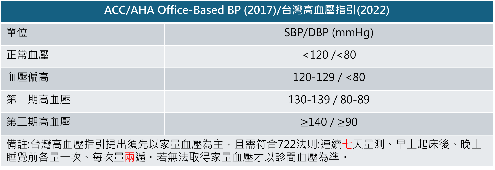

✅模板試作(HTN)
\*

2025年2月4日
下午 11:14

- 編輯格式
  - 顏色註記方式
    - 重要標題 : 母標題藍色(最暗)標記/子標題藍色(較暗,25%)標記
    - 重要術式治療藥物 : **綠色標記+粗體**
    - 重要內文 : 紅色(標準色彩)/**橘色+粗體(橘色那一欄第一個)**(如果同色太醜就紅橘相間)
    - 直接來複製顏色格式一定不會錯xd
  - 字型&大小
    - 字型：微軟正黑
    - 大小：
      - 內文：11號
      - 母標題：16號
      - 子標題：14號
  - 其他
    - 符號統一用全形；英文本人需要半形，不然空格大家空文字前後、個數不一有點困擾(但我下面有些符號沒改到拍謝)
    - 表格可以用PPT自己重繪轉成圖檔上傳(像下面藍色的高血壓數值是參考小麻跟台灣HTN guideline畫出來的，流行病學是Harrison的內容跟一篇台灣相關的論文弄成的表格)
    - 模板只是參考用的，可以再依個人想法做微調喔~大家加油!

- 底下開始為HTN模板，請各位參考一下!

- 定義
  - 各類高血壓定義：
    - 原發性高血壓(primary)：不明原因之高血壓
    - 繼發性高血壓(secondary)：由潛在疾病引發之高血壓
    - 頑固性高血壓(persistent)：經≥3種最大劑量高血壓藥物治療**仍≥130/80 mmHg**之患者
  - 參考值：
    - 台灣常見：

- 國際高血壓學會(ISH)：
  - 2020年發布的全球高血壓實踐指南認為高血壓定義為診室收縮壓SBP ≥140 mmHg和/或診室舒張壓DBP ≥90 mmHg。
- 分類
  - 原發性(Primary)(95%)=Essential HTN
    - 特色：
      - 在25-55歲被診斷有家族史
      - 50歲以前的高血壓：常是**收縮壓、舒張壓一起升高**，乃因resistance arterioles的血管收縮(vasoconstriction)所致
        - DBP升高與冠狀動脈疾病較相關
      - 60歲以後的高血壓：**收縮壓升高、舒張壓下降**(=孤立性收縮性高血壓(Isolated systolic HTN))
        - 因年紀愈大，大動脈(Aorta)血管的彈力蛋白(Elastin) 被膠原(Collagen)和纖維組織取代，導致血管彈力變差(Decreased distensibility)
        - 心臟**收縮**時，血管無法展現彈力而擴張，導致收縮壓增高
        - 心臟**舒張**時，血管應展現彈力將血液往前推，若血管無彈力，反而沒有那股推力，導致舒張壓下降，造成脈壓(Pulse pressure)增加
        - **SBP、pulse pressure增加為此類病患的主要危險因子**

- 次發性(Secondary)(5~20%)
  - \<30或\>60歲被診斷、突發性或難以控制的高血壓需考慮

- 流行病學：　

- 病因：
  - 原發性(Primary)：idiopathic
  - 次發性(Secondary)：\[口訣：腎內主神藥\]
    - **常見病因：腎實質病變(renal parenchymal disease)\>原發性醛固酮過高(primary aldosteronism**)
      - 腎臟
        - 腎動脈狹窄(2%)
        - 腎實質疾病(2%)：secondary hypertension最常見的原因
      - 內分泌
        - Primary Hyperaldosteronism (Conn's syndrome)、Cushing's syndrome(1-5%)：
        - Pheochromocytoma(\<1%、0.05%)
        - 甲狀腺亢進(Grave's disease)或低下
        - 副甲狀腺亢進
      - 主動脈窄縮(Coarctation of the aorta)(0.2%)
      - 神經疾病(腦壓過高、呼吸停止症候群)
      - 藥物(避孕藥、NSAID、類固醇、紅血球生成素、抗排斥藥、cocaine)
- 臨床特徵
  - 頭痛
  - 胸痛
  - 頭暈
  - 呼吸困難
  - 噁心
  - 嘔吐
  - 視野改變(模糊、缺損)
  - 焦慮
  - 混亂/迷亂/意識模糊
  - 耳鳴
  - 流鼻血
  - 心律不整
  - 
*來自 \< <https://www.who.int/news-room/fact-sheets/detail/hypertension>\>*
- 診斷
  - 使用722法則測家量血壓
  - 若患者無法達成可以用診間血壓代替
  - 使用血壓袖帶(BP cuff)原則
    - 選擇適當的血壓袖帶尺寸
      - 血壓袖帶的長度和**寬度**應分別為手臂圓周的80%和**40%**
    - **測量步驟**
      - 首次測量時，雙臂皆需測量，之後使用讀數較高的手臂進行後續測量。
      - **每次測量應取2-3次讀數**，並於不同時間點進行，以提高準確性。
    - **特殊情況考量**
      - 假性高血壓(pseudohypertension)：老年患者如動脈硬化嚴重，可能影響血壓測量準確性。若血壓袖帶充氣至阻斷肱動脈時，橈動脈仍摸得到脈搏(Osler maneuver)，應考慮以動脈內直接測量確認血壓。
    - **測量儀器選擇**
      - **汞柱血壓計因汞毒性問題逐漸被淘汰**，目前多使用**氣壓式(aneroid)或振盪式(oscillometric)血壓計**。

- 處置
治療\[口訣：ABCD\]
- PRE-HTN
| 減重                      | 目標BMI\<25 kg/m2                  |
|----------------------------|---------------------------------------------------|
| 飲食限鹽                  | 每天\<6g NaCl                                   |
| 以DASH-type\*訂定飲食計畫 | 多蔬果、低脂乳製品、減少飽和脂肪或脂肪攝取       |
| 適量酒精攝取              | 建議有飲酒習慣的病患，男性每天2杯，女性每天1杯酒 |
| 運動                      | 規律有氧運動，如每天快走30分鐘                   |
- **平均一個藥可降壓 SBP 10 mmHg**
- Stage 1 HTN：**\<55歲**建議**ACEI/ARB**、**\>55歲**建議**CCB**或**D**iuretics
- Stage 2 HTN：合併用藥，(A/B) + (C/D)。一般可考慮ACEI+CCB
  - 其他共病用藥選擇
    - **最優藥物選擇**
      - **糖尿病合併蛋白尿**：優先考慮 ACEI
      - **心肌梗塞、心臟衰竭**：非 ISA 類 β 阻斷劑（β-blockers）
      - **老年獨立收縮高血壓**：首選 DHP 類鈣離子通道阻斷劑（CCB），亦可使用利尿劑
    - **可能有助益的藥物**
      - **偏頭痛**：可選擇 β 阻斷劑或非 DHP 類 CCB
      - **骨質疏鬆症**：可考慮使用噻嗪類利尿劑
      - **攝護腺肥大、血脂異常**：可考慮 α 阻斷劑
    - **可能不適合或需謹慎使用的藥物**
      - **懷孕、腎血管高血壓**：避免使用 ACEI
      - **支氣管氣喘、周邊血管疾病、憂鬱症**：避免使用 β 阻斷劑
      - **糖尿病（無合併心臟病）**：避免大劑量利尿劑或 β 阻斷劑
      - **血脂異常**：避免使用 ISA 類 β 阻斷劑
      - **痛風**：避免使用利尿劑
      - **房室阻滯（第二、三度）**：避免使用非 DHP 類 CCB

- 藥物各論：
  - ACEI、ARB
| ACEI | **Captopril (Capoten®), Lisinopril (Zestril®)**                     | 高血壓     |
|-------|----------------------------------------------------------------------|-------------|
| ARB  | **Losartan (Cozaar®), Valsartan (Diovan®), Telmisatan (Micardis®)** | 慢性腎病變 |
- 腎病變保護效果：\[[CKD藥物控制](onenote:Nephro.one#%F0%9F%A9%BA%E7%96%BE%E7%97%85|%E6%85%A2%E6%80%A7%E8%85%8E%E7%97%85%E8%AE%8A%E5%92%8C%E6%B4%97%E8%85%8E(Chronic%20Kidney%20Disease%20hemodialysis)&section-id={B08C88BC-36F3-4D11-B601-B2A118E8B884}&page-id={801B5757-82B0-4232-839F-AC91B203ADA9}&object-id={123FF96E-5F37-0705-2945-8BFB1A2C1F97}&35&base-path=https://d.docs.live.net/56ce32fba64785ca/%E8%87%A8%E5%BA%8A%E7%AD%86%E8%A8%98)\]
  - 減少Efferent arteriolar resistance→腎絲球濾過率減少
  - 雖會使腎功能變差一些，但因減少蛋白質濾出到腎小管，傷害腎小管。長期而言，可減緩糖尿病或非糖尿病的腎病變進展
- 心血管益處：
  - 減少心臟Preload、Afterload
  - 減緩心肌梗塞後(Post MI)心臟的remodeling(心室擴張)，而保存左心室功能，減緩心臟衰竭的進展
  - 改善心臟衰竭症狀
- 副作用
  - ACEI：乾咳(20％)、腎功能不佳者身上可能導致高血鉀
  - ARB：血管性水腫(angioedema)、過敏、皮膚紅疹
  - Teratogenic effect致畸胎
  - Renal artery stenosis(bilateral or unilateral with a solitary functioning kidney )禁用
- **==β-blocker==**
<table>
<colgroup>
<col style="width: 47%" />
<col style="width: 33%" />
<col style="width: 19%" />
</colgroup>
<thead>
<tr class="header">
<th>分類</th>
<th>
ISA(-)

[記：A.P開頭的藥中，不常見的是ISA(+)]
</th>
<th>ISA(+)</th>
</tr>
</thead>
<tbody>
<tr class="odd">
<td>β1blocker[字首為A〜M]=cardioselective</td>
<td>Atenolol、Bisoprolol、Metoprolol</td>
<td>Acebutolol</td>
</tr>
<tr class="even">
<td>Nonselectiveβblocker[字首為N之後]</td>
<td>Propranolol (Inderol)、Nadolol、Timolol</td>
<td>Pindolol</td>
</tr>
<tr class="odd">
<td>α1blocker + Nonselectiveβblocker</td>
<td>Carvedilol、Labetalol</td>
<td></td>
</tr>
</tbody>
</table>
- 阻斷β1：
  - 降低心輸出量及心跳
  - 減少Renin分泌使Baroreceptor接受較低的血壓
  - 促進血管放鬆的prostaglandins釋放
  - 減少血液容積
  - 作用在CNS
- 藉由阻斷β2
  - 可能導致氣喘惡化、對低血糖反應消失
  - 低劑量的selectiveβ1blocker可安全使用於輕微慢性阻塞性肺病(COPD)、糖尿病(DM)、周邊血管疾病患者
- Intrinsic sympathetic activity(ISA)：較不會心跳慢，但無法減少猝死、總死亡率、反覆心肌梗塞和Thiazide併用有導致糖尿病傾向(diabetogenic potential)，**不建議**用於**較年輕無其他併發症**或**Metabolic syndrome**的病患
- β2blocker副作用：\[口訣：ABCD\]
  - **Asthma**
  - **Bradycardia、Bronchospasm**
  - **CHF(decompensated)**
  - **DM、PVD(Peripheral vessel disease)**
- **==CCB==**
<table>
<colgroup>
<col style="width: 16%" />
<col style="width: 30%" />
<col style="width: 16%" />
<col style="width: 36%" />
</colgroup>
<thead>
<tr class="header">
<th></th>
<th></th>
<th>Indication</th>
<th>S/E</th>
</tr>
</thead>
<tbody>
<tr class="odd">
<td>
1代DHP

(Short-acting)
</td>
<td>
<strong>Nifedipine (Adalat)、nimodipine(SAH)</strong>

時間短效，作用較強烈，容易引起反射性心跳過速
</td>
<td>
高血壓

心絞痛

Raynaud phenomenon
</td>
<td>
頭痛

周圍水腫

Flushing

Reflex tachycardia

牙齦增生
</td>
</tr>
<tr class="even">
<td>
2代DHP

(Intermediate-acting)
</td>
<td>
<strong>Nicardipine(Perdipine)(HTN emergency)</strong>

<strong>、Felodipine (Plendil)</strong>

改善了作用持續時間短的問題，部分劑型改為長效
</td>
<td>同上</td>
<td>同上</td>
</tr>
<tr class="odd">
<td>
3代DHP

(Long-acting)
</td>
<td>
<strong>Amilodipine (Norvasc)、Lacidipine (Lasyn)</strong>

長效制劑，起效緩和，副作用更少
</td>
<td>同上</td>
<td>同上</td>
</tr>
<tr class="even">
<td>
Non DHP

[<a href="onenote:%E9%87%8D%E8%A6%81%E8%97%A5%E7%90%86.one#%E5%BF%83%E5%BE%8B%E4%B8%8D%E6%95%B4%E8%97%A5%E7%89%A9&amp;section-id={2819C0B0-10A1-4B6D-B555-73178248D88C}&amp;page-id={E8BEFA50-C8D6-43FB-96B7-FF142A0DE0E2}&amp;object-id={E69CC795-181C-4902-A6C9-DC4B71971976}&amp;C8&amp;base-path=https://d.docs.live.net/56ce32fba64785ca/%E8%87%A8%E5%BA%8A%E7%AD%86%E8%A8%98">Class 4心律不整藥物</a>]
</td>
<td>
<strong>Diltiazem (Herbesser、Cardizem)</strong>

<strong>、Verapamil (Isoptin)(Migraine)</strong>
</td>
<td>
心室上心搏過速

HoCM
</td>
<td><blockquote>

心肌收縮、HR↓

AV block

牙齦增生

Verapamil

</blockquote>
<ul>
<li>
便秘
</li>
<li>
Hyperprolactinemia
</li>
</ul></td>
</tr>
</tbody>
</table>
- 由肝臟代謝、**舒張動脈\>靜脈**
- 較ACEI、β-blocker有更多預防中風較果，對isolated HTN效果佳
<table>
<colgroup>
<col style="width: 12%" />
<col style="width: 41%" />
<col style="width: 46%" />
</colgroup>
<thead>
<tr class="header">
<th><strong>特性</strong></th>
<th>DHP</th>
<th>
Non-DHP

(Verapamil, Diltiazem)
</th>
</tr>
</thead>
<tbody>
<tr class="odd">
<td><strong>作用位置</strong></td>
<td>血管平滑肌</td>
<td>心肌與傳導系統</td>
</tr>
<tr class="even">
<td><strong>主要作用</strong></td>
<td>血管擴張、降血壓</td>
<td>減慢心率、降低心肌收縮力</td>
</tr>
<tr class="odd">
<td><strong>副作用</strong></td>
<td>頭痛、潮紅、水腫</td>
<td>
心跳過慢、房室傳導阻滯、便秘

<strong><mark>不可用於systolicHF(HFrEF)</mark></strong>
</td>
</tr>
<tr class="even">
<td><strong>臨床應用</strong></td>
<td>高血壓、冠心病(stable、variant angina)</td>
<td>心律不整、心絞痛(減少心肌耗氧需求)</td>
</tr>
</tbody>
</table>

副作用：腳踝水腫、臉部潮紅、頭痛、便秘
- [**==Diuretic==**](onenote:%E9%87%8D%E8%A6%81%E8%97%A5%E7%90%86.one#%E5%88%A9%E5%B0%BF%E5%8A%91&section-id={2819C0B0-10A1-4B6D-B555-73178248D88C}&page-id={3F28B558-5AED-4C40-B1BD-138B6AED1459}&end&base-path=https://d.docs.live.net/56ce32fba64785ca/%E8%87%A8%E5%BA%8A%E7%AD%86%E8%A8%98)
  - **Thiazide**
  - **Furosemide**
  - **==Nitroprusside、Nitroglycerin==**
    - 會增加腦壓，不可用於腦中風相關的高血壓
    - 雖可用於心臟衰竭病患提升心輸出，但若發生低血壓，則需搭配強心劑或IABP
<table>
<colgroup>
<col style="width: 10%" />
<col style="width: 45%" />
<col style="width: 43%" />
</colgroup>
<thead>
<tr class="header">
<th>學名</th>
<th>Nitroprusside</th>
<th>Nitroglycerin</th>
</tr>
</thead>
<tbody>
<tr class="odd">
<td>商品名(劑量)</td>
<td>Nipride (50 mg = 2 ml = 1 amp)</td>
<td>0.1% Isoket (10 mg = 10 ml = 1 amp)</td>
</tr>
<tr class="even">
<td>藥理作用</td>
<td>同時擴張動、靜脈，降壓速度極快</td>
<td>
一般劑量：擴張靜脈及冠狀動脈，用於心肌梗塞減少preload及增加冠狀動脈血流

高劑量：可同時擴張動脈，降低afterload
</td>
</tr>
<tr class="odd">
<td>副作用</td>
<td><ul>
<li>
紅血球、肌肉會將nitroprusside代謝成cyanide再於肝臟轉thiocyanide由腎臟排出
</li>
<li>
肝腎功能不佳會造成代謝物累積，導致cyanide中毒(意識改變、乳酸中毒)
</li>
</ul></td>
<td>會增加腦部血流，增加顱內壓，造成頭痛， 不可用於腦壓高的病患</td>
</tr>
<tr class="even">
<td>適應症</td>
<td>用於心衰竭病患以提高心輸出量；用於labetalol控制不佳的高血壓併發主動脈剝離</td>
<td>較常用於心絞痛或心肌梗塞時(<strong>右心室心肌梗塞不可使用</strong>)，降低preload；偶爾可用較高的劑量來降血壓</td>
</tr>
<tr class="odd">
<td>注意事項</td>
<td>
降壓效果極快，建議在加護病房內有Arterial line可隨時掌握血型動力學時使用；

急診或病房病患建議先用其他藥物
</td>
<td>使用一般塑膠(PVC) set會使藥物吸附於管壁上，起始劑量可能須提高數倍(2〜5X)， 建議使用特殊set(橘色)及以特殊材質(PP)塗於內層的生理食鹽水瓶泡製</td>
</tr>
</tbody>
</table>
- **Hydralazine**(血管擴張、主要擴張小動脈)
- 併發症：急性嚴重的高血壓(Acute severe HTN)
  - Hypertensive urgency
    - 定義：血壓很高(SBP \> 180 and/or DBP \> 120)，但**「無」急性目標器官受損**
    - 臨床表現：通常僅有頭痛、頭暈等輕微症狀，常是慢性高血壓患者無規則服藥或藥物劑量不足
    - 治療：
      - 先使病患在安靜的環境休息，可能就會降10〜20 mmHg
        - 以往希望快速降壓而使用舌下鈣離子阻斷劑(Nifedipine = Adalat)，但在**老人病患(收縮壓高、舒張壓低)，快速降壓可能造成心肌梗塞、腦部缺血性中風**
      - 建議若無Hypertensive emergency的那些症狀出現，僅須以**口服降壓藥在 1~2天內將血壓降至160/100 mmHg以下**即可
    - 口服藥物選擇：依個別病患狀況給予，如CHF、CKD病患給予ACEI等
  - Hypertensive emergency
    - 定義：不管血壓上升多少，病患**「合併」急性目標器官受損(Acute target organ damage)**
      - 腦中風、心肌梗塞、主動脈剝離、急性肺水腫、急性腎衰竭等
    - 臨床表現：頭痛、意識不清、視力模糊、噁心嘔吐，甚至有癲癇發作、喘、寡尿，且血壓常高到220/140
    - 治療
<table>
<colgroup>
<col style="width: 11%" />
<col style="width: 59%" />
<col style="width: 28%" />
</colgroup>
<thead>
<tr class="header">
<th></th>
<th>狀況</th>
<th>目標血壓</th>
</tr>
</thead>
<tbody>
<tr class="odd">
<td>一般患者</td>
<td>IV 藥物(<strong>Nitroprusside、Labetalol</strong>) 將血壓於幾分鐘到2小時內降低</td>
<td>160/100 以下</td>
</tr>
<tr class="even">
<td><strong>保守降壓</strong></td>
<td>
缺血性中風病患

缺血性中風若欲給予血栓溶解劑出血性中風病患

出血性中風病患
</td>
<td>
僅在220/130以上才需降壓

<strong>降至185/110以下</strong>

<strong>降至180/130以下</strong>
</td>
</tr>
<tr class="odd">
<td><strong>積極降壓</strong></td>
<td>
<a href="onenote:外科.one#🧠NS|Head%20trauma\%20顱內出血&amp;section-id={BC9E9AED-B5B5-4309-97AF-D04A7DB9E34C}&amp;page-id={F7B6D218-B37F-4EB1-9CFE-A2793C33973D}&amp;object-id={4547C7F3-AA31-4366-9435-83C45DA1F7BE}&amp;24&amp;base-path=https://d.docs.live.net/56ce32fba64785ca/臨床筆記">SAH</a>建議將MAP

<a href="onenote:https://d.docs.live.net/56CE32FBA64785CA/臨床筆記/外科.one#CVS|急性主動脈症候群(acute%20aortic%20syndrome)&amp;section-id={BC9E9AED-B5B5-4309-97AF-D04A7DB9E34C}&amp;page-id={031A2D06-3683-47E6-B4BC-7F056343190D}&amp;object-id={12C9563A-5016-00C6-226D-F9C4AAB6403F}&amp;58">Aortic dissection</a> 建議將 SBP
</td>
<td>
降至130以下

<strong>降至120以下</strong>
</td>
</tr>
</tbody>
</table>
- 缺血性或出血性中風：建議用**labetalol**或**CCB**
  - nitroprusside或nitroglycerin這類藥物會增加腦部血流，造成腦壓增高
  - Nimodipine可預防、治療因動脈瘤引起之蜘蛛膜下出血(SAH)後腦血管痙攣所引起的缺血性神經缺損
- 主動脈剝離：
  - 靜脈注射**β blocker**降低心臟收縮強度，且可預防直接給予血管擴張劑(nitroprusside, CCB )造成反射性心跳加速
  - 血壓仍無法控制，再以靜脈給予**Nitroprusside**將SBP控制在120mmHg以下
- 
