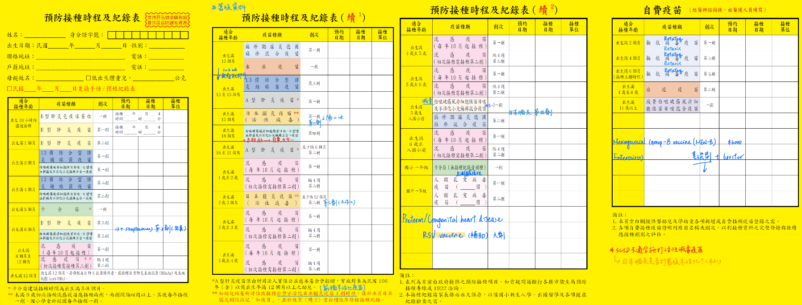
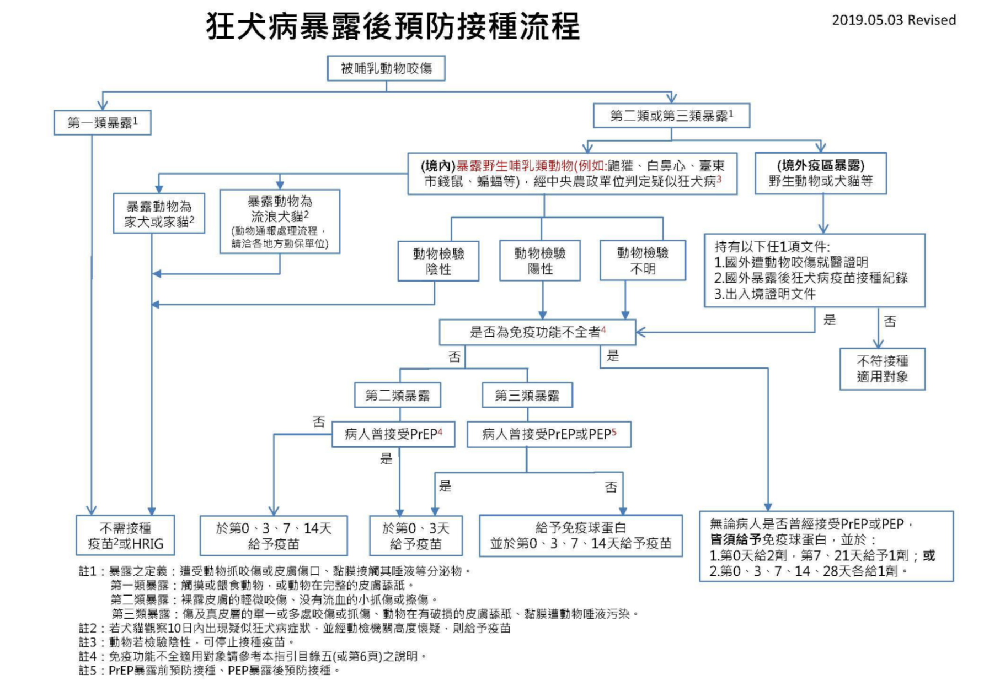

兒童發展、疫苗
2025年2月13日
下午 03:36
- 兒童疫苗概論:
  - 台灣疫苗接踵紀錄表:
  - 
  - 疫苗接種：
    - 與外在病原體暴露有關，應依出生後年紀來計算(無論是否早產)
  - 生長發育：
    - 以矯正年齡作爲參考
  - 時程
    - 出生後24 小時內： HBV 1
    - 1 個月大： HBV2
    - 2 個月大： DTaP-Hib-IPV 1 、PCV13 1
    - 4 個月大： DTaP-Hib-IPV 2 、PCV13 2
    - 5 個月大： BCG
    - 6 個月大： DTaP-Hib-IPV 3 、HBV3、(流感開打)
    - 12 個月大： PCV13 3 、MMR 、Varicella 、HAV 1
    - 15 個月大： 日本腦炎(JE) 1
    - 18 個月大： DTaP-Hib-IPV 4 、HAV2
    - 27 個月大： 日本腦炎(JE) 2
    - 2025/1：HAV改18.27施打(降低A肝疫苗第1、2劑常發生接種間隔不足之誤失)
    - DTaP-Hib-IPV：五合一
    - 白喉、破傷風、百日咳、B型嗜血桿菌、不活化小兒痲痺:
      - 2.4.6.18個月
      - 孕婦：百日咳疫苗建議於28週至36週施打，可以提升胎兒出生後對於百日咳的免疫力
- 疫苗個論
  - 活性減毒疫苗
    - 不可施打的情況：
      - Immunocompromised
      - 懷孕
      - 3 個月內肌肉注射HBV IG
      - 6 個月內輸過血或接受靜脈血品(washed RBC 除外)
      - 11 個月內IVIG \> 2 g/kg(高劑量)
      - 1 個月內使用超過2 mg/kg/day prednisone
      - 在1個月內， 10 kg 以上的孩童用20 mg/day prednisone 以上，且使用超過2 星期

- \[口訣： JR MV BOY\]
  - J= 日本腦炎
  - R＝輪狀病毒
  - M=MMR
  - V＝水痘(varicella)
  - B=BCG
  - O=口服沙賓
  - Y＝黃熱病

- 水痘疫苗：
  - 1劑水痘疫苗：保護力大約86%，減少、預防水痘感染造成的重症
  - 成人水痘新舊疫苗比較
  - 
| **項目**                       | **Shingrix (GSK)**                        | **Zostavax (MSD)**                               |
|--------------------------------|-------------------------------------------|--------------------------------------------------|
| **適用年齡**                   | 50 歲以上                                 | 50 歲以上                                        |
| **劑數**                       | 2 劑                                      | 1 劑                                             |
| **接種間隔**                   | 兩劑相隔 2-6 個月                         | 無                                               |
| **接種方式**                   | 肌肉注射 (IM)                             | 皮下注射 (SC)                                    |
| **疫苗類型**                   | 重組疫苗                                  | 減活疫苗                                         |
| **疫苗成分**                   | 非活性抗原 (gE)                           | Oka/Merck 水痘帶狀皰疹病毒                       |
| **免疫功能低下者可否接種**     | 可                                        | 不適合                                           |
| **禁忌**                       | 對疫苗成分過敏者                          | 對疫苗成分過敏者、免疫缺乏者、使用免疫抑制藥物者 |
| **整體保護效能**               | 較高                                      | 較低                                             |
| **後遺神經痛 (PHN) 保護效能**  | 較高                                      | 較低                                             |
| **預防帶狀皰疹併發症保護效能** | 較高                                      | 無相關數據                                       |
| **CDC 建議**                   | 50 歲以上皆建議接種，特別是免疫功能低下者 | 建議曾接種者再接種 Shingrix，不建議 50-59 歲接種 |
| **市場狀況**                   | 現行建議使用                              | 美國已於 2020 年退市                             |

- 流感疫苗
  - 出生滿6個月即可施打，每年冬季打一次
  - 8歲以下初次接種需打第二劑(兩劑間隔4週)
  - 禁忌症：高燒、急性疾病、先前接種該項疫苗曾發生嚴重反應或未經治療的結核病患
- 輪狀病毒疫苗：
  - 年紀較大的孩童上可能導致腸套疊，不建議大於8 個月大之兒童接種疫苗
  - RotaTeq 羅逹停：打滿才有保護力，效果較久
    - 口服3 劑，出生後滿2 、4 、6 個月各口服一劑； 8 月大前接種完成
  - Rotarix 羅特律：保護力較快出現，但維持時間較短
    - 口服2 劑，出生後滿2 、4 個月分別服用一劑； 6 月大前接種完成
- RSV單株抗體(Palivizumab、Nirsevimab)：
  - 直接施打抗體，必須持續施打才能獲得保護力
  - 健保給付族群：
    - 出生時懷孕週期\<33週的早產兒
    - 併有呼吸道結構、功能異常之慢性肺疾病早產兒（35週以下）
    - 具重大血流動力學異常的先天性心臟病童
    - 所有年齡\<8個月在RSV流行季節期間(僅能使用Nirsevimab)
  - 肺炎鏈球菌疫苗:
    - 肺炎鏈球菌表面莢膜多醣(capsularpolysaccharide)與致病力有關，至少有90種血清型
    - 潛伏在鼻腔內，當免疫力降低可侵入呼吸道或血液中而引發肺炎、菌血症、腦膜炎等嚴重病症，稱為侵襲性肺炎鏈球菌疾病感染症(IPD)，也是幼兒中耳炎、鼻竇炎最常見 的病原。
    - 高罹病率族群：
      - 5歲以下幼童及65歲以上老人為2大高罹病率族群
      - 不論年齡高危險群：
        - ①脾臟缺損
        - ②先天或後天免疫功能不全(愛滋病毒感染)
        - ③人工耳植入者
        - ④慢性疾病：慢性腎病變、慢性心臟疾病、慢性肺臟病、糖尿病、慢性肝病與肝硬化患者、酒癮者、菸癮者
        - ⑤腦脊髓液滲漏者
        - ⑥接受免疫抑制劑或放射治療的惡性腫瘤者或器官移植者
    - 出生2個月即可打13價第一劑
    - 23價為多醣體抗原，2歲以下嬰幼兒對其免疫反應不佳

- 破傷風:
  - 五合一預防接種保護力至20歲
  - 低風險：10年內是否施打
  - 高風險：5年內是否施打
- 狂犬病:
  - 疫苗注射
    - 暴露前： 注射3劑疫苗，分別爲第0 、7 、21或28天(衛服部2018)
      - WHO 2022：2劑，0、7天
      - 高風險族群必需在可能的暴露發生前1個月以上事先安排與規劃
    - 暴露後： 第0、3、7、14天各接種1劑
    - 病人有接受過暴露前預防接種：只需再施打2劑(第0、3天)
  - 暴露後免疫球蛋白HRIG (human rabies immunoglobulin) 的使用原則：
    - 施打：與疫苗同時，或首劑疫苗施打後7天內施打
    - 不施打：首劑疫苗施打超過7天(已產生免疫力不需要被動免疫)、已接受暴露前預防接種、曾接受完整暴露後預防接種
    - 下圖節錄自[狂犬病防治工作手冊](https://bit.ly/2GWJQEx)

- 小補充：
  - 疫苗接種觀念：
    - **活性 + 活性:**
      - **可同時**
      - **不同時間施打時，除了**BCG 和口服活性疫苗，其他都須間隔至少28天
    - **活性 + 非活性:**
      - **霍亂與黃熱病不可同時施打，其餘皆可。**
      - **不同時間施打時霍亂與黃熱病需間隔 3 週，其餘沒限制。**
    - **非活性 + 非活性**:
      - 沒有限制
  - 口服疫苗(台灣)：輪狀病毒、小兒痲痺(口服沙賓)
