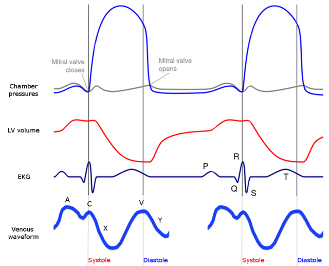
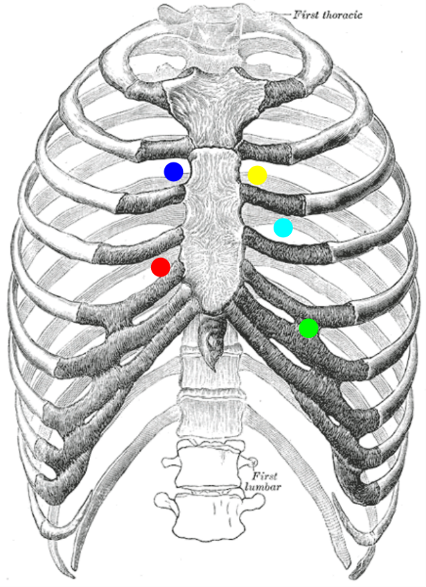

瓣膜性心臟病
Saturday, February 15, 2025
7:19 PM

- 心音
  - 基礎心音（Normal Heart Sounds）
    - S1（第一心音）「LUB」
      - 來源： 二尖瓣（Mitral Valve, MV） 與三尖瓣（Tricuspid Valve, TV） 的關閉
      - 發生時機： 心室收縮開始（Systole 的開始）
      - 聽診位置：
        - 心尖區（Apex, 第5肋間左鎖骨中線）最清楚
      - 強弱變化：
        - 增強： 高心搏量狀態（如發燒、貧血、甲亢）、二尖瓣狹窄
        - 減弱： 二尖瓣閉鎖不全、心室收縮無力、心包積液
    - S2（第二心音）「DUB」
      - 來源： 主動脈瓣（Aortic Valve, AV） 與肺動脈瓣（Pulmonary Valve, PV）的關閉
      - 發生時機： 心室舒張開始（Diastole 的開始）
      - 聽診位置：
        - 胸骨左緣第2肋間（肺動脈區）最清楚
      - 正常生理性分裂（Physiologic Split）：
        - 核心概念：正常情況下，吸氣時因肺血流增加，使肺動脈瓣（P2）關閉延遲，產生生理性分裂。 S2 分裂（A2→P2）
      - 異常變化：
        - 固定分裂（Fixed splitting of S2）：
          - 核心概念：吸氣與呼氣時的分裂程度相同，沒有隨呼吸改變。原因是左右心房間持續存在的分流，使肺循環血流量固定增加。
          - 典型病因：
            - Atrial Septal Defect (ASD)（房間隔缺損）
        - 寬分裂（Wide splitting of S2）：
          - 核心概念：吸氣和呼氣時皆可聽到明顯的 S2 分裂，吸氣時分裂更為明顯。主要是因為右心負荷增加，肺動脈瓣（P2）關閉顯著延遲，使分裂持續存在。
          - 常見病因：
            - Right Bundle Branch Block (RBBB)（右束支傳導阻滯）
            - Pulmonary Stenosis（肺動脈瓣狹窄）
            - Pulmonary Hypertension（肺動脈高壓）
        - 反轉分裂（Paradoxical Splitting of S2）：
          - 核心概念：正常情況下，吸氣時因肺血流增加，使肺動脈瓣（P2）關閉延遲，產生生理性分裂。反常性分裂則是在呼氣時出現分裂，而吸氣時反而消失，這是因為某些病理情況下，主動脈瓣（A2）關閉延遲，使其與肺動脈瓣的關閉時間重疊或錯位。反常性分裂通常與左心系統疾病相關，特別是會延遲主動脈瓣關閉的狀況。
          - 常見病因：
            - Left Bundle Branch Block (LBBB)（左束支傳導阻滯）
            - Aortic Stenosis (AS)（主動脈瓣狹窄）
            - Hypertrophic Cardiomyopathy（肥厚型心肌病變）
            - 人工心律調節器（Ventricular Pacing）導致左心收縮延遲
          - 聽診特徵：
            - 呼氣時聽到A2-P2分裂
            - 吸氣時因肺血回增加，P2延遲與A2重疊，使分裂消失
            - 最佳聽診點： 胸骨左緣第2肋間（肺動脈區）

- 額外心音（Extra Heart Sounds）
  - S3（第三心音）「LUB-DUB-ta」
    - 時機： 心室舒張早期（快速充盈期，在 S2 之後）
    - 機轉： 心室快速充盈時，心室壁因擴張或僵硬產生震動
    - 聽診位置： 心尖區（左側臥位時更清楚），用鈍頭聽診器
    - 臨床意義：
      - 生理性（青少年、運動員、妊娠婦女）
      - 病理性（心衰竭、擴張型心肌病、二尖瓣閉鎖不全）
    - 記憶法： 「Kentucky」節奏（S1-S2-S3）
  - S4（第四心音） — 「ta-LUB-DUB」
    - 時機： 心室舒張末期（心房收縮期，在 S1 之前）
    - 機轉： 心房收縮將血液推入僵硬的心室，產生震動
    - 聽診位置： 心尖區（左側臥位），用鈍頭聽診器
    - 臨床意義：
      - 病理性（左心室肥厚、主動脈瓣狹窄、高血壓心臟病、心肌缺血）
      - 不會出現在心房顫動（Atrial Fibrillation， AF）患者，因為缺乏心房收縮
    - 記憶法： 「Tennessee」節奏（S4-S1-S2）
| 心音/雜音          | 病理意義                                  | 聽診區域 |
|--------------------|-------------------------------------------|----------|
| Opening Snap       | 僧帽瓣狹窄（Mitral Stenosis）             | 心尖區   |
| Ejection Click     | 主動脈瓣或肺動脈瓣狹窄、二葉瓣畸形        | 胸骨上緣 |
| Mid-systolic Click | 僧帽瓣脫垂（Mitral Valve Prolapse, MVP）  | 心尖區   |
| Pericardial Knock  | 限制型心包炎（Constrictive Pericarditis） | 胸骨左緣 |
| Friction Rub       | 心包炎（Pericarditis）                    | 胸骨左緣 |

- Heart murmur 心雜音
  - Heart Murmur（心雜音） 是心臟血流經過瓣膜或心腔時產生的紊流（Turbulent Flow）所引起的額外聲音，常在心臟聽診時以「吹拂音（Blowing）」、「粗糙音（Harsh）」或「機械音（Machinery-like）」等形式呈現。心雜音可以是生理性（無害）或病理性（與心血管疾病相關）。
# 
- 雜音強度分級（Levine Scale, 6 級制）
| 等級      | 特徵                             |
|-----------|----------------------------------|
| Grade I   | 非常微弱，需專心聽診才聽得見     |
| Grade II  | 較清楚但仍屬輕度，容易聽到       |
| Grade III | 中等強度，無震顫                 |
| Grade IV  | 強烈，伴隨可觸摸的震顫（Thrill） |
| Grade V   | 震顫明顯，輕放聽診器即可聽見     |
| Grade VI  | 無需聽診器緊貼皮膚，也可聽見     |

- Heart murmur介紹
| 類型                            | 發生時機           | 可能原因                         |
|---------------------------------|--------------------|----------------------------------|
| Systolic Murmur（收縮期雜音）   | S1 → S2            | 瓣膜狹窄、閉鎖不全等             |
| Diastolic Murmur（舒張期雜音）  | S2 → S1            | 瓣膜狹窄或閉鎖不全（通常病理性） |
| Continuous Murmur（連續性雜音） | 整個心週期持續出現 | PDA 等先天性心臟病               |
# 
- 常見心雜音詳解
  - 收縮期雜音（Systolic Murmur）
    - S1與S2之間發生，可能是瓣膜狹窄或閉鎖不全。
| 疾病                            | 雜音特徵                                  | 聽診位置            | 輻射方向     |
|---------------------------------|-------------------------------------------|---------------------|--------------|
| Aortic Stenosis (AS)            | 粗糙的噴射性雜音（Crescendo-Decrescendo） | 胸骨右緣第 2 肋間   | 頸部、頸動脈 |
| Pulmonary Stenosis (PS)         | 粗糙噴射性雜音                            | 胸骨左緣第 2 肋間   | 左肩         |
| Mitral Regurgitation (MR)       | 持續性吹拂音（Holosystolic/Pansystolic）  | 心尖區（Apex）      | 左腋下       |
| Tricuspid Regurgitation (TR)    | 持續性吹拂音（呼吸時變化明顯）            | 胸骨左緣第 4-5 肋間 | 右胸部或劍突 |
| Mitral Valve Prolapse (MVP)     | 中期收縮期點擊音（Mid-systolic Click）    | 心尖區              | 無特定輻射   |
| Ventricular Septal Defect (VSD) | 強烈粗糙的全收縮期雜音                    | 胸骨左緣第 4-5 肋間 | 全胸腔範圍   |

- 舒張期雜音（Diastolic Murmur）
  - S2與S1之間發生，通常為病理性，提示瓣膜狹窄或閉鎖不全。
| 疾病                         | 雜音特徵                                               | 聽診位置            | 輻射方向                      |
|------------------------------|--------------------------------------------------------|---------------------|-------------------------------|
| Aortic Regurgitation (AR)    | 高頻遞減性吹拂音（Decrescendo Blowing）                | 胸骨左緣第 3 肋間   | 心尖區（Austin Flint murmur） |
| Pulmonary Regurgitation (PR) | 遞減性吹拂音                                           | 胸骨左緣第 2 肋間   | 無特定輻射                    |
| Mitral Stenosis (MS)         | 低頻隆隆音（Opening Snap 後的 Mid-Diastolic Rumbling） | 心尖區              | 無特定輻射                    |
| Tricuspid Stenosis (TS)      | 低頻隆隆音                                             | 胸骨左緣第 4-5 肋間 | 無特定輻射                    |

- 連續性雜音（Continuous Murmur）
  - 聽診時整個心週期（收縮期與舒張期）都能聽見。
| 疾病                           | 雜音特徵                               | 聽診位置          |
|--------------------------------|----------------------------------------|-------------------|
| Patent Ductus Arteriosus (PDA) | 機械般的連續性雜音（Machinery Murmur） | 胸骨左緣第 2 肋間 |
| Arteriovenous Fistula          | 低頻連續性雜音                         | 依位置不同        |
| Coarctation of the Aorta       | 背部可聽到連續性雜音                   | 肩胛間區          |
### 
- 心音的變化
  - 呼吸變化：
    - 吸氣時增強： 吸氣時，橫膈下降、胸腔內壓降低 → 增加靜脈回流 → 右心血液增加 → 右心相關雜音增加（如 TR、PS）
    - 呼氣時增強： 呼氣時，橫膈上升、胸腔內壓回升 → 增加肺靜脈回流，更多血液回流到左心房 → 左心室充血量增加 → 左心相關雜音增加（如 MR、AS、AR、MS）
  - Valsalva Maneuver：
    - 用力閉氣 → 胸腔內壓上升 → 靜脈回流受阻 → 心室充血量減少。
    - 大部分雜音減弱，因血流減少導致湍流減少。
    - 例外：
      - Hypertrophic Cardiomyopathy（HCM）： 心室腔室變小 → 動態性流出道阻塞加重 → 雜音變大聲。
      - Mitral Valve Prolapse（MVP）： 心室腔變小 → 二尖瓣脫垂更早發生 → 雜音變大聲。
  - 體位改變：
    - 蹲下（Squatting）/抬腳： 增加靜脈回流 → 大部分雜音變大聲，但Hypertrophic Cardiomyopathy（HCM）充血量增加 → 心室腔室擴大 → 流出道阻塞減少 → 雜音變小聲、Mitral Valve Prolapse（MVP）左心室腔擴大 → 脫垂延後 → 雜音變小聲
    - 站立： 靜脈回流減少 → 大部分雜音減弱，但HCM和MVP因心室腔室變小 → 雜音變大聲
  - 握拳運動（Handgrip Exercise）：
    - 周邊血管阻力（Afterload）增加 → 左心壓力增加 → 心室內血流量增加
      - MR、AR、VSD 雜音變大聲（左心或分流相關）
      - HCM 雜音變小聲（左心室流出道壓力減少）
      - MVP： 影響不明顯，但部分情況下可延遲脫垂發生
  - 藥物測試：
    - Amyl Nitrite： 降低血管阻力 → MR 減弱、HCM 增強

- 心雜音重點整理
| 情境                             | 生理變化                              | 影響的雜音                             |
|----------------------------------|---------------------------------------|----------------------------------------|
| 吸氣（Inspiration）              | ↑ 靜脈回流 → ↑ 右心血流量             | 右心雜音變大聲（如 TR、PS、ASD）       |
| 吐氣（Expiration）               | ↑ 左心血流量                          | 左心雜音變大聲（如 MR、MS、AS、AR）    |
| Valsalva maneuver                | ↓ 靜脈回流 → ↓ 心室充血量             | 大部分雜音變小聲；但HCM、MVP雜音變大聲 |
| 站立（Standing）                 | ↓ 靜脈回流 → ↓ 心室充血量             | 大部分雜音變小聲；但HCM、MVP雜音變大聲 |
| 蹲下/抬腳（Squatting/Leg raise） | ↑ 靜脈回流 → ↑ 心室充血量             | 大部分雜音變大聲；但HCM、MVP雜音變小聲 |
| 握拳運動（Handgrip exercise）    | ↑ 周邊阻力（↑ Afterload）→ ↑ 左心壓力 | MR、AR、VSD 雜音變大聲；HCM 雜音變小聲 |
| 操作                 | 大部分雜音    | HCM 雜音 | MVP 雜音 |
|----------------------|---------------|----------|----------|
| 吸氣                 | 右心雜音↑     | \-       | \-       |
| 吐氣                 | 左心雜音↑     | \-       | \-       |
| Valsalva             | ↓             | ↑        | ↑        |
| 站立                 | ↓             | ↑        | ↑        |
| 蹲下/抬腳            | ↑             | ↓        | ↓        |
| 握拳運動（Handgrip） | ↑（左心雜音） | ↓        | \-       |

- 動脈壓脈搏(Arterial pressure pulse)
  - 動脈壓脈搏（Arterial Pressure Pulse） 是指心臟每次收縮所產生的壓力波，經由動脈傳導到全身，形成可觸摸到的脈搏。它反映了心臟泵血功能、血管彈性以及血液動力學的變化。
<table>
<colgroup>
<col style="width: 17%" />
<col style="width: 20%" />
<col style="width: 14%" />
<col style="width: 47%" />
</colgroup>
<thead>
<tr class="header">
<th>脈搏名稱</th>
<th>可見特徵</th>
<th>生理/病理意義</th>
<th>代表疾病</th>
</tr>
</thead>
<tbody>
<tr class="odd">
<td>Normal Pulse</td>
<td>上升快速 → 最高點 → 平緩下降</td>
<td>
正常血流動力學

</td>
<td></td>
</tr>
<tr class="even">
<td>Pulsus Tardus</td>
<td>動脈搏動延遲且緩慢上升</td>
<td>收縮期阻力增加 → 血流受阻</td>
<td>Aortic Stenosis（AS）</td>
</tr>
<tr class="odd">
<td>Pulsus Parvus</td>
<td>動脈搏動振幅減少（amplitude↓）</td>
<td>心輸出量減少</td>
<td>Aortic Stenosis（AS）</td>
</tr>
<tr class="even">
<td>Pulsus Parvus et Tardus</td>
<td>振幅減少+延遲上升</td>
<td>重度 Aortic Stenosis</td>
<td>Severe AS</td>
</tr>
<tr class="odd">
<td>Pulsus Bisferiens</td>
<td>收縮期出現雙波峰（兩個脈衝）</td>
<td>快速射血後，再次湧現血流</td>
<td>Aortic Regurgitation（AR）、Hypertrophic Cardiomyopathy（HCM）</td>
</tr>
<tr class="even">
<td>Bounding Pulse</td>
<td>動脈搏動快速上升且振幅大（跳動感強）</td>
<td>Stroke Volume↑ 或周邊血管阻力↓</td>
<td>Aortic Regurgitation（AR）、Patent Ductus Arteriosus（PDA）</td>
</tr>
<tr class="odd">
<td>
Water-Hammer Pulse/

Corrigan's pulse
</td>
<td>動脈搏動快速上升後快速下降（急速下墜感）</td>
<td>大量血液回流 → 快速壓力釋放</td>
<td>Aortic Regurgitation（AR）</td>
</tr>
<tr class="even">
<td>Pulsus Paradoxus</td>
<td>吸氣時收縮壓下降超過 10 mmHg</td>
<td>心包壓迫或右心負荷增加</td>
<td><ul>
<li>
心包填塞（Cardiac Tamponade）
</li>
<li>
張力性氣胸（Tension Pneumothorax）
</li>
<li>
嚴重哮喘或慢性阻塞性肺病（COPD）
</li>
</ul></td>
</tr>
<tr class="odd">
<td>Pulsus Alternans</td>
<td>脈搏節律規則，但強弱交替變化（一強一弱）</td>
<td>左心室功能嚴重受損 → 射出率不穩定</td>
<td>Left Heart Failure（心衰竭）</td>
</tr>
<tr class="even">
<td>Dicrotic Pulse</td>
<td>舒張期出現第二波脈衝（低壓時反彈）</td>
<td>外周阻力低或心搏出量減少</td>
<td>Sepsis、Severe Heart Failure</td>
</tr>
<tr class="odd">
<td>Anacrotic Pulse</td>
<td>上升緩慢，伴隨收縮期波頂前的小凹陷（notch）</td>
<td>血流受阻且左心室收縮力降低</td>
<td>Severe Aortic Stenosis</td>
</tr>
<tr class="even">
<td>Collapsing Pulse</td>
<td>快速上升且急速下降（類似 Water-Hammer）</td>
<td>大量回流 → 壓力迅速釋放</td>
<td>Aortic Regurgitation（AR）</td>
</tr>
</tbody>
</table>

- 頸靜脈波形
  - 頸靜脈壓波形（Jugular Venous Pulse, JVP） 是反映右心房壓力變化的間接指標。由於頸內靜脈與右心房之間沒有瓣膜阻隔，心房內的壓力變化可以直接傳遞到頸靜脈，形成特有的波形。評估右心功能、心包疾病、以及血液動力學狀態。

<table>
<colgroup>
<col style="width: 16%" />
<col style="width: 23%" />
<col style="width: 28%" />
<col style="width: 32%" />
</colgroup>
<thead>
<tr class="header">
<th>
Wave/

Des

cent
</th>
<th>成因</th>
<th>心臟週期階段</th>
<th>臨床意義</th>
</tr>
</thead>
<tbody>
<tr class="odd">
<td>a wave</td>
<td>右心房收縮 → 血液推向右心室</td>
<td>心房收縮期 (Atrial systole)</td>
<td>- 增大：肺高壓、三尖瓣狹窄（TS）、右心室肥厚 
- 消失：心房顫動（Atrial Fibrillation，Af）</td>
</tr>
<tr class="even">
<td>c wave</td>
<td>三尖瓣隆起（因右心室等容收縮）</td>
<td>等容收縮期 (Isovolumetric contraction)</td>
<td>- 輕微波動，部分受頸動脈搏動干擾</td>
</tr>
<tr class="odd">
<td>x descent</td>
<td>心室收縮期間右心房放鬆與下移</td>
<td>心室收縮期 (Ventricular systole)</td>
<td>- 加深：心包填塞時變淺 
- 正常情況下為深谷</td>
</tr>
<tr class="even">
<td>v wave</td>
<td>三尖瓣關閉時，靜脈血液回流累積於右心房</td>
<td>心室後期收縮期 (Late systole)</td>
<td>- 增大：三尖瓣閉鎖不全（TR）</td>
</tr>
<tr class="odd">
<td>y descent</td>
<td>三尖瓣打開 → 血液流向右心室</td>
<td>心室舒張早期 (Early diastole)</td>
<td>- 快速下降：縮窄性心包炎（Constrictive Pericarditis） 
- 緩慢下降：心包填塞（Cardiac Tamponade）</td>
</tr>
</tbody>
</table>

- 瓣膜性心臟病定義：
  - Valvular Heart Disease（心臟瓣膜疾病） 是指心臟四個瓣膜（Aortic valve、Mitral valve、Tricuspid valve、Pulmonary valve）出現結構或功能異常，導致血流受阻（Stenosis, 狹窄）或血液逆流（Regurgitation, 閉鎖不全）。這會進一步引起心室負荷增加、心臟擴大、心衰竭等併發症。

- Aortic Valve Disease（主動脈瓣疾病）： 最常見的瓣膜疾病之一
  - Aortic Stenosis (AS, 主動脈瓣狹窄)
    - 病因：
      - 鈣化性退化（老年人最常見）
      - 先天性二葉瓣（Bicuspid aortic valve）
      - 風濕性心臟病（Rheumatic fever）
    - 病理生理：
      - 左心室需產生更大壓力以克服阻力（afterload增加） → 左心室肥厚 → 最終心衰竭
      - LV systolic pressure 大於 aortic systolic pressure
    - 臨床表現：
      - 經典三徵（Angina, Syncope, Heart Failure）
| **症狀** | **原因**                     |
|----------|------------------------------|
| 心絞痛   | 心肌需氧↑ 但供血受限         |
| 昏厥     | 運動時心輸出量不足 → 腦灌流↓ |
| 心衰竭   | 慢性後負荷↑ → LV功能惡化     |
- 心雜音：
  - 胸骨右緣第 2 肋間聽到粗糙的收縮期雜音（Systolic Crescendo-Decrescendo），向頸動脈放射。
  - S2 單一或矛盾性分裂（paradoxical split）。
  - 重度AS：S2 消失或變柔。
- Pulsus parvus et tardus（重度AS）
- 診斷： 心臟超音波（Echocardiography）評估瓣膜面積與壓力梯度
- 治療：
  - 無症狀 → 觀察追蹤，藥物緩解症狀（如利尿劑）
  - 有症狀或重度狹窄 → 外科瓣膜置換（SAVR）或經導管瓣膜置換術（TAVR）
- Aortic Regurgitation (AR, 主動脈瓣逆流)
  - 病因：
    - 急性：感染性心內膜炎（IE）、主動脈剝離（Dissection）、外傷、心肌梗塞
    - 慢性：馬凡氏症（Marfan syndrome）、梅毒、風濕性心臟病、瓣膜退化
  - 病理生理：
    - 心舒期血液逆流至左心室（LV的preload和stroke volume增加） → 容量負荷增加 → 左心室擴大
  - 臨床表現：
    - 急性 AR：肺水腫、心源性休克、嚴重呼吸困難
    - 慢性 AR：逐漸惡化的呼吸困難、仰臥時心悸感、夜間陣發性呼吸困難
    - 心雜音：
      - 聽診時患者應坐起、前傾、吐氣屏氣，可在左胸骨緣聽到早期吹氣樣舒張期雜音（Early blowing diastolic murmur）Austin Flint murmur：心尖部中舒張期雜音（因逆流壓迫二尖瓣）
    - 脈壓擴大（Wide pulse pressure）
      - de Musset sign（頭部隨脈搏擺動）
      - Corrigan sign（Water-hammer pulse）
      - Duroziez sign（股動脈雜音）
    - 低舒張壓
      - 血液回流到左心室導致低舒張壓（Low diastolic BP）
      - 正常120/80 → 120/40
  - 診斷：心臟超音波（Echocardiogarphy）確認逆流程度與左心室功能
  - 治療：
    - 血管擴張劑（如 ACEI、Nifedipine）降低後負荷
    - 症狀嚴重 → 瓣膜置換術
    - 急性 AR：需緊急手術

- Mitral Valve Disease（僧帽瓣疾病）：亞洲地區常見風濕性病變
  - Mitral Stenosis (MS, 僧帽瓣狹窄)
    - 病因：
      - 風濕性心臟病（最主要病因）
    - 病理生理：
      - 左心房壓力上升 → 左心房擴大 → 心房顫動（Atrial Fibrillation, AF） & 肺高壓
      - LA pressure 大於 LV diastolic pressure（mitral valve stiff，左心房需要更用力把血擠到左心室）
    - 臨床表現：
      - 肺鬱血症狀：呼吸困難、仰臥呼吸困難（Orthopnea）、夜間陣發性呼吸困難、咳血（Hemoptysis）
      - 左心房擴大併發症：心房顫動（Atrial Fibrillation，AF）、聲音沙啞（壓迫喉返神經）、吞嚥困難（壓迫食道）
      - 心雜音：
        - 心尖區聽到舒張期低頻隆隆音（Mid-diastolic Rumbling Murmur），常伴有Opening Snap，o**pening snap 發生越早 → 狹窄越嚴重（可列為病情評估依據）**
    - 診斷： 心臟超音波
    - 治療：
      - 抗心律不整藥物（β-blockers, digoxin, CCBs）控制心房顫動
      - 抗凝治療（如 Warfarin）以預防血栓
      - 嚴重者： 經皮氣球擴張術（PBMV）或瓣膜置換（若嚴重狹窄）
  - Mitral Regurgitation (MR, 僧帽瓣逆流)
    - 病因：
      - 慢性 MR：風濕性心臟病、二尖瓣脫垂（Mitral Valve Prolapse, MVP）、心內膜炎
      - 急性 MR：乳頭肌斷裂（心肌梗塞後）、腱索斷裂、外傷
    - 病理生理：
      - 心收縮期血液逆流至左心房 → 容量負荷增加 → 左心房擴大
    - 臨床表現：
      - 慢性：呼吸困難、夜間陣發性呼吸困、疲勞
      - 急性：肺水腫、休克
      - 心雜音：
        - S3心音（左心室容量負荷增加）
        - 心尖區聽到全收縮期雜音（Holosystolic Murmur），向左腋下放射
    - 診斷：心臟超音波評估逆流程度，心導管評估嚴重程度與冠狀動脈狀況（特別是術前評估）。
    - 治療：
      - 藥物治療：ACEIs/ARBs 降低後負荷，利尿劑緩解肺鬱血
      - 控制心律不整：β-blockers、抗凝劑
      - 瓣膜修補或置換術：適用於嚴重 MR

- Tricuspid Valve Disease（三尖瓣疾病）
  - Tricuspid Regurgitation (TR, 三尖瓣逆流)
    - 病因：
      - 少量三尖瓣逆流（Tricuspid Regurgitation, TR）在正常生理情況下是可以接受的，這被稱為生理性三尖瓣逆流（Physiologic TR）
      - 右心擴大（最常見）、肺高壓、感染性心內膜炎（IV drug users 常見）、Carcinoid、Ebstein anomaly
    - 臨床表現：
      - 右心衰竭（Right Heart Failure）症狀：頸靜脈怒張（JVD）、肝腫大（Hepatomegaly）、腹水（Ascites）、下肢水腫（Peripheral edema）
      - 心雜音： 胸骨左下緣聽到收縮期雜音（Holosystic murmur），吸氣時加重（Carvallo's sign）
    - 治療：
      - 控制肺高壓、利尿劑減輕症狀
      - 嚴重者考慮外科修補/置換瓣膜
  - Tricuspid stenosis（少考）
    - 病因：
      - 罕見的瓣膜疾病，多與風濕性心臟病（Rheumatic Heart Disease, RHD）併發二尖瓣疾病（Mitral Valve Disease）相關，常與二尖瓣狹窄（Mitral Stenosis, MS）共存
    - 臨床表現：
      - 右心衰竭（Right Heart Failure）症狀：頸靜脈怒張（JVD）、肝腫大（Hepatomegaly）、腹水（Ascites）、下肢水腫（Peripheral edema）
      - 心雜音：左下胸骨緣舒張期雜音（Diastolic Murmur）

- Pulmonary Valve Disease（肺動脈瓣疾病）（少考）
  - Pulmonary Stenosis (PS, 肺動脈瓣狹窄)
    - 病因：
      - 先天性心臟病（最常見）
    - 臨床表現：
      - 右心衰竭症狀（JVD、肝腫大、下肢水腫）
      - 胸骨左上緣聽到收縮期雜音
    - 治療：
      - 嚴重狹窄者進行經皮氣球擴張術
  - Pulmonary Regurgitation (PR, 肺動脈瓣逆流)
    - 病因：
      - 肺高壓、感染性心內膜炎、瓣膜退化
    - 臨床表現：
      - 胸骨左緣聽到舒張期遞減型雜音
      - 右心衰竭症狀
    - 治療：
      - 控制肺高壓、必要時瓣膜置換

- 重點：
| **疾病**             | **心雜音類型**               | **病因**                       | **治療方式**         |
|----------------------|------------------------------|--------------------------------|----------------------|
| Aortic Stenosis      | 收縮期 Crescendo-Decrescendo | 鈣化退化、二葉瓣、風濕性       | TAVR/SAVR            |
| Aortic Regurgitation | 舒張期遞減型雜音             | 馬凡氏症、內膜炎、升主動脈擴張 | 血管擴張劑、瓣膜置換 |
| Mitral Stenosis      | 舒張期隆隆音 + Opening Snap  | 風濕性心臟病                   | PBMV/瓣膜置換        |
| Mitral Regurgitation | 全收縮期雜音（向腋下放射）   | MVP、乳頭肌功能障礙、內膜炎    | 瓣膜修補/置換        |
- 心尖區雜音 → 多半與僧帽瓣有關
- 胸骨右上緣 → 主動脈瓣問題
- 胸骨左下緣 → 三尖瓣問題
- 胸骨左上緣 → 肺動脈瓣問題

- 人工心臟瓣膜（Prosthetic Heart Valves）
  - 人工瓣膜主要分為機械瓣膜（Mechanical Valves）與生物瓣膜（Bioprosthetic Valves），兩者在耐用性、血栓風險、抗凝需求等方面各有優缺點。

| 特性       | 機械瓣膜                          | 生物瓣膜                        |
|------------|-----------------------------------|---------------------------------|
| 耐用性     | 20–30 年                          | 10–15 年                        |
| 血栓風險   | 高（需終生抗凝）                  | 低（大多不需長期抗凝）          |
| 抗凝治療   | 終生需使用Warfarin（INR 2.0–3.5） | 3–6 個月 Warfarin，之後 Aspirin |
| 適用族群   | \<50 歲，需長期抗凝者             | \>65 歲，無法長期使用抗凝者     |
| 再手術風險 | 低                                | 高                              |

REFERENCE：
- HARRISON Principles of Internal Medicine 20th Edition
- Boards & Beyonds：Heart sounds，heart murmur，valvular heart disease
- First aid STEP 2 CK
- <https://commons.wikimedia.org/wiki/File:Wiggers_diagram_with_jugular_venous_waveform.png>
- <https://commons.wikimedia.org/w/index.php?search=heart+murmur&title=Special:MediaSearch&type=image>

