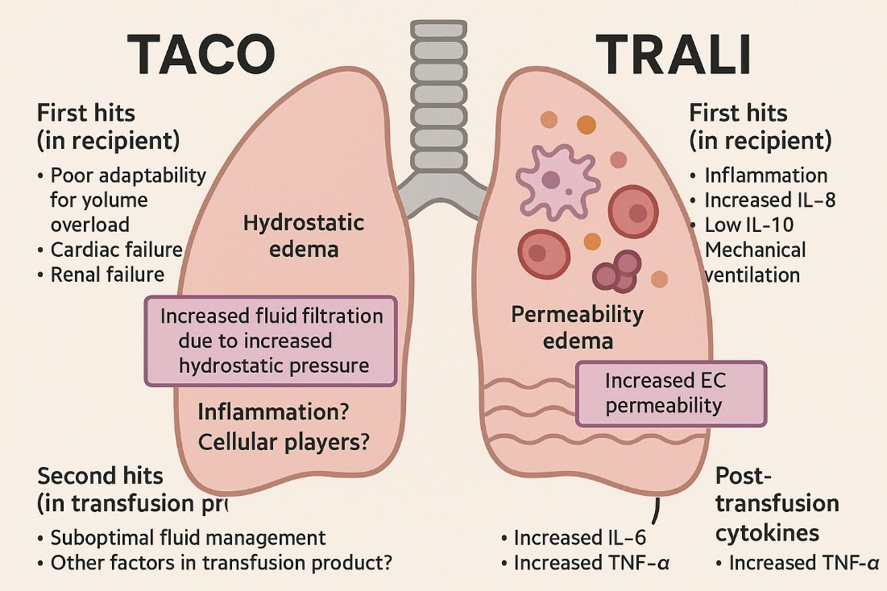

AM

- 編輯格式
  - 顏色註記方式
    - 重要標題 : 母標題藍色(最暗)標記/子標題藍色(較暗,25%)標記
    - 重要術式治療藥物 : **綠色標記+粗體**
    - 重要內文 : 紅色(標準色彩)/**橘色+粗體(橘色那一欄第一個)**(如果同色太醜就紅橘相間)
    - 直接來複製顏色格式一定不會錯xd
- 定義
  - Transfusion-Related Acute Lung Injury，簡稱 TRALI 是一臨床症候群，屬於非心源性肺水腫，定義為輸注含血漿的血液製品後 6小時內，出現急性肺損傷（ALI）的症狀。特徵包括：
    - 急性呼吸困難
    - 低氧血症
    - 胸部 X 光顯示雙側肺部浸潤
- 病因
  - TRALI是因輸血引起的瀰漫性肺損傷所導致，其致病原因可用二次打擊模型(Two-hit Model) 來解釋：
    - 第一次打擊(Baseline) :
      - 慢性酒精濫用、休克、肝臟手術、吸煙、機械通氣時較高的氣道壓力、血管內體液正平衡、低IL-10水平，以及全身性發炎。
    - 第二次打擊(輸血相關因素)
      - 抗白血球抗體（約80%的病例）: Anti-HLA class I、Anti-HLA class II以及Anti-HNA抗體
      - 非抗體因素（約20%的病例) : 脂質介質、細胞外囊泡和老化血細胞
    - **透過第一次打擊，使白血球聚集於肺部血管。於第二次打擊時，造成嚴重發炎反應，使肺部微血管膜通透性上升**
- 診斷（2019 Canadian Consensus Conference）
<table>
<colgroup>
<col style="width: 17%" />
<col style="width: 82%" />
</colgroup>
<thead>
<tr class="header">
<th></th>
<th>說明</th>
</tr>
</thead>
<tbody>
<tr class="odd">
<td>Type 1 TRALI</td>
<td><ul>
<li>
輸血後6小時內急性發作
</li>
<li>
低血氧（PaO2/FiO2 ≤ 300或室內空氣下SpO2 &lt; 90%）
</li>
<li>
影像學檢查（胸部X光、CT或超音波）顯示雙側肺水腫
</li>
<li>
無左心房高壓(LAH)證據(Non-cardiogenic)，即使存在LAH也非低血氧的主要原因
</li>
<li>
與其他ARDS風險因素無時間相關性
</li>
</ul></td>
</tr>
<tr class="even">
<td>
Type 2

TRALI
</td>
<td><ul>
<li>
符合TRALI type 1的前四項臨床標準
</li>
<li>
存在ARDS風險因素或輕度ARDS（P/F ratio : 200~300）
</li>
<li>
輸血前12小時內肺部狀態穩定
</li>
</ul></td>
</tr>
</tbody>
</table>
- 治療
  - 停止輸送可疑血品
  - 支持性治療，必要時使用機械通氣(參考ARDS治療)，並血液動力學穩定
  - 不建議常規使用類固醇，缺乏足夠臨床研究支持其效果

- 預後
  - 大多數患者在24-48小時內會改善
  - 通常是自限性疾病
  - 死亡率：
    - 重症患者的存活率約53%
    - 相較於一般急性肺損傷患者(存活率83%)明顯較低
- 預防策略
  - 使用男性或未妊娠女性的血液(懷孕使產生anti-HLA抗體機會增加)
  - 使用洗滌且新鮮的血品
  - 捐血者若有引起TRALI的病例應通報
- 與TACO(Transfusion-Associated Circulatory Overload)比較
<table>
<colgroup>
<col style="width: 33%" />
<col style="width: 40%" />
<col style="width: 25%" />
</colgroup>
<thead>
<tr class="header">
<th><strong>特徵</strong></th>
<th><strong>TRALI</strong></th>
<th><strong>TACO</strong></th>
</tr>
</thead>
<tbody>
<tr class="odd">
<td>病理機制</td>
<td>• 非心源性肺水腫 
• 抗體或非抗體介導的發炎反應 
• 肺部微血管通透性增加</td>
<td>• 心源性肺水腫 
• 體液過量 
• 左心房壓力升高</td>
</tr>
<tr class="even">
<td>臨床表現</td>
<td>• 輸血後6小時內發生 
• 雙側肺浸潤 
• 無左心房高壓證據 
• 可能出現發燒</td>
<td>• 循環負荷過重表現 
• 左心衰竭表現 
• 血壓可能升高</td>
</tr>
<tr class="odd">
<td>
CXR特徵(其實就是

non-cardiogenic vs

cardiogenic pulmonary

edema)
</td>
<td>• 雙側對稱性浸潤 
• 正常心臟大小 
• 無肺門充血 
• 無胸腔積液</td>
<td>• 雙側浸潤 
• 心臟擴大 
• 肺門充血 
• 可見胸腔積液 
• Kerley B線</td>
</tr>
<tr class="even">
<td>治療方式</td>
<td>• 支持性治療為主 
• 維持氧氣供應 
• 利尿劑無效</td>
<td>• 停止輸血 
• 使用利尿劑 
• 降低前負荷</td>
</tr>
<tr class="odd">
<td>預防策略</td>
<td>• 篩查高風險供血者 
• 優先使用男性供血者血漿 
• 避免多次妊娠女性血製品</td>
<td>• 控制輸血速度 
• 監測輸血量 
• 評估心功能狀態</td>
</tr>
<tr class="even">
<td>預後</td>
<td>• 24-48小時內可能改善 
• 重症患者存活率約53% 
• 通常為自限性</td>
<td>• 對治療反應較好 
• 及時處理預後良好 
• 取決於基礎心功能</td>
</tr>
</tbody>
</table>

- **參考資料**
  - Semple JW, Rebetz J, Kapur R. Transfusion-associated circulatory overload and transfusion-related acute lung injury. Blood. 2019 Apr 25;133(17):1840-1853. doi: 10.1182/blood-2018-10-860809
  - Tung JP, Chiaretti S, Dean MM, Sultana AJ, Reade MC, Fung YL. Transfusion-related acute lung injury (TRALI): Potential pathways of development, strategies for prevention and treatment, and future research directions. Blood Rev. 2022 May;53:100926. doi: 10.1016/j.blre.2021.100926
  - Goel R, Tobian AAR, Shaz BH. Noninfectious transfusion-associated adverse events and their mitigation strategies. Blood. 2019 Apr 25;133(17):1831-1839. doi: 10.1182/blood-2018-10-833988

