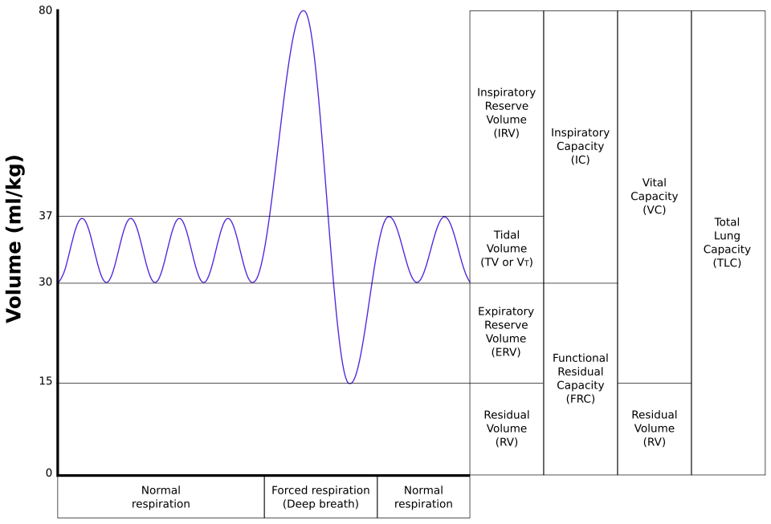
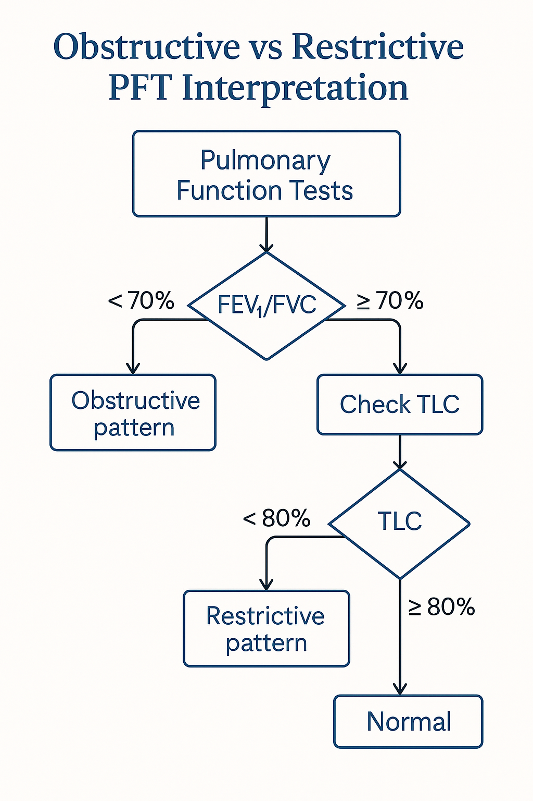

AM

- 編輯格式
  - 顏色註記方式
    - 重要標題 : 母標題藍色(最暗)標記/子標題藍色(較暗,25%)標記
    - 重要術式治療藥物 : **綠色標記+粗體**
    - 重要內文 : 紅色(標準色彩)/**橘色+粗體(橘色那一欄第一個)**(如果同色太醜就紅橘相間)
    - 直接來複製顏色格式一定不會錯xd

- 呼吸系統理學檢查（Physical Examination of the Respiratory System）
  - **視診（Inspection）**
    - 呼吸困難表現：呼吸急促、使用輔助呼吸肌（胸鎖乳突肌、斜角肌）
    - 無法用一口氣講完一句話：表示呼吸嚴重受限
    - 胸廓變形（如**重度脊柱後側彎 Kyphoscoliosis**）：提示限制性肺病（Restrictive physiology）
    - **杵狀指（Clubbing）**：常見於肺纖維化、肺癌、囊性纖維化（CF）
    - **發紺（Cyanosis）**：\>5 g/dL 還原血紅素，表示嚴重低氧血症
    - **水腫與頸靜脈怒張（JVD）**：顯示右心衰竭或肺心症（Cor Pulmonale）
  - **觸診（Palpation）**
    - **胸壁擴張對稱性**：
      - 方法：雙手大拇指放於胸後正中線，深吸時觀察對稱性擴張
      - 非對稱：提示單側肺病或通氣障礙
    - **語音震顫（Tactile Fremitus）**：
      - ↑（增強）：肺實變（Pneumonia）
      - ↓（減弱）：胸水或氣胸
    - **皮下氣腫（Subcutaneous Emphysema）**：
      - 摸到皮下氣泡，常見於氣胸或Barotrauma後
  - **叩診（Percussion）**
| **聽診音調**               | **意義**     |
|----------------------------|--------------|
| **鼓音（Hyperresonance）** | 氣胸、肺氣腫 |
| **濁音（Dullness）**       | 胸水、肺實變 |
| **叩診減弱但音調正常**     | 肺炎或纖維化 |
- **聽診（Auscultation）**
| **聽診音**                                 | **特徵說明**                                       | **常見疾病**                        |
|--------------------------------------------|----------------------------------------------------|-------------------------------------|
| **Wheezing（喘鳴）**                       | 喘音，主動期呼氣；多音性（Asthma）、單音性（腫瘤） | Asthma、COPD、CHF（周邊支氣管水腫） |
| **Rhonchi（濕哮）**                        | 中等氣道分泌物濃稠、咻咻聲                         | 急性支氣管炎、COPD、支氣管擴張症    |
| **Stridor（吸氣高音）**                    | 頸部聽得到，單音性，吸氣期音                       | 上呼吸道阻塞（如聲門水腫、異物）    |
| **Crackles（Rales）**                      | 吸氣時出現，有乾濕之分                             | 肺水腫（濕）、IPF（Velcro rales）   |
| **Bronchial breath sound**                 | 實變區出現氣管樣呼吸音                             | 肺炎（Lobar pneumonia）             |
| **Absent breath sounds**                   | 聽不到呼吸音                                       | 氣胸、胸水、大腫瘤、重度COPD        |
| **Egophony（共鳴音）**                     | 「EEE」變「AHH」                                   | 肺實變（如肺炎）                    |
| **Whispered pectoriloquy（低聲語音清晰）** | 小聲講話卻清楚可聽見                               | 肺實變                              |

- **呼吸系統三大組成（Three Functional Components）**
| **組成系統**                             | **功能說明**                               |
|------------------------------------------|--------------------------------------------|
| **肺（Lung）**                           | 含肺泡與氣道，是氣體交換的場所             |
| **神經肌肉系統（Neuromuscular system）** | 控制呼吸肌產生運動（主動）                 |
| **胸壁（Chest wall）**                   | 包含肋骨、胸肌、橫膈、腹部、心臟等（被動） |

- **靜態順應性與肺容積壓力關係（Static Compliance & Pressure-Volume Curve）**
  - **肺的特性（Lung）**
    - 肺靠**彈性回縮力（Elastic recoil pressure）**保持張開。
    - 肺在**低容積**時較具順應性（compliant），高容積時則**變硬（stiff）**。
    - 肺泡小氣道靠肺實質張力拉開；若肺容量降低 → 小氣道關閉 →**氣體滯留（gas trapping）**。
    - 肺氣腫與老化會**加劇氣體滯留**。
  - **胸壁的特性（Chest Wall）**
    - 胸壁**自然傾向外擴**，即使在大氣壓下也維持一定容積。
    - 在高容積時仍具有順應性，但當容積過小 → 肋骨壓迫、橫膈拉伸 →**順應性下降**。
    - 正常情況下，肺與胸壁形成一個**彈性張力平衡點（FRC）**。
  - **呼吸肌與胸壁互動（Respiratory Muscle Mechanics）**
    - 吸氣肌（如橫膈、肋間肌）產生**正向壓力**，推動肺擴張
    - 呼氣肌（如腹肌）產生**負向壓力**，協助呼氣
    - 各組肌肉壓力能力依肺容積變化（肌肉角度與長度）而異
    - 正常情況下，肌肉力量**足以推動整個呼吸系統從 RV→TLC**

- **肺容積與功能區（Lung Volumes）**

| **基本肺容積名稱** | **簡寫**                               | **定義**                     | **常見數值（成人）** |
|--------------------|----------------------------------------|------------------------------|----------------------|
| **潮氣容積**       | **TV (Tidal Volume)**                  | 每次安靜呼吸進出肺的氣體量   | 約 500 mL            |
| **吸氣儲備容積**   | **IRV (Inspiratory Reserve Volume)**   | 吸氣後再用力吸入的最大量     | 約 3000 mL           |
| **呼氣儲備容積**   | **ERV (Expiratory Reserve Volume)**    | 呼氣後再用力呼出的最大量     | 約 1100 mL           |
| **殘氣容積**       | **RV (Residual Volume)**               | 用力呼氣後肺內仍殘留之氣體量 | 約 1200 mL           |
| **肺容量名稱**     | **簡寫**                               | **臨床意義**                 | **組成**             |
| **肺總容量**       | **TLC**                                | 肺可容納的最大氣量           | TV + IRV + ERV + RV  |
| **肺活量**         | **VC (Vital Capacity)**                | 最大吸氣與呼氣間的容積       | TV + IRV + ERV       |
| **功能性殘氣量**   | **FRC (Functional Residual Capacity)** | 正常呼氣後肺內剩餘的氣體量   | ERV + RV             |
| **吸氣容量**       | **IC (Inspiratory Capacity)**          | 安靜呼氣後能吸入的最大氣體量 | TV + IRV             |

- **功能檢查（Pulmonary Function Testing）**
  - **區分阻塞性(Obstructive)與限制性(Restrictive)肺疾病**
  - **主要測量項目（Key PFT Parameters）**
| **名稱**               | **簡寫**     | **說明與意義**                                         |
|------------------------|--------------|--------------------------------------------------------|
| **肺活量**             | **VC / FVC** | 最大吸氣後完全呼氣之容量                               |
| **第一秒用力呼氣容積** | **FEV₁**     | 最大努力呼氣第一秒排出的氣體量                         |
| **FEV₁/FVC比值**       | \-           | 最常用於區分阻塞型肺病，正常約 \>70%                   |
| **肺總容量**           | **TLC**      | 吸氣至極限之最大肺容量（量測限制型疾病）               |
| **功能性殘氣量**       | **FRC**      | 正常呼氣後肺內剩餘空氣量（體積過度膨脹指標）           |
| **殘氣容積**           | **RV**       | 肺內無法排出的氣體，需特殊檢查才能測出                 |
| **氣體擴散能力**       | **DLCO**     | CO的單次吸氣法，用於評估氣體交換（如間質病變、肺氣腫） |

- **流程圖（Interpretation Algorithm）**
  - **先看 FEV₁/FVC 比值：**
    - **\< 70% → 阻塞型疾病**
      - **FEV₁ 減少幅度定義輕中重度**
      - **DLCO 減少 → 肺氣腫；正常或上升 → 氣喘**
    - **≥ 70% → 檢查 TLC：**
      - **TLC \< 80% → 限制型疾病**
        - **DLCO ↓ → 肺纖維化或肺血管病**
        - **DLCO 正常 → 肥胖、胸壁限制**
      - **TLC 正常 → 可能為正常肺功能或早期疾病**

- **若 DLCO 單獨下降 → 考慮：**
  - **肺泡壁病變（肺纖維化）**
  - **肺血管病變（肺高壓）**
  - **肺氣腫（表面積減少）**
  - **貧血（Hb 減少）**

- **疾病對照（PFT Patterns）**
| **疾病**                   | **FEV₁/FVC** | **TLC** | **DLCO** | **特殊變化**             |
|----------------------------|--------------|---------|----------|--------------------------|
| **Asthma**                 | ↓            | 正常或↑ | 正常或↑  | 可逆性氣流受限           |
| **COPD（Emphysema）**      | ↓            | ↑       | ↓        | 氣體交換表面積減少       |
| **Restrictive（ILD）**     | 正常或↑      | ↓       | ↓        | 肺彈性減少，氣體交換障礙 |
| **Obesity**                | 正常         | ↓       | 正常     | 胸壁限制型通氣障礙       |
| **Myasthenia Gravis**      | 正常         | ↓       | 正常     | 呼吸肌無力造成 TLC 降低  |
| **Pulmonary Hypertension** | 正常         | 正常    | ↓        | 僅 DLCO 下降             |

- **DLCO（Diffusing Capacity for Carbon Monoxide）定義：**
  - 單次吸氣少量一氧化碳，量測肺泡膜擴散與血紅素結合的能力
  - **影響因素：**
| **DLCO 下降**    | **DLCO 上升**                            |
|------------------|------------------------------------------|
| 肺氣腫、肺纖維化 | 肺出血、心衰（急性）、氣喘、紅血球過多症 |
| 肺高壓、貧血     | —                                        |

| **指標** | **正常參考** | **異常意義**           |
|----------|--------------|------------------------|
| FEV1/FVC | \>70%        | ↓ → Obstruction        |
| TLC      | 80–120%      | ↓ → Restriction        |
| DLCO     | \>75%        | ↓ → 間質性肺病、肺高壓 |

- **氣體擴散（Diffusion）**
  - **氧氣與二氧化碳**通過肺泡-微血管膜進行擴散。
  - 正常情況：
    - **肺泡面積大、膜厚度小**，擴散效率極高。
    - 紅血球在通過肺泡毛細血管的前1/3路程內即達到**完全氧合**。
  - **臨床重點**：
    - 正常情況下，氧氣與二氧化碳的交換是**灌流限制（Perfusion-limited）**，而非擴散限制。
    - 只有在以下情境會發生擴散限制（Diffusion-limited）：
      - 高海拔暴露
      - 極端運動（如高強度運動員）
      - 肺泡膜增厚（如間質性肺病 Interstitial Lung Disease, ILD）

- **通氣與灌流不均（Ventilation/Perfusion Mismatch）**
  - **正常情況（Normal V/Q）**
    - 單位肺泡之通氣（V）與灌流（Q）應相匹配（V/Q ≈ 0.8–1）。
    - 地心引力影響造成輕微V/Q變異（下肺通氣灌流較高）。
  - **典型異常型態（Abnormal V/Q Patterns）**
| **型態**              | **描述**                               | **臨床意義**                 |
|-----------------------|----------------------------------------|------------------------------|
| **高V/Q**             | 通氣正常，但灌流下降                   | 肺栓塞（Pulmonary Embolism） |
| **低V/Q**             | 灌流正常，但通氣下降                   | 肺炎、肺水腫、小氣道疾病     |
| **真正分流（Shunt）** | 無通氣（肺泡完全塌陷或充水）但仍有灌流 | ARDS、肺炎、肺水腫           |
| **死腔通氣增加**      | 通氣至無灌流區域                       | 肺栓塞、嚴重低血壓           |
- **補充氧氣的反應**
| **機制**  | **對氧氣補充反應**           |
|-----------|------------------------------|
| **低V/Q** | 有改善                       |
| **Shunt** | 效果不佳（血氧無法大幅上升） |

- **低血氧機轉（Mechanisms of Hypoxemia）**
| **機制**                                   | **特色**                      | **臨床代表**           |
|--------------------------------------------|-------------------------------|------------------------|
| **低吸入氧氣濃度（↓FiO₂）**                | 高海拔或吸入低氧氣體          | 高山症                 |
| **肺泡低通氣（Alveolar Hypoventilation）** | 通氣不足造成氧氣下降，CO₂上升 | 神經肌肉疾病、麻醉過度 |
| **V/Q 不均**                               | 通氣與灌流不匹配              | COPD、肺炎             |
| **Shunt**                                  | 無法改善的缺氧                | ARDS、重症肺炎         |
| **擴散障礙（Diffusion limitation）**       | 罕見，通常伴隨重症ILD         | 間質性肺病             |

- **典型呼吸系統生理異常（Respiratory Patterns in Diseases）**
| **疾病範例**                       | **生理異常**             | **PFT特徵**            | **DLCO變化**    |
|------------------------------------|--------------------------|------------------------|-----------------|
| **IPF（特發性肺纖維化）**          | 肺回縮力↑，通氣受限      | ↓TLC, ↓FVC, ↓RV        | ↓DLCO           |
| **中度肥胖症（Moderate Obesity）** | 胸壁外擴能力下降         | ↓FRC，TLC正常或稍↓     | 正常DLCO        |
| **重症Myasthenia Gravis**          | 呼吸肌無力，動作範圍受限 | ↓TLC，↑RV              | 正常DLCO        |
| **急性氣喘發作（Acute Asthma）**   | 小氣道狹窄               | ↓FEV1, ↓FEV1/FVC，↑Raw | 正常或輕微↑DLCO |
| **嚴重肺氣腫（Severe Emphysema）** | 肺回縮力↓，動態肺氣腫    | ↑TLC, ↑RV, ↓FEV1, ↓FVC | ↓DLCO           |

- **影像學檢查（Imaging Modalities）**
  - **胸部X光（Chest Radiography）**
| **項目**         | **說明**                                                       |
|------------------|----------------------------------------------------------------|
| **基本觀察方向** | PA + Lateral 是標準；臥位片用於重症病人（解析度差）            |
| **特殊角度**     | Lateral decubitus（判斷游離胸水）、Apical lordotic（上肺病灶） |
| **優點**         | 快速、普及；適合篩檢肺炎、肺水腫、氣胸等                       |
| **限制**         | 組織重疊多、解析度不高、心臟易放大（AP view）                  |

- **超音波（Ultrasound）**
| **用途**         | **說明**                                    |
|------------------|---------------------------------------------|
| **胸腔病灶定位** | 協助引導胸腔穿刺、引流、肺周邊病灶定位      |
| **橫膈功能**     | 可評估橫膈活動                              |
| **病灶評估**     | 快速診斷氣胸、胸水、肺鬱血（肺水腫B-lines） |
| **特色**         | 無輻射、可床邊操作（POCUS）、敏感度高於X光  |

- **核醫檢查（Nuclear Imaging）**
| **項目**     | **說明**                                         |
|--------------|--------------------------------------------------|
| **V/Q Scan** | 用於診斷肺栓塞（Perfusion缺損但Ventilation正常） |
| **輔助用途** | 評估手術後肺功能（如肺葉切除前）                 |
| **限制**     | 逐漸被CTPA取代；特異度有限，解釋須依臨床結合     |

- **電腦斷層（CT / MDCT）**
| **項目**                             | **說明**                                           |
|--------------------------------------|----------------------------------------------------|
| **CT用途**                           | 肺癌分期、肺間質病變（如UIP）、肺結節評估          |
| **MDCT**                             | 多切面、多偵測器 → 提高解析度、重建3D圖像          |
| **CTPA（CT Pulmonary Angiography）** | 肺栓塞檢查首選                                     |
| **Low-dose CT**                      | 肺癌篩檢（建議對象：55–80歲、30 pack-year 吸菸史） |

- **虛擬氣管鏡（Virtual Bronchoscopy）**
  - 利用CT重建支氣管路徑，可輔助定位、術前規劃
  - 可搭配導航系統（ENB）到達周邊肺結節

- **正子斷層（PET / PET-CT）**
<table>
<colgroup>
<col style="width: 25%" />
<col style="width: 74%" />
</colgroup>
<thead>
<tr class="header">
<th><strong>用途</strong></th>
<th><strong>說明</strong></th>
</tr>
</thead>
<tbody>
<tr class="odd">
<td><strong>肺癌分期</strong></td>
<td>利用高代謝率的[18F]-FDG示踪劑判斷惡性病灶、淋巴轉移</td>
</tr>
<tr class="even">
<td><strong>Hybrid PET/CT</strong></td>
<td>將代謝活動與解剖結構疊合 → 提高診斷精準度</td>
</tr>
<tr class="odd">
<td><strong>限制</strong></td>
<td>
小於1 cm 或低代謝腫瘤（如typical carcinoid）可能偽陰性

炎症或肉芽腫可能偽陽性
</td>
</tr>
</tbody>
</table>

- **核磁共振（MRI）**
  - **優點**：對軟組織解析度高，可用於胸壁侵犯、上肺溝腫瘤（Pancoast tumor）術前評估
  - **特殊應用**：不適用放射線者（孕婦、兒童）、使用超極化氣體研究COPD功能
  - **限制**：空間解析度差、檢查時間長、病人需配合良好、不適用金屬植入者

- **傳統肺動脈攝影（Pulmonary Angiography）**
  - 過去為肺栓塞診斷金標準，需導管注射顯影劑
  - 現已多由**CTPA**取代，僅限於特殊疑難病例

- **侵入性診斷技術（Invasive Diagnostic Techniques）**
  - **血液檢查（Serologic Testing）**
    - 評估系統性疾病（如結締組織病）是否影響肺部
    - α1-antitrypsin 缺乏診斷早發性肺氣腫
    - 基因檢測可辨識CF、遺傳性支氣管擴張症等

- **痰液檢查（Sputum Analysis）**
| **種類**                     | **說明**                                       |
|------------------------------|------------------------------------------------|
| **誘導痰（Induced sputum）** | 利用高張鹽水霧化誘發，適合評估PJP              |
| **常見應用**                 | 細菌、黴菌、分枝桿菌（TB）、病毒、惡性細胞檢查 |

- **經皮針吸（Percutaneous Needle Aspiration）**
  - CT或超音波導引穿刺肺結節或胸壁病灶
  - 可得細胞學/組織學診斷
  - 風險：少數造成氣胸或出血

- **胸腔穿刺（Thoracentesis）**
  - 針對胸腔積液做細胞、化學、培養、細菌染色分析
  - 可作為**診斷**與**緩解性抽液**用

- **支氣管鏡（Bronchoscopy）**
| **類別**                                    | **說明**                                            |
|---------------------------------------------|-----------------------------------------------------|
| **Flexible Fiberoptic Bronchoscopy**        | 可進行洗液（BAL）、刷檢（brushing）、活檢（biopsy） |
| **Transbronchial Biopsy (TBBx)**            | 取得肺泡組織，用於間質性肺病或周邊病灶              |
| **Transbronchial Needle Aspiration (TBNA)** | 經氣管壁針吸淋巴結，評估肺癌分期                    |
| **EBUS-TBNA**                               | 超音波導引針吸，實時定位→取樣精準                   |
| **Radial Probe EBUS (RP-EBUS)**             | 增加對周邊肺結節之診斷率，可結合ENB導航             |

- **新興支氣管內視技術（Emerging Endobronchial Tools）**
| **技術**                                | **特點**                     |
|-----------------------------------------|------------------------------|
| **Autofluorescence Bronchoscopy (AFB)** | 偵測癌前病變                 |
| **Narrow Band Imaging (NBI)**           | 提高血管顯影，區辨惡性病變   |
| **Optical Coherence Tomography (OCT)**  | 細胞層級斷層影像（高解析度） |
| **Confocal Laser Microscopy (CFM)**     | 即時高解析顯微影像，近似活檢 |

- **胸腔內視鏡（Medical Thoracoscopy / Pleuroscopy）**
  - 可視化胸膜表面，取得活檢、放置胸管或執行**胸膜固定術（pleurodesis）**
  - 不需全身麻醉，適合惡性胸水患者

- **胸腔手術性檢查（Surgical Diagnostic Techniques）**
| **技術**                                         | **說明**                                     |
|--------------------------------------------------|----------------------------------------------|
| **Mediastinoscopy**                              | 取樣2R/4R等縱膈前方淋巴結，肺癌分期用        |
| **Mediastinotomy（Chamberlain procedure）**      | 取樣5/6區塊淋巴結                            |
| **VATS（Video-Assisted Thoracoscopic Surgery）** | 微創手術，可進行肺活檢、肺葉切除、胸膜處理   |
| **Thoracotomy**                                  | 傳統開胸手術，適用於深部或靠近重要結構之病灶 |

<https://commons.wikimedia.org/wiki/File:Lungvolumes.svg>
