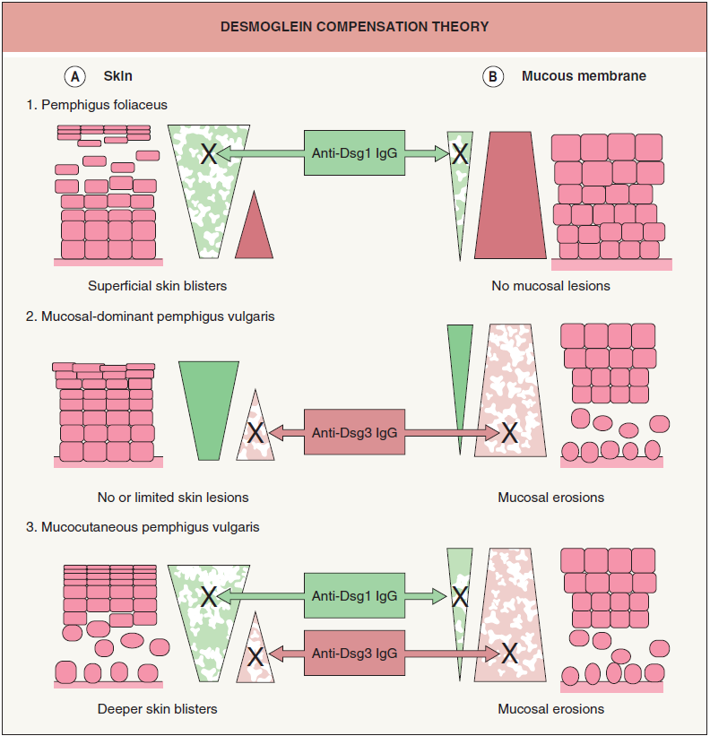
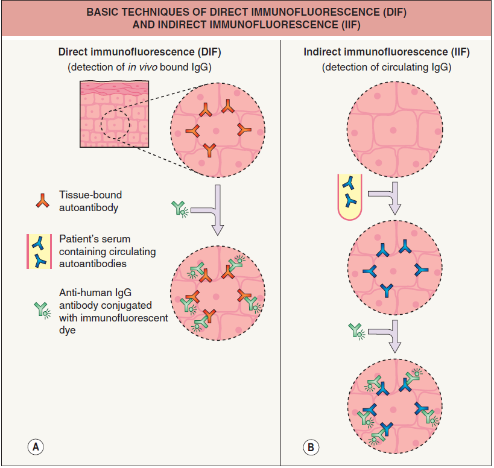
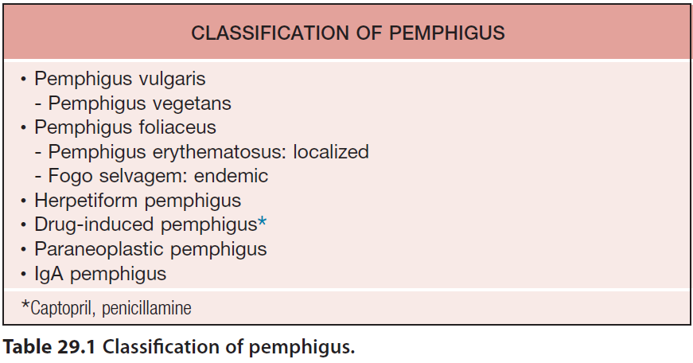

水泡疾病
2025年2月9日
下午 03:25

- 編輯格式
  - 顏色註記方式
    - 重要標題 : 母標題藍色(最暗)標記/子標題藍色(較暗,25%)標記
    - 重要術式治療藥物 : **綠色標記+粗體**
    - 重要內文 : 紅色(標準色彩)/**橘色+粗體(橘色那一欄第一個)**(如果同色太醜就紅橘相間)
    - 直接來複製顏色格式一定不會錯xd

- 名詞定義：
  - 天皰瘡(pemphigus)：
    - 一群皮膚、黏膜的自體免疫性水泡性疾病(autoimmune blistering disease)，有以下特徵：
      - 組織學特徵：因角質細胞(keratinocytes)間棘層鬆解(acantholysis)，形成表皮內水泡(intraepidermal blisters)
        - 棘層鬆解(acantholysis)：游離的表皮細胞形狀也從多角形變圓形(acantholytic cell)，使皮膚或黏膜發炎剝離產生水泡
      - 免疫學特徵：有針對角質細胞(keratinocytes)細胞表面的抗體
  - 橋粒(Desmosomes)：
    - 主要功能是維持角質細胞間的連結
    - Desmoglein 1(Dsg1)：主要分佈於皮膚淺層、黏膜中含量低
    - Desmoglein 3(Dsg3)：主要分佈於皮膚基底層、口腔黏膜

Dermatology 4th ed. p.584
- 類天疱瘡抗原(Bullous pemphigoid antigen, BPAg)：
  - 位於連接基底層(stratum basale)和Basement membrane的半胞橋小體(hemidesmosome)上
- Nikolsky sign：
  - 在已有的水泡病灶邊緣輕微施壓，原本好的皮膚也會上下層分離，使得水泡病灶延伸擴大，代表細胞間的接合力很差
- Direct immunofluorescence(DIF)、Indirect immunofluorescence(IIF)

- 分類：
  - 尋常性天疱瘡(Pemphigus vulgaris, PV)
  - 落葉型天疱瘡(Pemphigus foliaceus, PF)
    - 紅斑型天疱瘡(Pemphigus erythematosus, PE )=Senear-Usher syndrome
  - 類天疱瘡(Bullous pemphigoid, BP)
  - Dermatitis herpetiformis
  - IgA pemphigus=Linear IgA dermatosis
  - Paraneoplastic pemphigus
  - Drug-induced pemphigus

- 病生理：
  - 免疫系統產生 IgG 自體抗體→攻擊皮膚、黏膜上皮細胞之間的細胞連結結構(橋粒，Desmosomes)→角質形成細胞(keratinocytes)間棘層鬆解(acantholysis)→形成水泡
- 尋常性天疱瘡(Pemphigus vulgaris, PV)：
  - 流行病學：
    - 發病高峰：40-60歲
  - 病因：
    - Type 2過敏反應
    - 加劇因素：藥物(non-thiol drugs)、病毒、紫外線輻射、飲食(洋蔥、大蒜、韭菜…)
    - 可被誘發
  - 臨床表現：
    - 好發部位：
      - 表皮：頭皮、臉部、軀幹、皮膚皺摺處(flexural area)
      - 黏膜：口咽部最常見
    - 先從出現口腔黏膜潰瘍(\>50%)，數個月後皮膚才會開始出現病灶
    - 皮膚病灶：卵圓形含清澈組織液，鬆且易破的水泡(flaccid vesicle/ bulla)， 破裂之後呈現表淺的糜爛(erosion)傷口，很痛，會輕微出血與結痂(crust)，來診病患多呈現身體大面積糜爛
  - 診斷：
    - Anti-desmoglein IgG抗體：Dsg1 ± Dsg3
    - 病理變化：表皮內的基底層(Stratum basale)與其上的表皮細胞分離，形成表皮層內裂縫(Intraepidermal cleft) ，裂縫中有許多游離的acantholytic cell，此種水泡稱為suprabasal blister
    - 直接免疫螢光染色(Direct immunofluorescence, DIF )：IgG和C3沉積在細胞間隙(intercellular(IC) deposition)呈現網狀的IC pattern， 如右圖可見表皮層自基底層以上剝離，DIF呈網狀圖案
    - Nikolsky sign(+)
- 落葉型天疱瘡(Pemphigus foliaceus, PF)：
  - 簡介：
    - 抗體只攻擊Desmoglein 1(表皮)，故不會有口腔黏膜的病灶，且裂解位置更表淺，水泡通常不明顯易破而形成落屑或結痂的表面
  - 病因：
    - Type 2過敏反應
    - 加劇因素：藥物(Thiol drugs)
  - 臨床表現：
    - 分布位置：好發於背、前胸、臉、頭皮和腹部，通常不影響黏膜
    - 紅斑基底、鱗屑/結痂性糜爛(scaly, crusted cutaneous erosions on an erythematous base)
    - 發病初期通常僅見零散的結痂病灶，易被誤認為膿痂疹(impetigo)
  - 診斷：
    - Anti-desmoglein IgG抗體：Dsg1
    - 病理變化：
      - 表皮層分裂的位置在角質層下方(Stratum corneum=Subcorneal)，較PV的基底層上方(Suprabasal)更表淺，所以水泡更薄更容易破裂
      - 也有acantholytic cell、IC pattern
    - Nikolsky sign(+)
- 紅斑型天疱瘡(Pemphigus erythematosus, PE)：
  - 簡介：
    - 少見的亞型
    - 只發生在臉上，分布位置和SLE的蝴蝶斑同
    - 形成粗紅、有點脫屑的紅斑
- 流行性落葉型天疱瘡(Endemic pemphigus foliaceus )=叢林之火(Fogo Selvagem)：
  - 簡介：
    - 出現在南美洲亞馬遜河流域森林的一種流行性疾病，可影響同住家人同時罹患
    - 症狀與落葉型天疱瘡(PF)完全相同
- 類天疱瘡(Bullous pemphigoid, BP)：
  - 流行病學：
    - 自體免疫水泡病中最常見的一種
    - 發病高峰：60-80歲、腦中風及中樞神經病變者
  - 病因：Type 2過敏反應
  - 病生理：
    - 自體抗體攻擊類天疱瘡抗原(Bullous pemphigoid antigen) BPAg1、BPAg2→活化補體及發炎反應→破壞基底層細胞與其下真皮層的聯結→表皮(epidermis)與真皮 (dermis)之間裂開
  - 臨床特徵：
    - 好發部位：腋下、腹股溝等皮膚皺摺處，約有10%病人會有口腔病灶
    - 一開始皮膚呈現發紅的紅疹或類似尋麻疹的病灶，數月後才慢慢出現水泡
    - 與PV相比，BP裂在較深層，故水泡看起來較大，厚而緊繃，較不容易破掉，為緊繃的大水泡(tense bullae)
  - 診斷：
    - 病理變化：
      - 基底層(Stratum basale )與其下的真皮層分離，形成表皮層下裂縫(Subepidermal cleft )，又稱 subepidermal blister
      - 嗜中性球、嗜伊紅性細胞和淋巴球浸潤於真皮層上層
      - 直接免疫螢光染色(Direct immunofluorescence, DIF)： IgG和 C3 沿著表皮與真皮之間的 Basement membrane zone(dermo-epidermal junction)沉積，呈線狀沉積(linear deposition)
    - Nikolsky sign(-)
- 皰疹樣皮炎(Dermatitis herpetiformis)
  - 流行病學：
    - 發病高峰：15-40歲
    - ♂ \> ♀
    - 北歐人較常見
  - 病因：
    - 與麩質腸病變(gluten-sensitive enteropathy, GSE)、表皮IgA沉積相關
      - HLA-DQ2、HLA-DQ8
      - 自體免疫抗體同時攻擊腸胃道及皮膚，免疫複合物(immunocomplex)沉積在皮膚內引發一連串發炎反應
  - 臨床表現：
    - 慢性、反覆發作、很癢的水泡疾病
    - 皮膚症狀：
      - 劇烈癢感的紅斑性蕁麻疹樣斑塊(erythematous urticarial plaques)和緊繃的小水泡(tense vesicles)，排列成皰疹狀(herpetiform arrangement)
      - 抓破的小水泡結痂癒合後的膚色可能較淺或較深(Post-inflammatory hypo- or hyperpigmentation)
      - 分布位置：對稱性分佈，好發於關節的伸側(extensor site)、背部、臀部，不會發生在口腔黏膜
    - 腸胃道症狀：長期腹瀉(乳糜瀉, celiac sprue)、營養不良
  - 診斷：
    - 病理變化：
      - 嗜酸性顆粒細胞性棘層水腫(eosinophilic spongiosis)與角質下膿皰(subcorneal pustules)
        - 無明顯棘層鬆解(minimal or no apparent acantholysis)
      - 直接免疫螢光染色(Direct immunofluorescence, DIF)：在真皮乳突處(dermal papillae)的頂端IgA顆粒狀沉積(granular deposition)
    - Nikolsky sign(-)
- Drug-induced pemphigus：
  - 病生理：藥物誘發產生針對Dsg 1、Dsg 3的抗體
  - 病因：確切病理機制仍未完全釐清，但可能與多重因素相關
    - 藥物(約佔已開發國家10%)：某些藥物的活性硫醇(sulfhydryl, -SH)基團可與橋粒小體抗原(desmosomal antigen complex)結合形成半抗原(hapten)→誘發針對橋粒小體的體液免疫反應→棘層鬆解(acantholysis)、表皮內水泡(intraepidermal blisters)的形成
      - Thiol drugs：penicillamine、ACEI(captopril、enalapril)：常引起pemphigus foliaceus
      - Non-thiol drugs：penicillin、cephalosporins、 vancomycin、高血壓藥物(Nifedipine、Propranolol)、piroxicam、Phenobarbital：常引起pemphigus vulgaris
  - 臨床特徵：
    - 通常在用藥數週至數個月後發生
  - 診斷：
    - 病理變化：
      - 直接免疫螢光染色(Direct immunofluorescence, DIF)：約90%可在病灶周圍皮膚呈陽性表現
      - 循環抗橋粒蛋白抗體(anti-desmoglein autoantibodies)：約70%可檢測到此抗體
  - 治療：
    - 停藥：對於由含硫醇基(-SH)藥物誘發的天皰瘡，停藥後大多可自發緩解(spontaneous remission)
      - 非硫醇基(-SH)藥物引起者，停藥後不一定能夠自發緩解，可能仍需Corticosteroids或免疫抑制劑(如 Rituximab)治療
    - 支持性療法：類似於原發性天皰瘡，包括傷口護理、抗生素預防感染等
- 治療：
  - 治療目標：減少自體抗體的產生、控制疾病、減少併發症，並達到長期緩解
  - 治療策略：
    - 主要依賴系統性皮質類固醇，並輔以免疫抑制劑以達到降低劑量、副作用最小化及早期病情控制
    - 部分難治或抗藥病例，則可考慮加入高劑量IVIg、Rituximab及血漿交換等進階治療
  - **口服類固醇**：治療首選，療效最快、最顯著的治療方式
    - 劑量：初始劑量 1 mg/kg/day prednisolone
    - 應每5~7天評估療效一次，以便調整劑量，若仍有新水泡繼續產生，則將藥量增加50-100%至無任何新水泡為止
    - 2週內沒有產生任何新水泡，且80%水泡傷口都癒合了，就可以開始減藥
  - **IV類固醇**：針對病情嚴重患者可直接用IV類固醇
    - 脈衝式靜脈注射類固醇法(Pulse therapy)：每日IV 500mg methylprednisolone， 連續三日
    - 可有效控制病情發展、可減少副作用
  - **免疫抑制劑**：減少長期使用皮質類固醇的副作用
    - **Azathioprine**：作為類固醇的輔助治療
      - 劑量：2–4 mg/kg/day
      - 療效緩慢，可能要等2-3週
      - 副作用：輕微，除了少數人出現噁心、嘔吐、肝功能異常、血球低下
    - **Methotrexate (MTX)**：
      - 療效快速，服用劑量低，適合無法吞太多藥物的老人家
      - 肝毒性，故無法長期服用，有些人會有嚴重的噁心嘔吐，故腎功能不好者需小心使用
    - **Cyclophosphamide**：做為自體免疫疾病的輔助治療或脈衝治療
    - **Mycophenolate mofetil(CellCept)**：近幾年來較受矚目的藥物之一
      - 劑量：一般2-3 g/day
      - 在美國有些專治免疫水泡疾病的醫學中心，已把此藥設定在類固醇之後的首選第二線治療藥物
      - 副作用：骨髓抑制較少，但腸胃毒性較顯著
    - **Rituximab**：
      - 也可以有效去除製造自體抗體的免疫細胞，可有效治療難治天疱瘡
      - 因為B淋巴球在治療後大量減少， 必須密切注意感染的副作用
