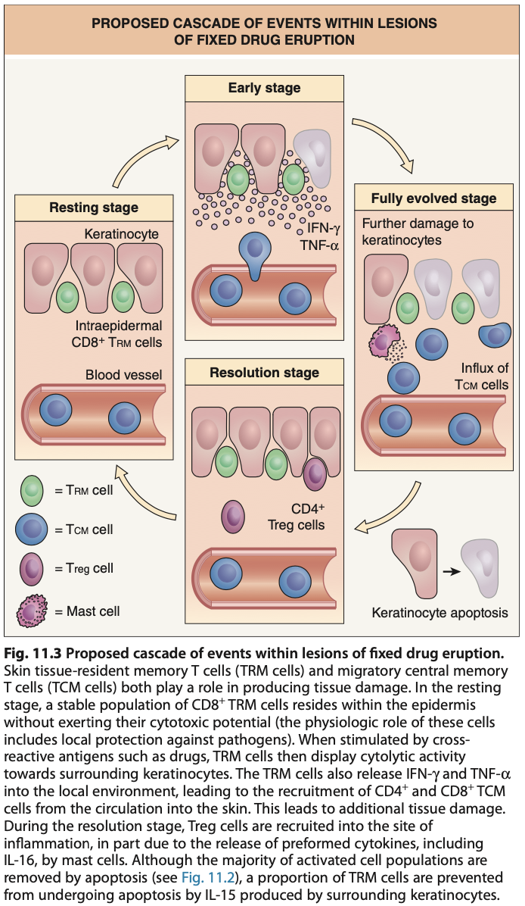
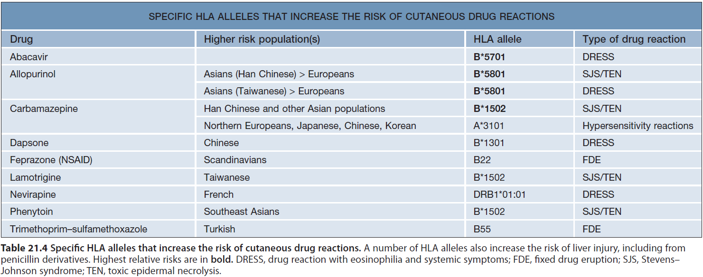
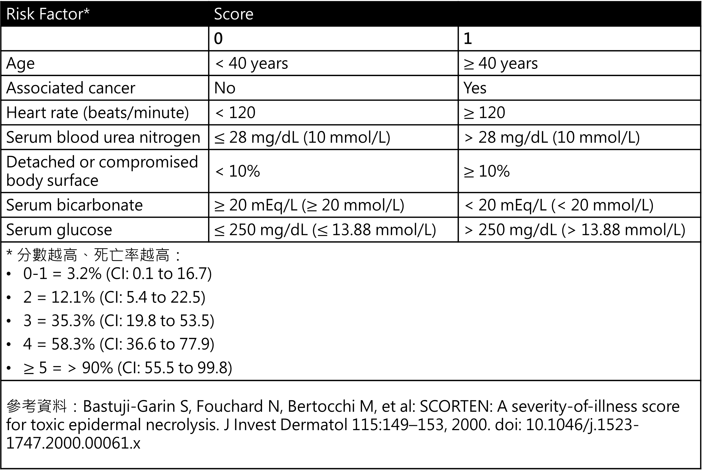

藥物疹
2025年2月16日
上午 11:19

<table>
<colgroup>
<col style="width: 46%" />
<col style="width: 22%" />
<col style="width: 21%" />
<col style="width: 9%" />
</colgroup>
<thead>
<tr class="header">
<th>臨床表現</th>
<th>由藥物引發的可能性</th>
<th>發作起始時間</th>
<th>致死率</th>
</tr>
</thead>
<tbody>
<tr class="odd">
<td>固定性藥物疹(Fixed drug eruption)</td>
<td>100%</td>
<td>
初次：1–2 週

再次暴露：&lt;48小時

(大多在24小時以內)
</td>
<td>0%</td>
</tr>
<tr class="even">
<td>
Drug reaction with eosinophilia and

systemic symptoms (DRESS)/drug-induced

hypersensitivity syndrome (DIHS)
</td>
<td>70-90%</td>
<td>15-40天</td>
<td>5-10%</td>
</tr>
<tr class="odd">
<td>
Stevens–Johnson syndrome

Toxic epidermal necrolysis
</td>
<td>70-90%</td>
<td>7-21天</td>
<td>
5%

30%
</td>
</tr>
</tbody>
</table>
| 特徵       | DRESS                                              | SJS/TEN                                                   | AGEP                                       |
|------------|----------------------------------------------------|-----------------------------------------------------------|--------------------------------------------|
| 發病時間   | 延遲 (2-8 週)                                      | 早期 (7-21 天)                                            | 非常迅速 (\<4 天)                          |
| 皮膚特徵   | 麻疹樣變水腫、臉部水腫、可能多形性紅疹             | 暗紅斑塊伴表皮剝離，邊緣不清的靶心樣病灶                  | 許多無菌性膿疱，紅斑水腫基底               |
| 黏膜受累   | 通常輕微或無                                       | 嚴重 ( \>90% 病例)                                        | 約 50% 病例                                |
| 全身性受累 | 顯著，多器官受累常見 (肝、腎、肺等)2...            | 通常有發燒等，但主要問題是表皮剝離21...                   | 少見 (~17%)                                |
| 實驗室異常 | **嗜酸性球增多**，非典型淋巴細胞增多，肝臟酵素升高 | 血球低下 (淋巴球、嗜中性球、血小板)                       | **嗜中性球增多**、輕度嗜酸球增多           |
| 組織病理   | 變異大，常有嗜酸性球浸潤，無廣泛表皮壞死           | **廣泛角質細胞壞死**，表皮剝離，真皮發炎細胞稀少          | **角質層下膿疱**，真皮血管周圍嗜中性球浸潤 |
| 常見病因   | 藥物 (抗癲癇藥、抗生素)                            | 藥物                                                      | 藥物                                       |
| 病毒關聯   | 常伴 HHV-6 等再活化                                | 可能與 *Mycoplasma pneumoniae* 或病毒有關，但不如藥物重要 | 少見，可能有病毒感染誘發                   |
| 預後       | 潛在致命 (2-10%)                                   | 高致死率 (SJS 5%、TEN 15-35%)                             | 低致死率 (1-2%)、自限性                    |

- 名詞定義：
  - 嚴重皮膚不良反應(Severe cutaneous adverse reactions, SCARs)
    - Anaphylaxis
    - Anticoagulant-induced skin necrosis
    - Acute generalized exanthematous pustulosis (AGEP)
    - Drug rash with eosinophilia and systemic symptoms (DRESS)/drug-induced hypersensitivity syndrome (DIHS)
    - Generalized bullous fixed drug eruption
    - Stevens–Johnson syndrome (SJS)/ toxic epidermal necrolysis (TEN)

- 固定性藥物疹(Fixed drug eruption)
  - 定義：
    - 初次接觸：初次接觸特定藥物引發固定性藥物疹時，病灶通常會在給藥後幾天到兩週內 (1-2 週)出現
    - 再次接觸：再次接觸同種藥物時，病灶會在完全相同的部位快速復發
      - 復發的發生速度會非常快(\<48 小時，通常在 24 小時內)
  - 病因：
    - 過敏引起的皮膚血管炎反應
    - 常見引起藥物診藥物：
      - 抗生素：
        - Sulfa類(最常見)、Tetracyclines \> β-lactams、fluoroquinolones、macrolides
      - 止痛退燒藥：
        - NSAIDs、acetaminophen、aspirin
      - 其他藥物：
        - Barbiturates、Dapsone、PPI、Azole類抗黴菌藥物、Pseudoephedrine
  - 病生理：Type 4過敏反應

- 臨床表現：
  - 發病時間：
    - 初次接觸： 1-2 週後出現
    - 再次接觸：\<48 小時，通常在 24 小時內
  - 常見部位：生殖器、肛門周圍 、手腳、臉部、嘴唇
  - 發作型態：
    - 邊界清晰、卵圓形紅斑塊(通常為單一)伴隨著搔癢及發熱症狀→水腫狀斑塊→脫屑(desquamation)並產生色素沈著(棕色、黑色斑)
      - 可能有標靶病變(target lesion)
    - 每次服用相同藥物後，都會在相同部位出現藥物疹的現象
- 診斷：
  - 主要基於病史(包括用藥史和病灶復發的特徵)、臨床表現
  - 皮膚激發(provocation test)試驗
    - 建議在過敏發作結束後一段時間內(4-6週)進行，以免受耐受期(refractory period)影響
    - 協助釐清致病藥物
    - 試驗種類：
      - oral challenge test
        - 病人暴露於懷疑藥物中，增加劑量直到給予完整劑量或發生過敏反應為止
        - 測試過程中能耐受藥物並完成完整劑量，則表示病人對該藥物沒有藥物過敏反應
      - skin patch test(陽性率\>40%)
        - 貼於上背部並保留48小時
        - 在 3-7 天時進行判讀
        - 建議在曾有病灶的部位進行原位貼膚試驗 (in situ patch test)
- 處置：
  - **立即停用懷疑致病藥物**
- 預後：
  - 通常是自限性疾病，通常在停藥後幾天內消退(可能需1-2週才能完全消退)
  - 再次用藥時可能復發
- Stevens-Johnson syndrome(SJS)、毒性表皮壞死溶解症(Toxic epidermal necrolysis, TEN)
  - 定義：依水泡、破皮面積佔全身體表面積(body surface area, BSA)比例
    - SJS：\<10% BSA
    - SJS-TEN overlap：10-30% BSA
    - TEN：\>30% BSA
  - 流行病學：
    - 女 \> 男(1.5：1)
    - 發病年齡：任何年齡都可能發生
  - 病因：幾乎是藥物造成、感染/疫苗相對罕見
    - 常見藥物：抗癲癇藥物(carbamazepine、phenytoin、Lamotrigine)、allopurinol、sulfa類抗生素、NSAID
    - 亞洲種族：HLA-B基因型與特定藥物所引起的SJS/TEN相關
      - HLA-B\*1502(carbamazepine、phenytoin、Lamotrigine)
      - HLA-B\*5801(allopurinol)

(參考資料)Dermatology 4th ed. p.349
- 病生理：
  - 目前認為和藥物激發Type 4過敏反應有關
    - 透過與人類白血球抗原(HLA)的交互作用活化特異CD8+T cell→T cell增生、浸潤到皮膚組織中攻擊表皮細胞→表皮細胞大量的凋亡(apoptosis)
    - 皮膚切片中會看到**整層表皮的壞死與溶解**
- 臨床表現：
  - 前驅症狀：被觸發後1-3週
    - 發燒、喉嚨痛
    - 肌痛、關節痛
    - 頭痛
    - 結膜發紅、嘴巴破皮、生殖泌尿道等黏膜破皮
  - 皮膚黏膜病變：前驅症狀出現後1-3天
    - 皮膚病變：影響所有患者
      - 臉部和軀幹最初出現疼痛性紅斑，中心呈紫斑狀(非典型target lesion)
      - 快速擴散並融合成大水泡(bullae)，擴展至廣泛表皮壞死、真皮/表皮分離與表皮脫落
      - 表皮脫落後1-2週再上皮化(Reepithelialization)
      - **Nikolsky sign(+)**
    - 黏膜病變： ≧ 90%患者
      - 口腔：口腔炎、唇炎、潰瘍
      - 眼部：結膜炎、角膜炎、虹膜炎、前葡萄膜炎
      - 生殖泌尿道：生殖器糜爛(如龜頭糜爛、外陰糜爛、陰道糜爛)、尿道糜爛
- 診斷：
  - 臨床診斷：根據病史、黏膜皮膚病變診斷
  - 確認診斷：皮膚切片(裂解位置：Stratum germinativum)

- 併發症：
  - 大面積皮膚脫落，剩下真皮層裸露在外
    - 急性：脫水、體溫/電解質失調、低血容性休克、繼發性感染、敗血症和感染性休克
    - 眼科：眼部疤痕和視力喪失(最常見)、乾性角結膜炎、睫毛倒刺(Trichiasis)
    - 皮膚科：色素沉澱、色素沉澱過少、掉髮、指甲脫落
    - 泌尿生殖系統：尿道狹窄、陰道沾黏、性交困難、包莖、性功能障礙
    - 胃腸道：狹窄、緊縮、吞嚥困難
- 處置：
  - **立即停用懷疑致病藥物**
  - 支持性療法：與大面積燒傷類似，維持生理穩定、預防併發症發生
    - 傷囗、黏膜照護
      - 非脫皮區域保持乾燥
      - 臉部：結痂以生理食鹽水每日清洗，必要時使用抗生素藥膏
      - 眼睛：每日眼科評估，生理食鹽水清洗 + 抗生素眼膏與眼藥水
      - 口腔：定時以生理食鹽水沖洗，昏迷者需抽吸避免吸入性肺炎
      - 鼻腔、耳朵：棉棒清潔 + 抗生素或凡士林藥膏
      - 肛門生殖區、指間：每日清潔，潮濕導致浸潤(maceration)者可用0.5%硝酸銀溶液
    - 維持電解質及體液平衡
    - 適當鎮靜止痛
    - 良好呼吸照護
  - 系統性治療
    - **類固醇**
    - **免疫抑制劑**
    - **IVIG、血漿交換術**：移除血中免疫活性物質、降低過敏反應
- 預後：
  - SJS平均死亡率：1-5%
  - TEN平均死亡率：25-35%
  - 預後評估：Severity-of-Illness Score for Toxic Epidermal Necrolysis (SCORTEN)

- Drug reaction with eosinophilia and systemic symptoms (DRESS) = Drug-induced hypersensitivity syndrome (DIHS)
  - 定義：
    - 罕見、潛在致命的免疫介導性藥物不良反應，特徵是皮膚表現伴隨內部器官影響
  - 病因：
    - 幾乎由藥物引起(70-90%)
      - 抗癲癇藥：lamotrigine、phenytoin、carbamazepine、phenobarbital、oxcarbazepine、zonisamide
      - 抗生素：dapsone、sulfamethoxazole/trimethoprim、piperacillin/tazobactam、vancomycin、minocycline、abacavir、nevirapine、磺胺類藥物、rifampicin
      - Allopurinol
    - HHV-6初次感染或再次活化
  - 危險因子：免疫低下族群、藥物基因易感性(Pharmacogenetic susceptibility)
  - 病生理學：
    - 遺傳易感性與Type 4過敏反應之間的相互作用
    - 與IL-5活化嗜酸性細胞增生、皮膚和內臟器官中藥物特異性 T cell活化有關
  - 臨床表現：
    - 發病時間 (Time interval)
      - 初次接觸：通常在藥物暴露後 2-8 週出現症狀
      - 再次接觸：暴露後數小時或數天
    - 症狀：
      - 發燒(通常是高燒，\>38.5°C，伴隨高低起伏)(85%)
      - 瀰漫性皮疹(75%)：以麻疹樣皮疹開始，隨後變為水腫樣
      - 淋巴結腫大
      - 臉部水腫
      - 內部器官影響(見"併發症")
  - 診斷：
    - 主要基於臨床表現(發燒、瀰漫性皮疹)、詳細的藥物史(最近 2-8 週內開始使用的藥物)、是否有內部器官受影響、是否有嗜酸性球增加(常見)綜合判斷
    - RegiSCAR score：協助診斷DRESS
<table>
<colgroup>
<col style="width: 45%" />
<col style="width: 10%" />
<col style="width: 10%" />
<col style="width: 18%" />
<col style="width: 15%" />
</colgroup>
<thead>
<tr class="header">
<th><strong>項目</strong></th>
<th><strong>Yes</strong></th>
<th><strong>No</strong></th>
<th><strong>Unknown</strong></th>
<th><strong>說明</strong></th>
</tr>
</thead>
<tbody>
<tr class="odd">
<td><strong>發燒 &gt;38.5°C</strong></td>
<td>0</td>
<td>-1</td>
<td>-1</td>
<td>必要項目之一</td>
</tr>
<tr class="even">
<td><strong>淋巴結腫大（≥2處，且每處&gt;1 cm）</strong></td>
<td>1</td>
<td>0</td>
<td>0</td>
<td>典型表現</td>
</tr>
<tr class="odd">
<td><strong>非典型淋巴球（Atypical lymphocytes）</strong></td>
<td>1</td>
<td>0</td>
<td>0</td>
<td></td>
</tr>
<tr class="even">
<td><strong>嗜酸性球</strong></td>
<td></td>
<td></td>
<td></td>
<td>以下擇一計分</td>
</tr>
<tr class="odd">
<td>700–1499 或佔白血球10–19.9%</td>
<td>1</td>
<td>0</td>
<td>0</td>
<td></td>
</tr>
<tr class="even">
<td>≥1500 或 ≥20%</td>
<td>2</td>
<td>0</td>
<td>0</td>
<td></td>
</tr>
<tr class="odd">
<td><strong>皮疹</strong></td>
<td></td>
<td></td>
<td></td>
<td>以下三項獨立計分</td>
</tr>
<tr class="even">
<td>面積 &gt;50% 體表面積</td>
<td>1</td>
<td>0</td>
<td>0</td>
<td></td>
</tr>
<tr class="odd">
<td>具2種以上特徵(如水腫、浸潤、紫癜、脫屑)</td>
<td>1</td>
<td>-1</td>
<td>0</td>
<td></td>
</tr>
<tr class="even">
<td>皮膚切片符合 DRESS</td>
<td>0</td>
<td>-1</td>
<td>0</td>
<td></td>
</tr>
<tr class="odd">
<td><strong>器官影響</strong></td>
<td></td>
<td></td>
<td></td>
<td>以下擇一計分</td>
</tr>
<tr class="even">
<td>一個器官</td>
<td>1</td>
<td>0</td>
<td>0</td>
<td></td>
</tr>
<tr class="odd">
<td>兩個以上器官</td>
<td>2</td>
<td>0</td>
<td>0</td>
<td></td>
</tr>
<tr class="even">
<td><strong>症狀持續超過15天</strong></td>
<td>0</td>
<td>-1</td>
<td>-1</td>
<td></td>
</tr>
<tr class="odd">
<td><strong>已排除其他診斷(完成至少3項生化檢查且為陰性)</strong></td>
<td>1</td>
<td>0</td>
<td>0</td>
<td></td>
</tr>
<tr class="even">
<td><strong>總分與診斷標準</strong></td>
<td></td>
<td></td>
<td></td>
<td></td>
</tr>
<tr class="odd">
<td>
<strong>≤1否定(No case)</strong>

<strong>2–3可能(Possible case)</strong>

<strong>4–5可能性高(Probable case)</strong>

<strong>≥6確診(Definite case)</strong>
</td>
<td></td>
<td></td>
<td></td>
<td></td>
</tr>
</tbody>
</table>

- 處置：
  - **立即停用懷疑致病藥物**
  - **全身性類固醇**(PO、IV)：1st line，通常需要長時間的逐漸減量
  - 其他治療：**cyclosporine、cyclophosphamide、血漿置換術、IVIg**
    - 通常用於難治性病例或對皮質類固醇有禁忌症時
- 併發症：
  - 其他器官侵犯：常見影響器官包括肝臟(最常見)、腎臟、肺部、心臟、肌肉、胰臟
    - 肝臟：肝臟壞死、衰竭
    - 腎臟：GFR↓、急性間質腎炎
    - 心臟：心肌炎
    - 肌肉：肌肉痠痛、無力
    - 胰臟：amylase/lipase↑、胰臟炎
  - 多重器官衰竭
- 預後：
  - 死亡率約2-10%
  - 肝臟壞死導致肝臟衰竭為主要死因
  - 延遲停藥會使預後惡化
  - 症狀可能需要數週或數月才能緩解
- 急性廣泛性發疹性膿疱病 (Acute Generalized Exanthematous Pustulosis, AGEP)
  - 流行病學：
    - HLA-B5、-DR11、-DQ3 在 AGEP 患者中更常見
  - 病因：最常見的原因是藥物(超過90%病例)
    - 常見藥物：
      - 抗生素：Penicillins、Cephalosporins、Clindamycin、磺胺類藥物、Metronidazole、Carbapenems、Quinolones、Macrolides
      - 鈣離子通道阻滯劑 (Calcium channel blockers)：特別是Diltiazem
    - 其他罕見原因包括：
      - 病毒感染(如腸病毒)
      - 汞
      - 疫苗
      - 胰島素注射(罕見)
  - 病生理學：Type 4過敏反應
  - 臨床表現：
    - 發病：非常迅速，通常在給藥後短於 4 天出現皮疹。再次接觸致病藥物時，發病時間會更短
    - 皮膚病灶：
      - 皮疹通常開始於臉部或主要的皺摺區(如腋窩和腹股溝)，然後在數小時內擴散全身，通常持續 1-2 週
        - 特徵為大量、微小 (\<5 mm)、主要為非毛囊性、無菌性膿疱
        - 發生在全身的水腫性紅斑皮膚上，膿疱可能匯合
        - 消退後通常會出現表面脫屑
      - 可能伴隨灼熱感、瘙癢
    - 黏膜侵犯(50%)
    - 全身症狀：
      - 常伴隨高燒 (通常 ≥ 38.5°C)
      - 少數患者(17%)有全身系統侵犯
        - 主要部位是肝臟、腎臟和肺部(急性呼吸窘迫)
        - 其他特徵：
          - 白血球升高伴明顯嗜中性球增多、輕度至中度嗜酸性粒細胞增多
          - 短暫腎功能不全
          - 肝功能異常
          - 低血鈣
  - 處置：
    - 立即停用所有可能的致病藥物
    - 支持性治療
    - 通常不常規推薦預防性抗生素，除非有感染跡象
  - 預後：
    - 通常是自限性疾病
    - 皮疹通常在停藥後 1-2 週內消退
    - 不會進展為毒性表皮壞死症 (TEN)
    - 死亡率相對較低(約1-2%)
