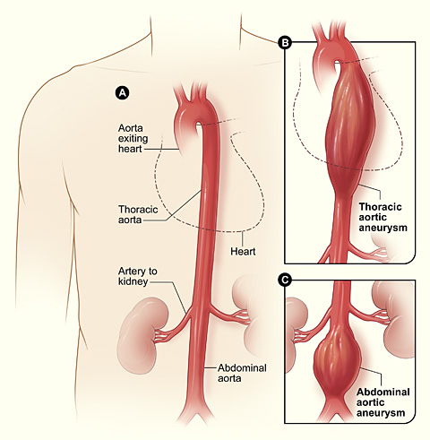

PM

- 編輯格式
  - 顏色註記方式
    - 重要標題 : 母標題藍色(最暗)標記/子標題藍色(較暗,25%)標記
    - 重要術式治療藥物 : **綠色標記+粗體**
    - 重要內文 : 紅色(標準色彩)/**橘色+粗體(橘色那一欄第一個)**(如果同色太醜就紅橘相間)
    - 直接來複製顏色格式一定不會錯xd

- 定義
  - 動脈瘤（Aneurysm）
    - 指血管三層（Intima、Media、Adventitia）完整擴張，直徑擴大超過正常的50%以上。
  - 真性動脈瘤（True Aneurysm）
    - 影響三層血管（Intima，Media，Adventitia）
  - 假性動脈瘤（Pseudoaneurysm）
    - 內膜與中層破裂，僅由外膜（Adventitia）或鄰近結締組織形成壁面。

- 分類
<table>
<colgroup>
<col style="width: 13%" />
<col style="width: 86%" />
</colgroup>
<thead>
<tr class="header">
<th>類型</th>
<th>特徵</th>
</tr>
</thead>
<tbody>
<tr class="odd">
<td>根據形態</td>
<td><ul>
<li>
Fusiform（紡錘狀）：整圈擴張，血管呈均勻擴張，最常見於腹主動脈
</li>
<li>
Saccular（囊狀）：局部囊樣突出，僅部分血管壁向外囊樣突出，常見於感染性動脈瘤（Mycotic Aneurysm）或外傷後
</li>
</ul></td>
</tr>
<tr class="even">
<td>根據部位</td>
<td><blockquote>

</blockquote>
<ul>
<li>
胸部動脈瘤 Thoracic Aortic Aneurysm（TAA）：

<ul>
<li>
包括升主動脈、主動脈弓、降主動脈
</li>
<li>
常見病因：中層退化（Medial Degeneration）、結締組織疾病（如Marfan Syndrome）
</li>
</ul></li>
<li>
腹部動脈瘤 Abdominal Aortic Aneurysm（AAA）：

<ul>
<li>
最常見，&gt;90%起源於腎動脈以下（Infrarenal）
</li>
<li>
主要因 Atherosclerosis 所致
</li>
</ul></li>
<li>
胸腹動脈瘤 Thoracoabdominal Aortic Aneurysm（TAAA）：

<ul>
<li>
橫跨胸部及腹部的大型動脈瘤
</li>
</ul></li>
</ul></td>
</tr>
</tbody>
</table>
- Epidemiology（流行病學）
  - 胸部動脈瘤：發生率約10/10萬人年，男性略多。
  - 腹部動脈瘤：盛行率4–8%，60歲以上男性最常見，吸菸者風險最高。

- 病因（Etiology）
<table>
<colgroup>
<col style="width: 28%" />
<col style="width: 71%" />
</colgroup>
<thead>
<tr class="header">
<th>類型</th>
<th>說明</th>
</tr>
</thead>
<tbody>
<tr class="odd">
<td>Thoracic Aortic Aneurysm (TAA)</td>
<td><ul>
<li>
主要與Cystic Medial Necrosis（囊性中層壞死）、Connective Tissue Disease（如 Marfan Syndrome）有關。
</li>
</ul></td>
</tr>
<tr class="even">
<td>Abdominal Aortic Aneurysm (AAA)</td>
<td><ul>
<li>
主要與Atherosclerosis（動脈粥樣硬化）有關。
</li>
</ul></td>
</tr>
</tbody>
</table>

- 病生理學（Pathophysiology）
  - 主因：彈性纖維（Elastin）與膠原蛋白（Collagen）退化，導致血管壁脆弱。
  - Medial Degeneration（中層退化）：膠原與彈性纖維裂解，平滑肌細胞減少，伴隨粘多糖（Proteoglycans）堆積。
  - 長期高血壓合併粥樣硬化與慢性發炎，使中層結構弱化。
- 臨床表現（Clinical Manifestations）
<table>
<colgroup>
<col style="width: 41%" />
<col style="width: 58%" />
</colgroup>
<thead>
<tr class="header">
<th>類型</th>
<th>主要症狀</th>
</tr>
</thead>
<tbody>
<tr class="odd">
<td>Thoracic Aortic Aneurysm (TAA)</td>
<td><ul>
<li>
無症狀（多數）
</li>
<li>
壓迫症狀（胸痛、喘、咳嗽、聲音沙啞、吞嚥困難）
</li>
<li>
升主動脈擴張 ➔ 心衰竭（二尖瓣或主動脈瓣逆流）
</li>
</ul></td>
</tr>
<tr class="even">
<td>Abdominal Aortic Aneurysm (AAA)</td>
<td><ul>
<li>
無症狀（多數）
</li>
<li>
腹部可觸及搏動性腫塊
</li>
<li>
腰背痛、腹痛、股部痛
</li>
<li>
若疼痛劇烈，通常是破裂前兆
</li>
</ul></td>
</tr>
</tbody>
</table>

- 診斷（Diagnosis）
| 工具                 | 說明                                                          |
|----------------------|---------------------------------------------------------------|
| X-ray                | Mediastinal widening, calcified aortic outline（25% AAA可見） |
| Ultrasound           | 最常用於篩檢與追蹤AAA                                         |
| CT / MRI Angiography | 定位與規劃手術用；可準確量測大小與擴張速率                    |
| Aortography          | 傳統血管攝影，因有風險，逐漸被非侵入性檢查取代                |

- 治療（Treatment）
<table>
<colgroup>
<col style="width: 42%" />
<col style="width: 57%" />
</colgroup>
<thead>
<tr class="header">
<th>類型</th>
<th>方式</th>
</tr>
</thead>
<tbody>
<tr class="odd">
<td>小動脈瘤 (&lt;5.5 cm AAA or &lt;5.0 cm TAA)</td>
<td>保守追蹤，每6–12個月影像檢查</td>
</tr>
<tr class="even">
<td>症狀性或大型動脈瘤</td>
<td>
- Open Surgical Repair（開放手術置換）

- Endovascular Aortic Repair (EVAR/TEVAR)（血管內支架）
</td>
</tr>
<tr class="odd">
<td>藥物控制</td>
<td>
- Statin（降低心血管事件）

- Beta-blocker（特別是Marfan患者）

- 控制血壓，目標&lt;130/80 mmHg
</td>
</tr>
</tbody>
</table>

- 胸部動脈瘤VS腹部動脈瘤：
<table>
<colgroup>
<col style="width: 8%" />
<col style="width: 44%" />
<col style="width: 47%" />
</colgroup>
<thead>
<tr class="header">
<th>項目</th>
<th>Thoracic Aortic Aneurysm（TAA）</th>
<th>Abdominal Aortic Aneurysm（AAA）</th>
</tr>
</thead>
<tbody>
<tr class="odd">
<td>好發族群</td>
<td>無特定性別，常見於結締組織疾病患者</td>
<td>男性較多，隨年齡增加而上升</td>
</tr>
<tr class="even">
<td>主要危險因子</td>
<td><ul>
<li>
結締組織疾病（Marfan, Ehlers-Danlos IV）
</li>
<li>
先天性異常（Bicuspid Aortic Valve）
</li>
<li>
血管炎（Takayasu, GCA, Syphilis）
</li>
<li>
高血壓（Hypertension）
</li>
</ul></td>
<td><ul>
<li>
動脈粥樣硬化（Atherosclerosis）
</li>
<li>
高血壓、高血脂、家族史、年齡
</li>
<li>
吸菸（破裂最強危險因子）
</li>
</ul></td>
</tr>
<tr class="odd">
<td>常見病理機轉</td>
<td><ul>
<li>
中層囊性壞死（Cystic Medial Necrosis）
</li>
<li>
彈性纖維破壞，血管脆弱
</li>
</ul></td>
<td><ul>
<li>
動脈粥樣硬化＋慢性發炎
</li>
<li>
膠原與彈性蛋白流失
</li>
</ul></td>
</tr>
<tr class="even">
<td>常見位置</td>
<td>升主動脈、主動脈弓、降主動脈</td>
<td>腎動脈以下的腹主動脈（Infrarenal）</td>
</tr>
<tr class="odd">
<td>診斷工具</td>
<td><ul>
<li>
胸部X光（CXR）
</li>
<li>
電腦斷層造影（Contrast CT）
</li>
<li>
經食道心臟超音波（TEE）
</li>
</ul></td>
<td><ul>
<li>
腹部超音波（Abdominal Ultrasound）
</li>
<li>
造影電腦斷層（Contrast CT）
</li>
</ul></td>
</tr>
<tr class="even">
<td>年破裂率</td>
<td><ul>
<li>
&lt;6 cm：約2–3% /年
</li>
<li>
&gt;6 cm：約7% /年
</li>
</ul></td>
<td><ul>
<li>
&lt;5 cm：約1–2% /年
</li>
<li>
5–6 cm：約6–7% /年
</li>
</ul></td>
</tr>
<tr class="odd">
<td>藥物治療</td>
<td><ul>
<li>
β-blocker（降低壁張力
</li>
<li>
ACEI（延緩擴張）
</li>
</ul></td>
<td><ul>
<li>
Statin（防止心血管事件）
</li>
<li>
控制血壓與血脂
</li>
</ul></td>
</tr>
<tr class="even">
<td>手術適應症</td>
<td><ul>
<li>
有症狀
</li>
<li>
升主動脈直徑 ≥5.5 cm
</li>
<li>
降主動脈直徑 ≥6.0 cm
</li>
<li>
年增大率 &gt;0.5 cm
</li>
</ul></td>
<td><ul>
<li>
有症狀
</li>
<li>
腹主動脈直徑 ≥5.5 cm（女性考慮5.0 cm）
</li>
<li>
年增大速率 &gt;0.5 cm
</li>
<li>
發炎或感染性動脈瘤
</li>
</ul></td>
</tr>
<tr class="odd">
<td>手術方式</td>
<td><ul>
<li>
傳統開刀（graft replacement）
</li>
<li>
TEVAR（降主動脈可選）
</li>
</ul></td>
<td><ul>
<li>
EVAR（血管內支架修復）
</li>
<li>
開放式手術（Open Repair）
</li>
</ul></td>
</tr>
<tr class="even">
<td>預後與追蹤</td>
<td><ul>
<li>
每6個月影像追蹤1次，穩定後每年1次。
</li>
<li>
平均自然成長速率：0.1 cm/年。
</li>
</ul></td>
<td><ul>
<li>
小於4 cm者每2–3年追蹤，4–5.4 cm者每6–12個月。
</li>
<li>
平均自然成長速率：0.3–0.4 cm/年。
</li>
</ul></td>
</tr>
</tbody>
</table>
REFERENCE
1.  HARRISON Principles of Internal Medicine 20th Edition
2.  USMLE step 2 CK
3.  Pocket medicine 8th
4.  <https://commons.wikimedia.org/wiki/File:Aortic_aneurysm.jpg>

