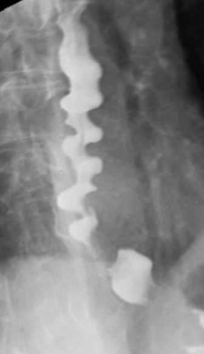

PM

- 編輯格式
  - 顏色註記方式
    - 重要標題 : 母標題藍色(最暗)標記/子標題藍色(較暗,25%)標記
    - 重要術式治療藥物 : **綠色標記+粗體**
    - 重要內文 : 紅色(標準色彩)/**橘色+粗體(橘色那一欄第一個)**(如果同色太醜就紅橘相間)
    - 直接來複製顏色格式一定不會錯xd
    - 
- 定義
  - 賁門弛緩不能（Achalasia）一種罕見的食道運動障礙疾病，特徵為食道肌間神經叢的神經節細胞缺失，導致食道蠕動消失和下食道括約肌Lower esophageal sphincter（LES）鬆弛功能受損
- 病生理機轉
  - 病因
    - 自體免疫反應導致食道肌間神經叢中抑制性神經節細胞的喪失
    - 歸因於潛伏的人類單純皰疹病毒1型感染與遺傳易感性結合
    - 由於抑制性神經元的缺失，導致吞嚥時下食道括約肌（LES）鬆弛受損以及蠕動消失
    - 長期賁門弛緩不能的特徵是食道進行性擴張和乙狀結腸樣畸形，伴隨LES肥大
- 症狀
  - 典型症狀
    - 吞嚥困難（Dysphagia）：對固體和液體食物都有吞嚥困難
    - 反流（Regurgitation）：當食物、液體和分泌物滯留在擴張的食道中時發生
    - 胸痛：可能在病程早期出現。患者描述為擠壓、壓迫感的胸骨後疼痛，有時放射到頸部、手臂、下顎和背
    - 體重減輕
    - 胃灼熱
  - 長期症狀
    - 慢性逆流
      - 吸入性肺炎
      - 支氣管炎
      - 肺膿瘍
    - 慢性食道炎
      - 增加鱗狀細胞癌風險
- 診斷
  - 內視鏡檢查（Endoscopy）
    - 初步評估
    - 用於排除胃賁門交界處的腫瘤或良性機械性狹窄，也可排除假性賁門弛緩不能
  - 鋇餐X光檢查（Barium swallow x-ray）
    - 表現為食道擴張、排空不良、氣液平面，以及LES處的錐形變窄（呈現鳥嘴樣Bird beak sign外觀(下方圖)）
    - 偶爾會觀察到食道膈上憩室（epiphrenic diverticulum）
    - 長期賁門弛緩不能的食道可能呈現乙狀結腸樣變形
  - 食道測壓術（Esophageal manometry）
    - 診斷標準是LES鬆弛受損和蠕動消失
    - 高解析度測壓術根據非蠕動食道的壓力模式，區分出三種賁門弛緩不能的亞型（經典型、食道受壓型、痙攣性賁門弛緩不能）
    - 測壓術可以識別食道擴張和食物滯留之前的早期疾病，因此是最敏感的診斷測試
- 治療
  - 治療目的:
    - 降低LES壓力，以便重力和食道加壓可促進食道排空
    - 蠕動無法恢復
  - 藥物治療（Pharmacologic therapies）：
    - 硝酸鹽或鈣通道阻滯劑：進食前給藥，但由於其對血壓的影響應謹慎使用
    - 肉毒桿菌毒素：在內視鏡引導下注射到LES中，抑制神經末梢的乙醯膽鹼釋放
    - 西地那非（Sildenafil）及其他磷酸二酯酶抑制劑：有效降低LES壓力，但實用性限制了其在賁門弛緩不能中的臨床應用。
  - 介入性治療
    - **氣球擴張術（Pneumatic dilation）**：一種內視鏡技術，使用非順應性圓柱形氣球擴張器，放置於LES處並充氣至3-4公分直徑
    - **LES肌切開術（LES myotomy）**：
      - **腹腔鏡Heller肌切開術（Laparoscopic Heller myotomy）**：最常見的achalasia手術，通常與抗逆流手術（部分胃底折疊術）同時進行
      - **經口內視鏡食道肌切開術（Peroral esophageal myotomy, POEM）**：一種內視鏡方法，在食道壁的黏膜下層創建一個通道，透過電燒截斷LES和遠端食道的環形肌。
- 影像補充(鋇劑吞食攝影)
<table>
<colgroup>
<col style="width: 54%" />
<col style="width: 45%" />
</colgroup>
<thead>
<tr class="header">
<th>Bird beak sign</th>
<th>Corkskrew esophagus</th>
</tr>
</thead>
<tbody>
<tr class="odd">
<td>

</td>
<td>

</td>
</tr>
<tr class="even">
<td>Achalasia</td>
<td>Esophagus spasm</td>
</tr>
</tbody>
</table>

- Reference
  - Harrison's principles
  - Wikimedia

