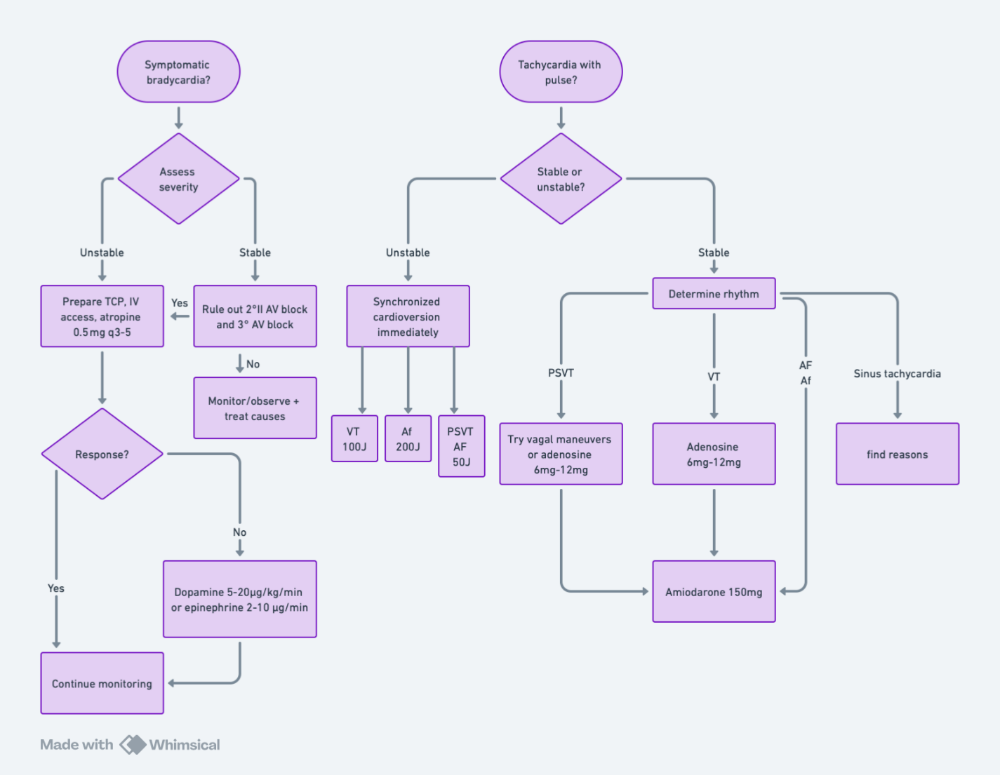

ACLS
Monday, March 24, 2025
3:19 PM

- BLS
  - 叫叫CAB
    - 評估反應 & 呼吸（確認無反應+無呼吸）
    - 撥打急救電話（Activate EMS）
    - 檢查脈搏，若無，立即開始 CPR
      - 胸外按壓速率：100-120 次/分鐘
      - 深度：成人至少 5 cm，兒童 5 cm，嬰兒約 4 cm
      - 壓胸與放鬆時間相等
      - 成人壓吹比：30:2
    - 使用 AED，檢查是否為可電擊心律
      - 若為VF或pulseless VT則立即電擊，電擊後立即開始2分鐘CPR
      - 若為PEA或asystole則不可電擊，立刻CPR 2分鐘，並每兩分鐘檢查心律，直到病人會動或是專業團隊接手。

- ACLS
  - ACLS（Advanced Cardiac Life Support，高級心臟救命術）主要適用於
    - 成人心搏驟停（Cardiac Arrest）、無脈搏心律異常（如 PEA, pulseless VT）、急性冠症候群（ACS）、中風（Stroke）等緊急狀況。
    - Cardiac Arrest 指的是心臟突然停止有效泵血，導致血流動力學崩潰（hemodynamic collapse），若未即時處置，將迅速導致死亡。

- 四種常見的 Cardiac Arrest 心律類型：
  - Ventricular Fibrillation (VF, 心室顫動)
    - 最常見的可電擊心律
    - 心室無組織性顫動，無有效收縮 → 無心輸出量
    - ECG 特徵： 快速、雜亂的波動，無明顯 P 波、QRS 波或 T 波
    - 處置： 立即去顫（Defibrillation）+ CPR + Epinephrine
  - Pulseless Ventricular Tachycardia (pVT, 無脈搏心室頻脈)
    - 心室快速規律收縮但無效排血 → 無脈搏
    - ECG 特徵： 寬大且規則的 QRS 波（通常 \>0.12 秒），無 P 波
    - 處置： 立即去顫（Defibrillation）+ CPR + Amiodarone
  - Pulseless Electrical Activity (PEA, 無脈搏電氣活動)
    - ECG 顯示有組織性電氣活動（如正常竇性或緩慢心律），但無有效脈搏
    - 常見原因： 5H & 5T（如低血容量、低氧、心包填塞、肺栓塞等）
    - 處置： CPR + Epinephrine + 處理可逆原因（H’s & T’s）
    - 不可電擊心
  - Asystole (心靜止)
    - 完全無心臟電氣活動 → 平直線（Flatline）
    - ECG 特徵： 等電位直線（注意與 Lead 脫落區分）
    - 處置： CPR + Epinephrine + 尋找可逆原因
    - 不可電擊心律

- ACLS 在心搏驟停時的核心流程
  - 確認狀況及求援
    - 評估患者反應（無反應，無正常呼吸/喘息）
    - 啟動急救系統（Activate emergency response system）
    - 開始高品質 CPR（Chest compression 30:2，速率 100-120/min，深度至少 5 cm）
    - 盡快使用 AED（若可用）
  - 供氧與監測
    - 給予氧氣（Apply Oxygen）：
      - 使用 Bag-Valve-Mask（BVM）與 100% 氧氣
      - 若有條件可進行進階氣道（如氣管插管）
    - 連接心律監測（Attach Monitor/Defibrillator）：
      - 使用 AED 或 Manual Defibrillator
      - 進行心律分析（Rhythm Analysis）
  - 分析心律（Rhythm Analysis）
    - 使用 Defibrillator/AED 檢查心律，分為兩大類：
      - 可電擊心律（Shockable Rhythms）
        - **Ventricular fibrillation (VF, 心室顫動)**
        - **Pulseless ventricular tachycardia (pVT, 無脈搏心室頻脈)**
          - 立即200J去顫（Defibrillation）
          - 繼續 CPR 2 分鐘，然後重新評估心律
          - 同時給予 **Epinephrine 1 mg**（每 3-5 分鐘一次）
          - 若仍為可電擊心律，給**Amiodarone 300 mg（可追加 150 mg）**
      - **不可電擊心律（Non-shockable Rhythms）**
        - **Asystole（心靜止）**
        - **Pulseless Electrical Activity (PEA, 無脈搏電氣活動)**
          - 繼續 CPR 2 分鐘，不電擊
          - 立即給 **Epinephrine 1 mg**（每3-5分鐘一次）
          - 尋找可逆因素（H's & T's）
  - 可逆因素（H's & T's）
    - 在處理 PEA 或 Asystole 時，應積極尋找並處理可逆因素：
      - H's（5H）：
        - Hypovolemia（低血容量）
        - Hypoxia（低氧）
        - Hydrogen ion (Acidosis)（酸中毒）
        - Hyper/Hypokalemia（高鉀/低鉀）
        - Hypothermia（低溫）
      - T's（5T）：
        - Tension pneumothorax（張力性氣胸）
        - Tamponade (cardiac)（心臟填塞）
        - Toxins（毒物/藥物過量，如 opioid, TCA）
        - Thrombosis (pulmonary or coronary)（肺栓塞/心肌梗塞）
        - Trauma（創傷）
  - 循環恢復（ROSC, Return of Spontaneous Circulation）
    - 若有心跳恢復，進入 Post-Cardiac Arrest Care
    - 維持 SpO₂ 94-99%
    - 維持血壓（SBP ≥90 mmHg, MAP ≥65 mmHg）
    - 若患者無意識，考慮 Targeted Temperature Management (TTM, 32-36°C, 24-48 小時）
    - 尋找原發原因（如心導管檢查）
    - 持續監測，預防再發作

- ACLS 心搏過緩處置流程
  - 初步評估
    - 確認心搏過緩定義：
      - 心率 \< 50 bpm（但臨床意義取決於症狀與血流狀況）
    - 評估生命徵象與症狀：
      - 血壓、呼吸、意識狀態
      - 有無低灌流症狀（Poor Perfusion Signs）：
        - 意識改變（如意識不清、嗜睡）
        - 低血壓或休克跡象
        - 胸痛
        - 呼吸困難
        - 急性心衰竭徵象
  - 情況是否穩定？
| 情況            | 處置                     |
|-----------------|--------------------------|
| 無症狀/血流穩定 | 觀察、持續監測、尋找病因 |
| 有症狀/血流不穩 | 進行藥物或TCP治療        |

- 積極處置（若出現症狀）
  - 藥物治療順序：
    - Atropine
      - 劑量： 0.5 mg IV 每 3-5 分鐘一次
      - 最大劑量： 3 mg
      - 作用： 阻斷迷走神經刺激，增加心率
    - 若 Atropine 無效 → 考慮以下選項：
      - Dopamine（多巴胺）
        - 劑量：2-20 mcg/kg/min IV（依反應調整）
        - 增加心輸出量與心率
      - Epinephrine（腎上腺素）
        - 劑量：2-10 mcg/min IV
        - 正性心肌作用，增加心率與血壓

- 經皮心臟節律器（Transcutaneous Pacing, TCP）
  - 適用於：
    - Atropine 無效或反應不佳
    - 高度房室傳導阻滯（如 Mobitz II, 完全房室傳導阻滯）
    - 重度症狀或不穩定狀況

- 繼續管理與考慮病因
  - 糾正可能的可逆原因（H's & T's）：
    - Hypoxia、Hypovolemia、Hypothermia、Hyper/Hypokalemia
    - Tension pneumothorax、Tamponade、Toxins、Thrombosis（MI/PE）
  - 考慮永久性節律器（Pacemaker）的適應症

- ACLS心博過速處置流程
  - 初步評估
    - 確認心搏過速定義：
      - 成人心率 \> 150 bpm
    - 評估生命徵象與症狀：
      - 血壓、呼吸、意識狀態
      - 有無低灌流症狀（Poor Perfusion Signs）：
        - 意識改變（如意識不清、嗜睡）
        - 低血壓或休克跡象
        - 胸痛
        - 呼吸困難
        - 急性心衰竭徵象
  - 情況是否穩定？
| 情況             | 處置                                         |
|------------------|----------------------------------------------|
| 不穩定（有症狀） | 立即同步電復律（Synchronized Cardioversion） |
| 穩定（無症狀）   | 根據 QRS 波型進行藥物治療                    |

- 穩定型心搏過速：**藥物處置**
  - 窄 QRS 複合波（\<0.12 秒） → 可能為 SVT 或 AF
  - **迷走神經刺激法（Vagal maneuvers）**：
    - 咳嗽、Valsalva maneuver 或冷水刺激
  - **Adenosine（腺苷）：**
    - **劑量： 6 mg IV push → 無效可追加 12 mg**
    - 快速注射並緊接 20 mL 生理食鹽水沖洗
  - 若 **Adenosine 無效** → 考慮：
    - **Beta-blockers（如 Metoprolol）**
    - **Calcium channel blockers（如 Diltiazem）**
    - 針對 AFib/AFlutter： 使用抗心律不整藥（如 Amiodarone）

- 寬 QRS 複合波（≥0.12 秒） → 可能為 VT/VF 或 SVT with aberrancy
  - 考慮 **Amiodarone、Procainamide 或 Sotalol**：
    - Amiodarone： 150 mg IV over 10 分鐘，必要時可再重複
  - 若懷疑為 **Torsades de Pointes（多形性 VT）：**
    - **Magnesium sulfate 2 g IV**
  - 若為 WPW 症候群合併 AFib → 禁用 AV node 阻斷藥物（如 CCB, BB）
  - 若症狀惡化或無效 → 考慮**同步電復律**
- 不穩定型心搏過速：立即同步電擊（synchronized cardioversion）
  - 適用於以下情況：
    - 低血壓、意識改變、胸痛或急性心衰竭
  - **同步電復律劑量建議：**
    - **Narrow Regular（SVT）： 50-100 J**
    - **Narrow Irregular（AFib）： 120-200 J**
    - **Wide Regular（VT）： 100 J**
    - **Wide Irregular（VF 或多形性 VT）： 非同步電擊（Defibrillation）**
- 考慮可逆原因（H's & T's）：
  - Hypoxia、Hypovolemia、Hyper/Hypokalemia、Hypothermia
  - Tension pneumothorax、Tamponade、Toxins、Thrombosis（MI/PE）

**REFERENCE：**
- Boards & Beyonds：ACLS&tachycardia
- USMLE Step 2 CK
- <https://cpr.heart.org/en/resuscitation-science/cpr-and-ecc-guidelines/algorithms>

ACLS flowchart

心博過緩和心博過速flowchart
