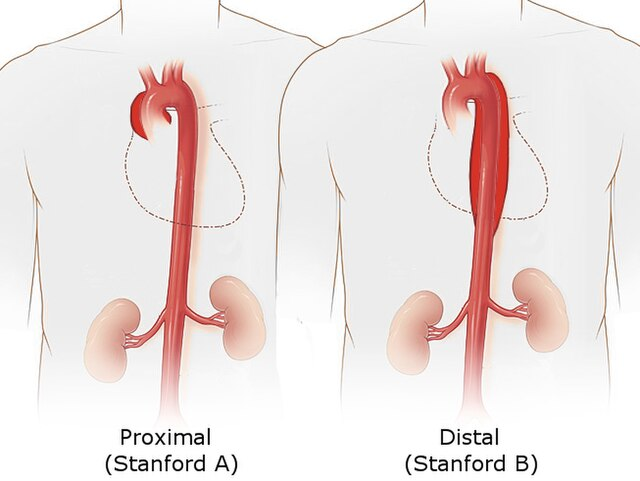
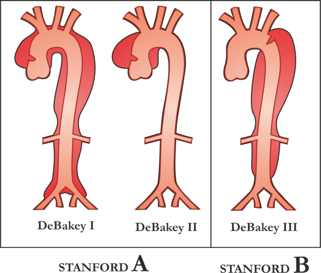

- 定義
  - 內膜有破口（intimal tear）→ 主動脈壁adventitia和media間形成false lumen
  - **急性 \<** 14天 **\> 慢性**

- 分類
  - 根據主動脈被侵犯之範圍，而非以內膜撕裂處所在之地點決定，目前常用的分類有**Stanford**及**DeBakey**兩種
  - **Stanford**：根據剝離範圍有無牽涉到升主動脈（ascending aorta）為分類
    - **Type A**（2/3）：牽涉到升主動脈
      - 發生後每小時死亡率增加1-2%
      - 接受治療後死亡率40%，未治療死亡率達90%，
    - **Type B（**1/3）：無牽涉到升主動脈
      - 1年存活率約85%；5年存活率\>70%

- （圖說：主動脈剝離之Stanford分類）
- Reference：Aortic dissection types (by Stanford system), Npatchett, 27 March 2015

- **Debakey**：考慮到破口位置
  - **Type I**（60%）：破口在升主動脈，剝離至升主動脈及降主動脈（descending aorta）
  - **Type II**（10-15%）：僅牽涉升主動脈（頭臂動脈之前）
  - **Type III**（=Stanford type B）（25-30%）：僅牽涉降主動脈（左鎖骨下動脈遠端）
    - **IIIa**：橫隔以上的descending aorta
    - **IIIb**：延伸到橫隔以下

- （圖說：主動脈剝離之Debakey分類）
- Reference：Classification of the aortic dissection. The DeBakey system, is an anatomical description. The Stanford system is used more commonly now, as it is more attuned to the management of the patient, Vanda Machová MD, 18 April 2014  
  <https://www.wikiskripta.eu/w/Soubor:Disekce_klasifikace.png>

- 流行病學
  - 發生率
    - 發病高峰：**60-80 歲**
    - 結締組織疾病患者之發病高峰期：30-50歲
    - **男 \> 女**
  - 位置
    - **升主動脈（~65%）**
    - 降主動脈、左鎖骨下動脈遠端（20%）
    - 主動脈弓（10%）
    - 腹主動脈（5%）
  - 危險因子
    - 高血壓（\>70%）
    - 結締組織疾病：Marfan's syndrome
    - 動脈硬化、血管平滑肌病變
    - 先天性主動脈窄縮（coarctation of the aorta）
    - 創傷
    - 懷孕：第三孕期
- 病因
  - 先天性
    - 結締組織疾病：Marfan's syndrome 、Ehlers-Danlos syndrome
    - 二葉式主動脈瓣（bicuspid aortic valve）：Turner syndrome
    - 主動脈窄縮
  - 後天性
    - 高血壓（最常見危險因子）
      - 約70%患者因血壓升高，導致剝離範圍擴散並增加破裂風險
      - 例外：**少於40歲的患者中，不到40%的病例是由高血壓引起的**
    - **創傷性**：車禍導致減速損傷、瓣膜置換/移植手術中的醫源性損傷
    - **血管炎**：梅毒感染、大動脈炎
    - **藥物濫用**：**Amphetamine、Cocaine**
    - **懷孕**：**妊娠晚期、產後早期**
    - **動脈粥狀硬化**
  - 病生理
    - 主動脈血管壁有內膜(tunica intima)、中膜(tunicamedia)和外膜(tunica adventitia) 三層
      - 當內膜破裂時，加上主動脈血流壓力大，會導致血液流入血管壁
→ 將中膜撕裂成中膜內層和中膜外層，形成假腔(false lumen)，範圍為中層內層到外膜(Adventitia)

→ 灌注入假腔的血流增加使其逐漸膨脹，甚至會壓迫到真腔(true lumen)

→ 血流量（flow volume）降低進而影響到全身血液供應，造成器官灌流不足（malperfusion syndrome）

→ 假腔的血管外壁脆弱，容易破裂引起大出血、休克甚至死亡
- 臨床特徵
  - 突發性的**劇烈胸痛，合併後背痛（interscapular pain）。**隨著主動脈剝離的進展，病人會描述有**撕裂痛(tearing pain)**的感覺
    - 僅在前胸：可能為升主動脈剝離
    - 延伸至頸部或下顎：可能有主動脈弓剝離
    - 延伸至下背部，可能為降主動脈剝離
  - 血壓上升、心跳增加、臉色蒼白、冒汗、頭暈、呼吸困難
  - 器官灌流不足（malperfusion syndrome）：主動脈剝離侵犯到其他血管或是假腔壓迫真腔影響血流引起
    - 冠狀動脈：缺血性心臟病
    - 主動脈瓣：急性心衰竭
    - 兩側頸動脈：腦中風
    - 脊椎動脈：下半身麻痺（paraplegia）
    - 腎動脈：寡尿、無尿、急性腎衰竭
    - 骼動脈（iliac artery）或腹主動脈分叉處（aortic bifurcation）：單側或雙側下肢缺血，numbness、pale 和 pulseless
  - 心包膜填塞(cardiac tamponade)
    - 當心包膜積液累積到一定程度，會影響心臟舒張，造成回心血量減少，連帶造成心輸出量減少
    - 臨床表現：Beck's triad
      - **頸靜脈壓（Jugular venous pressure）上升**
      - **低血壓（Hypotension）**
      - **Distant heart sounds**（隔一層積液，心音聽起來低沉，好像很遠的感覺）
    - Pulsus paradoxus：吸氣時SBP下降超過10 mmHg 或者9%
    - Kussmauls sign：吸氣時JVP上升（正常吸氣胸腔變更負壓，JVP下降）
  - 心跳停止、死亡
    - 若近端主動脈剝離，血液破出外膜（adventitia）併發心包膜填塞，死亡率極高
    - 通常是急性產生，容易快速變成阻塞性休克，造成心跳停止

- 診斷
  - 胸部X光
    - 中膈擴大（mediastinum widening）、Aortic knob消失、氣管右偏、左支氣管下移
  - CT：首選
    - false lumen會較正管血管腔黑
    - 近端剝離較不清楚，敏感度約80%
    - 遠端剝離敏感度可達 90-95%
  - 血管攝影（CTA）：Gold Standard
    - 可看到 intima dissection flap、double lumen
  - MRI：不需顯影劑，敏感性及特異性皆高
  - 經食道超音波（Transesophageal echocardiography, TEE）
    - **適應症**：病人vital sign不穩定、腎功能不好不能使用contrast
    - 近端剝離：敏感度可達95%以上
      - 可清楚看到心包膜積水、動脈瓣、冠狀動脈的問題
    - 遠端剝離：敏感度僅80%
- 處置
  - 處置方式依照急性(≦14天)、慢性(\> 14天)，Type A或Type B而有所不同
  - **慢性**
    - 定期追蹤：CT、MRA，頻率為 1.5個月（6週）、3個月、6個月，之後每年追蹤
    - 約20-40% 急性期後的病患在2-5年內假腔會持續擴大，若**最大直徑\>5公分**或者**每年增長\>0.5公分**，則建議**開刀**
    - **藥物治療為主（anti-impulse therapy）**
      - **目標：控制心律在60-80/min，收縮壓110-120 mmHg，MAP 80 mmHg**
      - **β1-blocker**：**esmolol**
        - 短效（short-acting）且容易調整劑量
        - 降低心臟收縮強度， 且預防直接給予血管擴張劑造成反射性心跳加速
      - **CCB、Sodium nitroprusside：**需合併β-blocker使用
        - 需合併β-blocker使用，避免心室收縮力過強
        - 副作用：cyanide toxicity 和 paraplegia
      - **嗎啡**：止痛
  - **急性**
    - 急性期mortality和morbidity最高，嚴重的併發症多發生在前14 天
    - 急性期開刀風險也相當大，不過病人要是相當unstable且合併complication，考量下還是得開刀
    - **Type A**：緊急開刀
      - **Mortality 高，嚴重併發症機率高**
        - 器官灌流不足（malperfusion syndrome）：腦、內臟、腎及周邊缺血
        - 心臟：acute aortic insufficiency、coronary ischemia 或 cardiac tamponade
        - 破裂（rupture）
      - **若不開刀，前48小時內，死亡率每隔一小時增加1%**
        - 兩天：50%；兩周：75%；一年：90%
      - **手術方式**：**置換升主動脈(或是主動脈弓)**及**去除內膜撕裂處**為主要目的，以避免病患發生升主動脈破裂及改善各器官缺血情況
        - **Open手術優先**
          - endovascular stent graft（EVSG）只能用在Type B或不適合open的病人
        - **須建立心肺體外循環(cardiopulmonary bypass, CPB)**，確保全身血液循環以及心肌保護
    - **Type B**：先區分病人是 complicated 或 uncomplicated
      - **Complicated**：**積極處置**
        - **Complicated 條件**：
          - 器官灌流不足（malperfusion syndromes），如心絞痛、EKG變化（冠狀動脈）、神經學症狀（腦血管）、寡尿（腎）、腹痛（腸胃）、脈搏減弱、蒼白（周邊血管）
          - 心臟相關併發症（cardiac complications），如心包填塞、急性主動脈瓣閉鎖不全（因剝離裂回主動脈瓣出現主動脈破裂）
          - 病人持續疼痛
        - **處置選擇**：
          - **打洞 Fenestration**
            - 在內膜的intimal Hap上打洞讓假腔內的血流回真腔，使假腔減壓以舒緩真腔所受到的壓迫
          - **支架置放**
          - **主動脈置換**
          - **血管繞道**
      - **Uncomplicated：症狀治療**
        - **低血壓：IV fluid、持續低血壓可給升壓劑（NE, Epi）**
          - 不能給強心劑，會加劇剝離
        - **高血壓：IV B-blocker**（Esmolol、labetalol）→ **Vasodilator**（Verapamil、Diltiazem）
          - 一定要先給B再給血管擴張，不然會反射性心搏加速（reflex tachycardia）
        - **藥物治療**：病人狀況穩定後再給，持續追蹤

- 併發症：急性嚴重的高血壓(Acute severe HTN)
  - Hypertensive urgency
    - 定義：血壓很高(SBP \> 180 and/or DBP \> 120)，但**「無」急性目標器官受損**
    - 臨床表現：通常僅有頭痛、頭暈等輕微症狀，常是慢性高血壓患者無規則服藥或藥物劑量不足
    - 治療：
      - 先使病患在安靜的環境休息，可能就會降10〜20 mmHg
        - 以往希望快速降壓而使用舌下鈣離子阻斷劑(Nifedipine = Adalat)，但在**老人病患(收縮壓高、舒張壓低)，快速降壓可能造成心肌梗塞、腦部缺血性中風**
      - 建議若無Hypertensive emergency的那些症狀出現，僅須以**口服降壓藥在 1~2天內將血壓降至160/100 mmHg以下**即可
    - 口服藥物選擇：依個別病患狀況給予，如CHF、CKD病患給予ACEI等
  - Hypertensive emergency
    - 定義：不管血壓上升多少，病患**「合併」急性目標器官受損(Acute target organ damage)**
      - 腦中風、心肌梗塞、主動脈剝離、急性肺水腫、急性腎衰竭等
    - 臨床表現：頭痛、意識不清、視力模糊、噁心嘔吐，甚至有癲癇發作、喘、寡尿，且血壓常高到220/140
    - 治療
<table>
<colgroup>
<col style="width: 12%" />
<col style="width: 61%" />
<col style="width: 26%" />
</colgroup>
<thead>
<tr class="header">
<th></th>
<th>狀況</th>
<th>目標血壓</th>
</tr>
</thead>
<tbody>
<tr class="odd">
<td>一般患者</td>
<td>IV 藥物(<strong>Nitroprusside、Labetalol</strong>) 將血壓於幾分鐘到2小時內降低</td>
<td>160/100 以下</td>
</tr>
<tr class="even">
<td><strong>保守降壓</strong></td>
<td>
缺血性中風病患

缺血性中風若欲給予血栓溶解劑出血性中風病患

出血性中風病患
</td>
<td>
僅在220/130以上才需降壓

<strong>降至185/110以下</strong>

<strong>降至180/130以下</strong>
</td>
</tr>
<tr class="odd">
<td><strong>積極降壓</strong></td>
<td>
<a href="onenote:%E5%A4%96%E7%A7%91.one#%F0%9F%A7%A0NS|Head%20trauma\%20%E9%A1%B1%E5%85%A7%E5%87%BA%E8%A1%80&amp;section-id={BC9E9AED-B5B5-4309-97AF-D04A7DB9E34C}&amp;page-id={F7B6D218-B37F-4EB1-9CFE-A2793C33973D}&amp;object-id={4547C7F3-AA31-4366-9435-83C45DA1F7BE}&amp;24&amp;base-path=https://d.docs.live.net/56ce32fba64785ca/%E8%87%A8%E5%BA%8A%E7%AD%86%E8%A8%98">SAH</a>建議將MAP

<a href="onenote:https://d.docs.live.net/56CE32FBA64785CA/%E8%87%A8%E5%BA%8A%E7%AD%86%E8%A8%98/%E5%A4%96%E7%A7%91.one#CVS|%E6%80%A5%E6%80%A7%E4%B8%BB%E5%8B%95%E8%84%88%E7%97%87%E5%80%99%E7%BE%A4(acute%20aortic%20syndrome)&amp;section-id={BC9E9AED-B5B5-4309-97AF-D04A7DB9E34C}&amp;page-id={031A2D06-3683-47E6-B4BC-7F056343190D}&amp;object-id={12C9563A-5016-00C6-226D-F9C4AAB6403F}&amp;58">Aortic dissection</a> 建議將 SBP
</td>
<td>
降至130以下

<strong>降至120以下</strong>
</td>
</tr>
</tbody>
</table>
- 缺血性或出血性中風：建議用**labetalol**或**CCB**
  - nitroprusside或nitroglycerin這類藥物會增加腦部血流，造成腦壓增高
  - Nimodipine可預防、治療因動脈瘤引起之蜘蛛膜下出血(SAH)後腦血管痙攣所引起的缺血性神經缺損
- 主動脈剝離：
  - 靜脈注射**β blocker**降低心臟收縮強度，且可預防直接給予血管擴張劑(nitroprusside, CCB )造成反射性心跳加速
  - 血壓仍無法控制，再以靜脈給予**Nitroprusside**將SBP控制在120mmHg以下
- Reference
  - Sabiston Textbook of Surgery 21st Edition
  - Schwartz's Principles of Surgery 11th Edition
  - Aortic Dissection, AMBOSS

