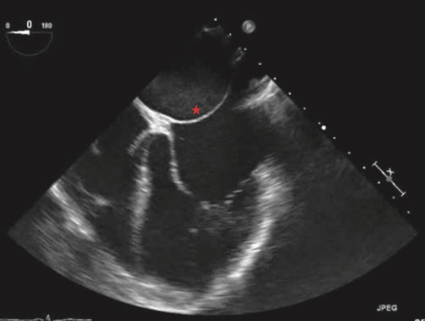

- 定義
  - 左心房被分隔成兩個腔室
- 流行病學
  - 非常罕見，佔所有先天性心臟缺陷的約 0.1%
- 分類
  - Type A：沒有合併ASD
  - Type B：常合併ASD
- 病因
  - 目前未有明確病因
- 病生理
  - 一層纖維肌肉性隔膜將左心房劃分為兩個腔室
    - **上腔室接收肺靜脈回流**
    - **下腔室則與二尖瓣及左心室連通**
  - 常見合併心房中隔缺損（ASD）
    - **通常存在於上腔室與右心房之間**，較罕見的情況是下腔室與右心房之間
  - 三心房症會導致肺靜脈回流受阻至左心房。阻力程度取決於以下幾項因素
    - **左心房隔膜膜上開口（fenestration）的大小**
    - **心房中隔缺損（ASD）的大小**
    - **是否合併其他心臟異常**
- 臨床特徵
  - 若上、下腔室之間的交通口徑小於 3 毫米，患兒通常會在出生第一年內出現症狀，包括：
    - 心輸出量低下
      - **呼吸系統**：**呼吸急促、呼吸困難、鼻翼煽動**
      - **心血管**：**心搏過速、四肢冰冷、蒼白或發紺、微血管充填時間延長（\>2秒）、低血壓偏低**（特別是收縮壓）、**周邊脈搏微弱**
      - **尿量減少**
      - **食慾差、體重不增、哺乳困難**
      - **嗜睡、昏迷、反應遲鈍**
    - 血氧飽和度降低
    - 肺靜脈高壓
    - 鬱血性心衰竭
    - 頸靜脈怒張
    - 肝腫大
  - 聽診
    - **肺動脈第二心音（S2）亢進（loud pulmonary S2 sound）**
    - **右心室搏動感（right ventricular heave）**
- 診斷
  - 血壓：收縮壓低、周邊脈搏微弱
  - 心電圖（EKG）
    - 右心室肥厚
  - 胸部 X 光
    - 心臟擴大
    - 肺血紋增加
  - 心臟超聲波**：確診**

（圖說：三心房症病人的心臟超音波，星號 \* 表示左心房的隔膜）

（Reference：Figure 20-22, P.768, Schwartz's Principles of Surgery 11th Edition）
- 心導管
  - 超音波結果不明確時才需進行
- 處置
  - 手術
    - 需使用體外循環（CPB）與心臟停跳（cardioplegic arrest）
    - 經由右心房切開（right atriotomy），再經由擴大的ASD進入肺靜脈腔室並切除該膜，手術後再以貼片關閉ASD。
    - **切除時需小心避免傷及二尖瓣與心房中隔**
    - **若右心房體積較小**，則可改為**直接切開左心房上腔（於右肺靜脈前方）**，以切除隔膜
    - 手術預後極佳，存活率接近100%
- 併發症
  - 肺動脈高壓
  - 心衰竭
- **Reference**
  - Sabiston Textbook of Surgery 21st Edition
  - Schwartz's Principles of Surgery 11th Edition

