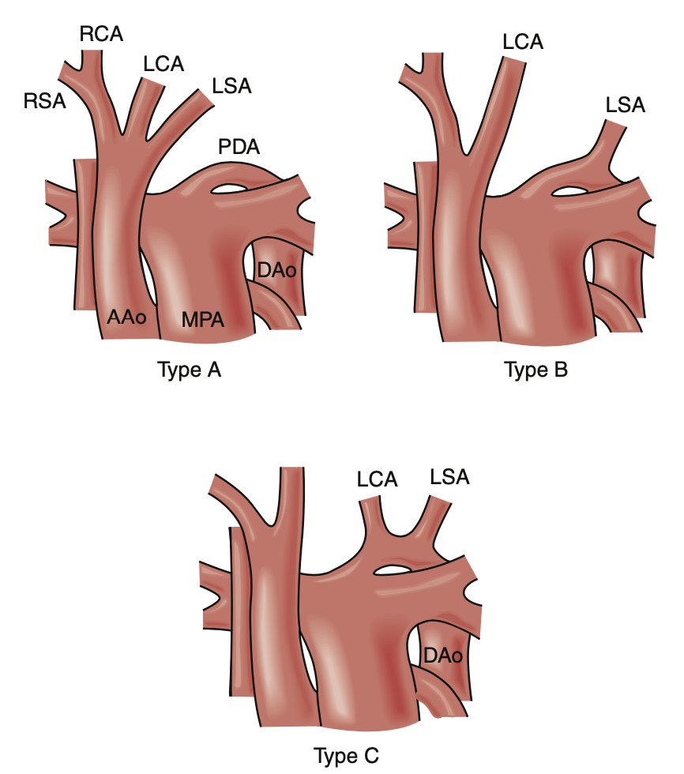
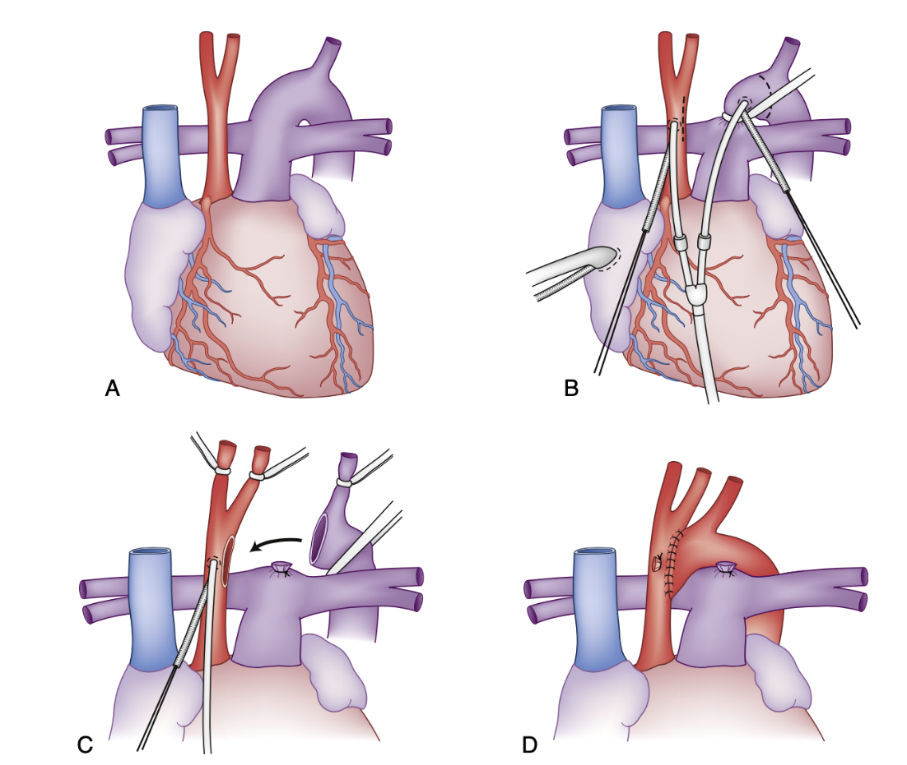

- 定義
  - 主動脈弓與降主動脈中斷，靠PDA連接降主動脈
- 流行病學
  - 約佔所有先天性心臟病 (CHD) 的 1-1.3%
- 病因
  - 胎兒主動脈弓未能正確融合和退化
  - 常合併 VSD、PDA
  - 與Turner syndrome、DiGeroge syndrome 有關
- 分型
  - **A型**：**左鎖骨下動脈遠端**
  - **B型**：**左鎖骨下動脈與頸總動脈之間**
  - **C型**：**左鎖骨下動脈近端**

（圖說：主動脈弓中斷之分型）

（Reference：FIG. 59.36 Classification of interrupted aortic arch,

Sabiston Textbook of Surgery 21st Edition）
- 病生理
  - 常見發現是異常的右鎖骨下動脈（經食道後路徑 retroesophageal），起源於**降主動脈**。
  - 通常不是單獨存在的缺陷，大多數會同時合併室間隔缺損（VSD）或開放性動脈導管（PDA）
  - **導管依賴性 (ductal-dependent)**
    - IAA 的病童，其血流依賴動脈導管維持。一旦動脈導管關閉，病童將會出現嚴重的代謝性酸中毒，影響其血流動力學，甚至致命
    - 在少數情況下，**病童的動脈導管未關閉，嬰兒期可能沒有症狀而未被診斷**，但這類病童會**因持續的左向右分流，而漸漸產生鬱血性心衰竭的症狀**
- 臨床特徵
  - **動脈導管關閉**：嚴重的代謝性酸中毒、血流動力學不穩、下肢發紺、缺血、休克致命
  - **動脈導管未關閉：**長期下來慢慢發展成**鬱血性心衰竭**
- 診斷
  - **確診：**心臟超音波
  - 其他方法：心導管（cardiac catheterization）
  - **在動脈導管未能閉合的情況下，可能會在嬰兒期被漏診**
- 治療
  - **需在新生兒時期進行外科治療，同時修補心內缺損**
  - 初步處置
    - 確診後，便需立即準備進行**手術治療**
    - **術前輸注前列腺素 E1（PGE1）**：維持動脈導管開放並糾正酸中毒。
    - **機械通氣、強心劑（inotropes）**：優化嬰兒的血流動力學
    - **降低吸入氧濃度（FiO₂）、避免過度換氣**：增加肺血管阻力，藉此讓更多血流導向系統循環。
  - 手術
    - 目前首選是在新生兒期進行單次全面的手術修復 (complete one stage surgical repair)
      - **經正中胸骨切開（median sternotomy）**
      - 使用**體外循環（CPB）與短暫的循環暫停（circulatory arrest）**
      - **主動脈弓重建**：透過**直接吻合或貼片成形術（patch aortoplasty）**
      - 接著再進行 **VSD 的關閉**

(圖說：單次全面的手術修復 (complete one stage surgical repair) ，A：B 型主動脈弓間斷（Type B interrupted aortic arch）；B：插管位置與手術切口的位置；C：降主動脈被拉至縱膈腔內，接著以端側吻合（end-to-side anastomosis）的方式接合至升主動脈。)

（Reference：FIG. 59.37, Sabiston Textbook of Surgery 21st Edition）
- **過去 IAA 治療**：姑息性手術
  - 經左側開胸（左胸廓切開術）
  - 利用主動脈弓的一支分支血管作為導管來重建主動脈
  - **缺點**：無法一併修補心室中膈缺損（VSD）或其他心內缺損
    - 只能**合併肺動脈束帶術，以限制左向右分流**。
- **若合併左心發育不全（hypoplastic left heart）**
  - 不能進行完整修補
  - **先接受 Norwood procedure，後續再進行 Fontan procedure 來重建循環**
- **貼片成形術優點**
  - **確保左心室流出道（LVOT）狹窄獲得充分緩解**
  - **減少吻合處的張力**
  - **降低術後再次狹窄（restenosis）機率**
  - **降低氣管及支氣管受壓（tracheobronchial compression）的風險**
- 但德州兒童醫院（Texas Children’s Hospital）的研究團隊報告指出，使用原生組織直接吻合修補（primary tissue-tissue repair），可有助降低日後主動脈弓再次狹窄的風險
- 預後
  - 手術死亡率：\<10%
- 併發症
  - 代謝性酸中毒
  - 鬱血性心衰竭
  - 新生兒死亡
  - **術後風險**
    - 氣管及支氣管受壓
    - 主動脈弓再狹窄
    - 復發性主動脈弓阻塞
- **Reference**
  - Sabiston Textbook of Surgery 21st Edition
  - Schwartz's Principles of Surgery 11th Edition

