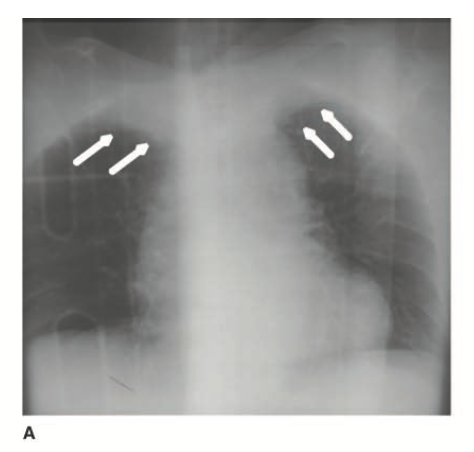

大血管損傷（Great Vessel Injuries）
2025年7月15日 星期二
下午2:16
- 病因
  - **穿刺性創傷（penetrating trauma）**：超過 90% 的胸腔大血管損傷的原因，死亡率接近 90%
  - **鈍傷（blunt injury）**：少見，但可能造成**假性動脈瘤（pseudoaneurysm）**或**血管破裂（frank rupture）**
- 鈍性創傷胸主動脈損傷（blunt traumatic aortic injury, BTAI/BAI）
  - **常見受損血管**：無名動脈（innominate artery）、鎖骨下動脈（subclavian artery）、降主動脈（descending aorta）
  - 預後
    - 大約 80% 的 BTAI 患者在送達醫院前死亡
    - 能存活至醫院者，有 **50% 在 24 小時內死亡**
  - 病生理
    - **快速減速（rapid deceleration）**：使主動脈於動脈韌帶（ligamentum arteriosum）附近撕裂
    - **側向受力機轉（lateral mechanisms）**：主動脈弓猶如槓桿，在主動脈峽部（aortic isthmus）產生扭力（torque）
  - 分級
<table>
<colgroup>
<col style="width: 12%" />
<col style="width: 33%" />
<col style="width: 54%" />
</colgroup>
<thead>
<tr class="header">
<th>分級</th>
<th>描述</th>
<th>詳細說明</th>
</tr>
</thead>
<tbody>
<tr class="odd">
<td>Grade I</td>
<td><strong>內膜撕裂或剝離瓣 
（Intimal tear or intimal flap）</strong></td>
<td>損傷<strong>僅限於主動脈內膜</strong>，外觀沒有異常，輕微損傷</td>
</tr>
<tr class="even">
<td>Grade II</td>
<td><strong>壁內血腫 
（Intramural hematoma）</strong></td>
<td>血液滲入主動脈壁內，但<strong>未造成全層破裂</strong>（without full-thickness disruption）</td>
</tr>
<tr class="odd">
<td>Grade III</td>
<td>
<strong>假性動脈瘤形成</strong>

<strong>（Pseudoaneurysm formation）</strong>
</td>
<td>血液突破內膜，聚集於外膜內（adventitia），形成被包裹的假性動脈瘤</td>
</tr>
<tr class="even">
<td>Grade IV</td>
<td>
<strong>完全破裂或橫斷</strong>

<strong>（Free rupture or transection）</strong>
</td>
<td>主動脈全層破裂，血液外滲</td>
</tr>
</tbody>
</table>
- 診斷
  - **胸部X光**
    - 縱膈擴大
    - 肺尖帽狀陰影（apical capping）

（箭頭為 apical capping）  
（Reference：Figure 7-23, Chapter 7 Truma, Part I Basic considerations, Schwartz's Principles of Surgery 11th Edition,）
- 主動脈弓消失
- 左主支氣管偏移（deviation of the left mainstem bronchus）

（箭頭顯示偏移的左主支氣管）

（Reference：Figure 7-23, Chapter 7 Truma, Part I Basic considerations, Schwartz's Principles of Surgery 11th Edition,）
- **胸部電腦斷層**
  - 漏診率較胸部X光低
- **螺旋式胸部CT血管攝影（helical CT angiography）**
  - **適應症**：高能量創傷（high-energy injury mechanisms）
  - 目前單純胸部CT通常足以規劃手術方案，不太需要血管攝影了
- 治療
  - 根據損傷類型
    - **升主動脈、主動脈弓的單純撕裂傷**：側向縫合術（lateral aortorrhaphy）
    - **後側主動脈損傷（posterior aortic injuries）**、**複雜的升主動脈或主動脈弓損傷**：人工血管重建
      - **進行修補時需使用體外循環**
    - **無名動脈損傷**：人工血管重建
      - 可使用旁路阻斷技術（bypass exclusion technique），而無需使用體外循環
      - 進行修復時，先以人工血管**從近端未受損的血管段進行側端吻合**（end-to-side anastomosis），**再與無名動脈進行端對端吻合**（end-to-end anastomosis）
      - 之後**再將無名動脈起始處以縫合封閉（oversewn）方式處理**，以隔離假性動脈瘤或其他損傷
    - **鎖骨下動脈損傷（Subclavian artery injuries）**
      - 側向動脈縫合術（lateral arteriorrhaphy）或 人工血管重建（PTFE graft interposition）
      - 由於此動脈具有多條分支且與周邊結構緊密連結，**若有明顯的節段性缺損**（segmental loss），**則不建議進行端對端的原位吻合**（end-to-end primary anastomosis）
    - **降主動脈損傷（Descending blunt aortic injury, BAI）：**需要緊急處置
      - 若病人合併顱內出血、腹內出血，或不穩定的骨盆骨折，需優先處理，處理順序高於主動脈修補
      - 為避免主動脈破裂，應於在急救區時使用 Labetalol、Esmolol（選擇性 β1 阻斷劑, selective β1-antagonist）
        - 目標為收縮壓 \<100 mmHg，心率 \<100 bpm
        - 在進行修復前，用以控制主動脈壁壓力（aortic wall stress）
      - **術式**
        - **胸主動脈內血管修復術（thoracic endovascular aortic repair, TEVAR）**
          - 血管支架經由鼠蹊部進入
          - **若支架遮蓋到左鎖骨下動脈的開口**（ostia of the left subclavian artery），**且出現相關症狀**，可能需額外進行總頸動脈至鎖骨下動脈繞道（carotid-to-subclavian bypass）
        - **開放性修補降主動脈**
          - 需使用左心部分體外循環（partial left heart bypass）以防止脊髓與腹腔內器官缺血，降低脊髓損傷造成的下半身癱瘓（paraplegia）風險，並減少左心室後負荷
          - 左側開胸
          - 若有大型穿刺傷或鈍傷斷裂（blunt transection），需將受損主動脈段以人工血管替代
  - **主動脈內膜損傷（intimal aortic injuries）**
    - **Grade I** ：可採取非手術處置，使用抗血小板藥物及控制血壓即可
    - **Grade II-IV**：建議進行血管內修復，尤其是有假性動脈瘤或動脈瘤破裂時
  - **合併假性動脈瘤（pseudoaneurysm）的 BTAI**
    - 必須進行手術修復，避免破裂
# Reference
1.  Schwartz's Principles of Surgery 11th Edition
2.  Sabiston Textbook of Surgery 21st Edition
