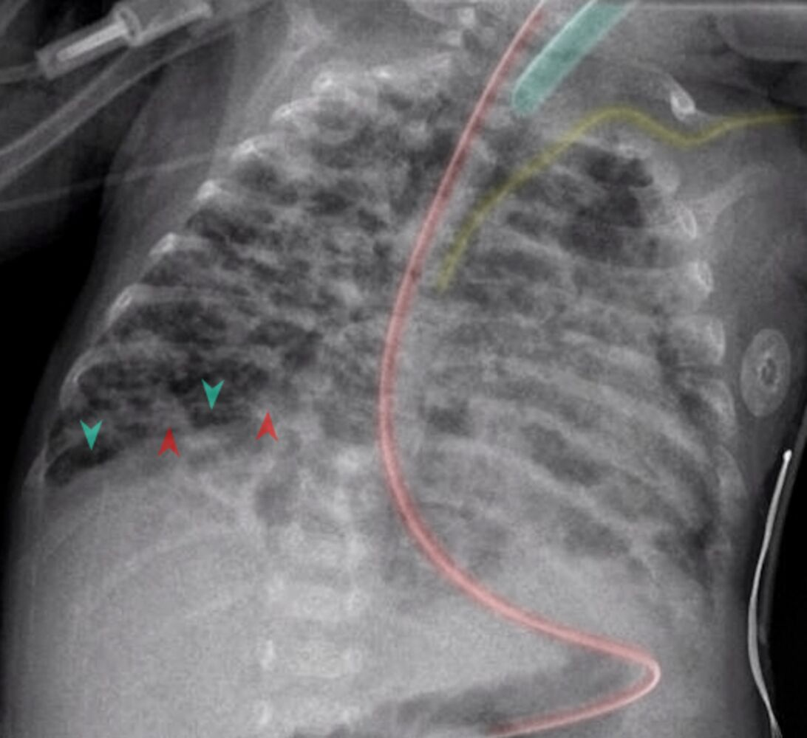

新生兒呼吸相關疾病
2025年2月13日
下午 03:44
相關條目：

- 小兒ECMO：
  - 適應症：
    - [胎便吸入症候群](onenote:#👼新生兒|呼吸疾病&section-id={7F1F1CC4-6BFC-4569-AF12-D38F3AE381D1}&page-id={57A1048E-6EE6-4FA6-A88B-17BE096F5F89}&object-id={9A4DA577-4028-07F6-0E92-2BC4BD3DDA19}&D&base-path=https://d.docs.live.net/56ce32fba64785ca/臨床筆記/兒科.one)
    - [呼吸窘迫症候群(respiratory distress syndrome)](onenote:#👼新生兒|呼吸疾病&section-id={7F1F1CC4-6BFC-4569-AF12-D38F3AE381D1}&page-id={57A1048E-6EE6-4FA6-A88B-17BE096F5F89}&object-id={FA82F1F2-2580-0CC5-0E3F-9C76007081D6}&11&base-path=https://d.docs.live.net/56ce32fba64785ca/臨床筆記/兒科.one)
    - [新生兒持續性肺動脈高壓(persistent pulmonary hypertension of newborn, PPHN)](onenote:#👼新生兒|呼吸疾病&section-id={7F1F1CC4-6BFC-4569-AF12-D38F3AE381D1}&page-id={57A1048E-6EE6-4FA6-A88B-17BE096F5F89}&object-id={49C17E3D-7273-0259-365E-96955BEB32F0}&E3&base-path=https://d.docs.live.net/56ce32fba64785ca/臨床筆記/兒科.one)
    - 敗血症
    - 先天性橫膈疝氣(congenital diaphragmatic hernia)
  - 禁忌症：
    - 顱內出血風險高而嚴重早產的寶寶(severe prematlirity due to a high risk of intracranial bleeding)
    - **體重\<2kg**
    - 顱內出血(grade II 腦室內出血)
    - 不可逆肺部疾病(先天性肺泡發育不良)

- 呼吸窘迫症候群(Respiratory distress syndrome, RDS)
  - 定義：由於表面張力素(surfactant)缺乏或不足造成的疾病
  - 病因：
    - 通常為早產兒的原發疾病
    - 次發性表面張力素的缺乏：[胎便吸入症候群](onenote:#👼新生兒|呼吸疾病&section-id={7F1F1CC4-6BFC-4569-AF12-D38F3AE381D1}&page-id={57A1048E-6EE6-4FA6-A88B-17BE096F5F89}&object-id={9A4DA577-4028-07F6-0E92-2BC4BD3DDA19}&D&base-path=https://d.docs.live.net/56ce32fba64785ca/臨床筆記/兒科.one)、肺炎、肺出血、敗血症
  - 流行病學:
    - 好發於早產兒，**發生率與懷孕週數成反比(同[Apnea](onenote:#👼新生兒|呼吸疾病&section-id={7F1F1CC4-6BFC-4569-AF12-D38F3AE381D1}&page-id={57A1048E-6EE6-4FA6-A88B-17BE096F5F89}&object-id={129174CB-0351-03F1-144A-4D965DD39DD8}&19&base-path=https://d.docs.live.net/56CE32FBA64785CA/臨床筆記/兒科.one))**
    - 出生時懷孕週數低於30週：發生率60%
    - 出生時懷孕週數為39週：發生率幾乎為0%
  - Risk factor：
    - **早產(最重要因素)**
    - 糖尿病、懷孕期間營養不良
    - 剖腹產
    - 男嬰
  - 病生理學：第二型肺泡細胞分泌肺泡張力素不足→肺部膨脹不全→出生時呼吸窘迫
  - 臨床表現：
    - 出生時或出生後6小時內發生症狀，隨時間逐漸惡化到24-72小時為高峰
      - 若未處理則在出生後第一個48~72小時之內會惡化
    - 呼吸過速、吐氣時呻吟(grunting)、肋下及胸骨凹陷、鼻翼搧動
    - room air下發紺、四肢水腫
  - CXR：
    - Low lung volume
    - prominent pulmonary vascular markings
    - flat diaphragms
    - Diffused reticular granular pattern air bronchograms
  - 病理表現：hyaline membrane disease(HMD)
    - 玻璃樣變性的膜狀構造(hyaline membrane)、塌陷肺泡
  - 評估:
    - 產前評估:
      - Lecithin-sphingomyelin(L/S)ratio：
        - 當L/Sratio\>2：28~32週出生的新生兒發生RDS機率小於5%
          - 母親為糖尿病患者的新生兒為例外
      - Desaturated phosphatidylcholine(DSPC) concentration：
        - DSPC濃度\>500mg/dL：肺部未成熟機率低於1%
      - 母親為糖尿病患者：L/S ratio、DSPC濃度評估要求標準較高(L/Sratio\>3·5,DSPC濃度\>1,000ug/dL)
    - 出生時評估:
      - Hypoxemia、動脈血氧分壓低於50mmHg、給予FiO2\>50%的氧氣仍然無法使Pa02\>80mmHg
      - Shake test：
        - 取0.5ml胃抽取物、與0.5ml純酒精放入試管混合並搖晃15分鐘
        - 搖晃後混合物出現穩定泡沫表示有表面張力素出現
        - 陰性或是+1：發生RDS機會約60%
        - +2以上則可能性為5%
      - Phosphatidylglycerol(PG)
  - 併發症：
    - 支氣管肺發育不良(bronchopulmonary dysplsia)
      - 定義：NRDS長期機械通氣、O2 therapy繼發的慢性肺部疾病
      - 病因：肺氣壓傷、氧中毒，由於肺部通氣不成熟(通氣時間超過28天)，隨後導致肺組織發炎
      - 臨床特徵
        - 見於32 週以下的嬰兒
        - 與RDS 相似的症狀持續存在
        - Desaturation
      - 診斷：
        - CXR：瀰漫性、細小、顆粒狀密度，肺部不張區域散佈著過度充氣區域
        - ABG：呼吸性與代謝性酸中毒
      - 治療：控制O2 supply、利尿劑
        - 
    - O2治療的併發症：[retinopathy of prematurity](onenote:https://d.docs.live.net/56CE32FBA64785CA/臨床筆記/眼科.one#視網膜&section-id={177E4EDB-E165-42B0-88D9-AC52B18BE5A2}&page-id={997235BA-DEE9-4C46-854C-36FF4152AED8}&object-id={7949FA0A-D1EC-45AB-951C-AF1D92696F62}&E3)、bronchopulmonary dysplasia、intraventricular hemorrhage
  - 治療：
    - 促進肺部發育：**產前24小時到七天前**給予**betamethasone、dexamethasone**
      - 可降低RDS風險(約可降低60%)、新生兒的死亡(約40%)
    - 氣管內插管後給予肺泡表面張力素治療
      - 出生8小時內使用第一劑，且出生時仍有胎兒肺液體時效果最好)
    - 呼吸治療：
      - 治療目標：**permissive hypercapnia(\>60-70 mmHg)、避免hyperoxia(91-95%)**
        - 維持適當通氣避免肺泡塌陷
        - 盡早用正壓呼吸器、嚴重呼吸衰竭考慮插管
- 新生兒暫時性呼吸急促(Transient tachypnea of the newborn, TTNB)
# =濕肺疾病(wet lung disease)=新生兒體液滯留症候群(newborn retained fluid syndrome)
- 定義：
  - 胎兒肺部體液延後清除，造成新生兒出生後立即發生呼吸急促的現象
  - 為一自限性疾病，通常24小時內可以完全恢復
- 診斷：排除性診斷
- 流行病學:
  - 選擇性剖腹產
  - 週產期窒息(perinatal asphyxia)
  - 臍帶脫垂
  - 早產
  - 母親氣喘、糖尿病
- 臨床表現:
  - 出生後立即性呼吸窘迫(peaceful tachypnea)，呼吸速率甚至可達到100~120/min
  - 鼻翼搧動、呼吸時呻吟(grunting)
  - 發紺，給予氧氣後可以改善
- CXR：
  - Hyperinflation
  - 從hilar延伸出明顯的vascular marking
  - 肺葉小裂有fluid(fluid in the fissures)
  - 輕微的心臟擴大(mild cardiomegaly)
- 治療：
  - O2 supply：確保SpO2 ≧ 95%
  - 監測心跳速率、呼吸速率、血壓、血氧飽和度
  - 維持性靜脈輸液給予直到病人症狀減緩
    - 輸液上限60mL/kg/day，以避免呼吸窘迫的加重
  - 保持嬰兒溫暖
- 早產兒呼吸暫停(Apnea of prematurity)
  - 定義：
    - 一般狀態：停止呼吸\>15秒
    - 嚴重的呼吸暫停(severe apnea)：停止呼吸\>20秒或低於20秒但同時有發紺與心搏過慢
  - 流行病學：
    - 早產兒發生呼吸暫停機率通常與**母親懷孕週數成反比(同[RDS](onenote:#👼新生兒|呼吸疾病&section-id={7F1F1CC4-6BFC-4569-AF12-D38F3AE381D1}&page-id={57A1048E-6EE6-4FA6-A88B-17BE096F5F89}&object-id={FA82F1F2-2580-0CC5-0E3F-9C76007081D6}&1B&base-path=https://d.docs.live.net/56CE32FBA64785CA/臨床筆記/兒科.one))**
  - 種類：可分為obstructive、central與mixed三種
    - **==Obstructive apnea==**：
      - 有胸壁的起伏但氣道沒有氣體的流動
      - 胸壁呈現吸氣時咽部氣道發生塌陷
    - **==Central apnea==**：
      - 中樞神經對呼吸相關肌肉刺激減少
      - 沒有氣體流動與胸部起伏，但呼吸道沒有阻塞的證據
    - **==Mixed apnea==**：**(最常見，50~75%**)
      - 阻塞型與中樞型混合
      - 通常阻塞型在中樞型前發生
  - 臨床表現：
    - **==足月新生兒==**：很少會在出生第一天發生apnea，若有通常表示有其它潛在性疾病
    - **==早產兒==**：通常發生在**出生後第2~7天**
      - **合併心搏過慢**(開始發生在呼吸暫停後1~2秒)、血氧低下
      - **呼吸暫停越久，發生心搏過慢機會大幅增加且低血氧情形越嚴重**
  - 治療：
    - 輕微、moderate：**表面皮膚刺激**便可以讓病童再度呼吸
    - 嚴重：給予氧氣、CPAP(continuous positive airway pressure)外
    - 發生呼吸暫停但沒有precipitating identifiable cause：可給theophylline或caffeine治療
- 新生兒持續性肺高壓(Persistent pulmonary hypertension of neonate, PPHN)
  - 流行病學：
    - 好發足月、過月產的嬰兒
  - 病因：通常為idiopathic
  - Risk factor：
    - 出生時窒息(birth asphyxia)
    - 胎便吸入性肺炎
    - 早期發生的敗血症(early-onset sepsis，e.g. GBS pneumonia)
    - 低血糖
    - 紅血球增多症(polycythemia)
    - 母親在懷孕過程中使用NSAID造成動脈導管收縮
    - [羊水過少](onenote:婦產科.one#🐣產科|妊娠併發症&section-id={1CB61D80-9E36-4404-8278-F4D943F71329}&page-id={4BD455BC-CCFB-4C87-AC74-2AF8F4DB056F}&object-id={6329EB2A-86B6-4459-A684-73DF49A3E91C}&B&base-path=https://d.docs.live.net/56ce32fba64785ca/臨床筆記)([Potter syndrome](onenote:婦產科.one#🐣產科|妊娠併發症&section-id={1CB61D80-9E36-4404-8278-F4D943F71329}&page-id={4BD455BC-CCFB-4C87-AC74-2AF8F4DB056F}&object-id={0D5B2AD1-C7A9-45D4-9FBC-FB6C267DD78C}&26&base-path=https://d.docs.live.net/56ce32fba64785ca/臨床筆記))
    - 母親有糖尿病、先天性橫膈疝氣造成肺部發育不良等
  - 病生理：胎兒時期肺血管阻力提高、從肺到全身的血液分流(卵圓孔或動脈導管)產生的低血氧造成
  - 臨床表現：
    - 常於出生後12小時內發生症狀
    - 發紺、呼吸窘迫、呼吸過速、呻吟(grunting)、低血壓、酸血症、末梢循環不良
  - 診斷：
    - 心臟超音波：心房中膈凸向左心房、通過卵圓孔或動脈導管的右向左分流、三尖瓣逆流(可評估肺高壓的程度)
    - 血液培養:排除感染與敗血症
    - CXR：診斷胎便吸入症候群、肺炎、先天性橫膈疝氣等
    - 高氧測試(hyperoxiatest)：使用FiO2 100%氧氣5~10分鐘
      - Pa02\>100mmHg者較可能是肺部疾病
      - Pa02增加若小於20mmHg則比較懷疑是PPHN
    - 高度換氣-高氧測試(hyperventilation-hyperoxiatest)：Fi02 100%氧氣+過度換氣狀況下(100~150/min)
      - PaC02 25mmHg才能使pa02上升者
  - 治療：
    - **O2 supply**：維持病人PaO2 50~90mmHg
      - 維持適當的組織氧合狀態
      - 同時避免高氧的傷害與高二氧化碳造成肺部血管阻力
    - **NO**吸入治療：藉由NO放鬆血管平滑肌特性調整血管張力
      - 提高組織氧合、降低使用ECMO的機率
    - 酸血症的矯正：矯正酸血症以減少血管阻力
    - **表面張力素(Surfactant)**：RDS、肺炎、敗血症、胎便吸入症候群可以考慮使用
    - 體外心肺循環(ECMO)：當以上治療方是失敗時使用
- 胎便吸入症候群(meconium aspiration syndrome, MAS)
  - 其他[胎便症候群(meconium syndrome)](onenote:#🔪兒外|腸胃道\腹壁&section-id={7F1F1CC4-6BFC-4569-AF12-D38F3AE381D1}&page-id={F3E40AAF-2D8D-4A69-AFA4-77DD3BD87C9E}&object-id={4FA6A799-90A2-0B7D-2C74-653E2789079D}&8E&base-path=https://d.docs.live.net/56ce32fba64785ca/臨床筆記/兒科.one)
  - 流行病學：
    - 羊水胎便染色(meconium-stained amniotic fluid, MSAF)發生率：總生產10-15%
      - 其中僅5%出現胎便吸入症候群(MAS)
  - 造成足月、過熟(post-term)新生兒呼吸窘迫的常見原因之一
  - 病生理：
    - 胎便通常於懷孕34週後排出
    - 子宮內環境變差、產生fetal distress、妊娠時間過久，便可能排出濃稠的胎便在羊水→在子宮內、生產過程吸入肺內→呼吸道阻塞、發炎→V/Q mismatch、呼吸窘迫、肺內壓力上升→[新生兒持續性肺高壓(PPTN)](onenote:#👼新生兒|呼吸疾病&section-id={7F1F1CC4-6BFC-4569-AF12-D38F3AE381D1}&page-id={57A1048E-6EE6-4FA6-A88B-17BE096F5F89}&object-id={49C17E3D-7273-0259-365E-96955BEB32F0}&E3&base-path=https://d.docs.live.net/56ce32fba64785ca/臨床筆記/兒科.one)
  - 臨床表現：
    - 患者出生時指甲、皮膚、臍帶常呈黃褐色的胎便染色
    - 症狀通常發生在出生後不久(數小時內)，臨床表現嚴重度差異性大
      - 呼吸道阻塞、肺內發炎→**低血氧、酸血症**
        - →部分阻塞→ball-valve effect→**氣胸、氣縱膈腔**
      - **1hr內呼吸窘迫、呼吸快、發紺**
      - **30%需要呼吸器、ECMO，死亡率約3-5%**
    - 一般在72小時內症狀會逐漸改善，但也可能併發氣胸或[新生兒持續性肺高壓(PPTN)](onenote:#👼新生兒|呼吸疾病&section-id={7F1F1CC4-6BFC-4569-AF12-D38F3AE381D1}&page-id={57A1048E-6EE6-4FA6-A88B-17BE096F5F89}&object-id={49C17E3D-7273-0259-365E-96955BEB32F0}&E3&base-path=https://d.docs.live.net/56ce32fba64785ca/臨床筆記/兒科.one)
  - CXR：典型變化
    - 胸部出現結節性的浸潤(nodular infiltration)
    - 肺部氣體分布不均匀
    - 嚴重者可能併發氣胸或縱膈腔積氣
  - 處理：STAT 氣管內插管及抽吸氣管內胎便(endotracheal suction)
    - 適應症：胎便染色濃、嬰兒出生有呼吸窘迫、心跳慢、活動力差
