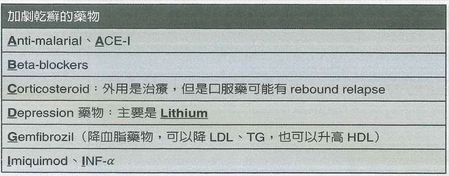
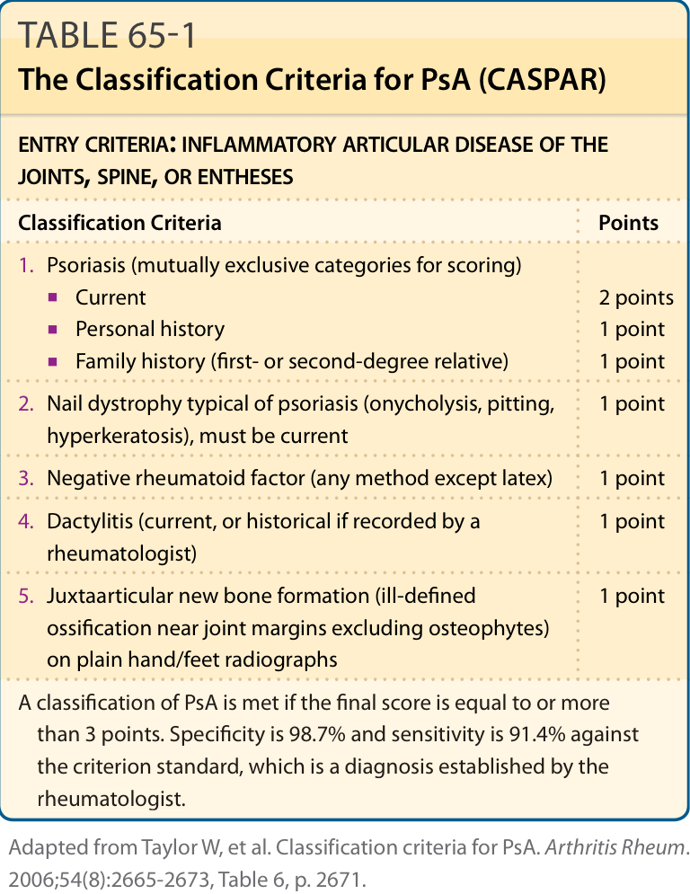
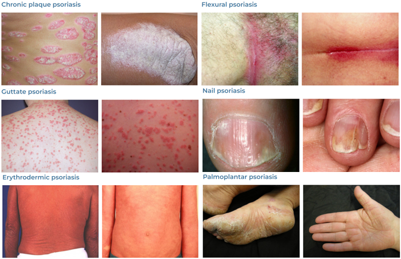

乾癬
2025年2月16日
上午 11:21
# 相關條目：[關節炎](onenote:Rheuma.one#總論|關節炎總論&section-id={2467CC7A-8F2B-4F25-B7A3-313D199800C1}&page-id={F6FBFCC2-66AB-4E98-8391-5F1D0D576BF7}&object-id={4453FD4F-D476-0256-364A-8FFB7BCB988A}&26&base-path=https://d.docs.live.net/56ce32fba64785ca/臨床筆記)

- 機轉：慢性反覆發作之皮膚病
  - **角質細胞的細胞週期縮短**(由原來的311小時縮短為36小時)，造成棘皮層增生 (acanthosis)，表皮增生為正常的28倍
  - 同時由於**第一型輔助型T細胞(Th1)免疫反應**，在真皮產生了發炎現象，許多發炎細胞圍繞在表皮和真皮血管周圍，在顯微鏡下可見其形成的微小膿疱(稱Munro's microabscess)
- 流行病學
  - **==發病期分別為23歲和55歲==**兩個高峰期，**越早發作症狀越嚴重且持續越久**。台灣男性平均出現於35.5歲，而女性為30.4歲
  - 男女發生率相等，少見於西非、日本人、北美南美印地安人和愛斯基摩人
    - 越往赤道發生率越低(陽光越充足越不易乾癬)
  - 遺傳性：
    - 雙親其中一個有乾癬：小孩乾癬機率10%
    - 雙親都有乾癬：小孩乾癬機率40%
    - 基因型以**==HLA-Cw6確定最相關==**，其他如HLA-B13、B17、B27、Bw57也有相關
- 分類
  - Type 1：好發在40歲前，與HLA 相關，有家族遺傳
  - Type 2：好發40歲以後，且與HLA 無關
- 病因：多基因遺傳+Trigger factor
- 危險因子：
  - 家族史
  - 抽菸、肥胖
- 觸發因子：\[口訣：TIDES\]
  - **外傷(Trauma)：==Koebner phenomenon：外傷、抓搔皮膚會促進乾癬的增生==**，30-50%的病患有此現象
  - **感染(Infection)**：
    - 急性滴狀乾癬(guttate psoriasis)：通常出現在**急性鏈球菌(GAS)感染**後1-2週
    - **HIV、S.aureus**也與乾癬加劇相關
  - **藥物(Drug)**：會造成發病或惡化**\[口訣：ABCD+GI\]**

- 環境、壓力(Environment、Emotion)：約40%的病患會因壓力使乾癬惡化，小孩更高達90%
- 光照(Sunlight)：照光治療(UVB)為治療之一、但過度日曬反而會加劇乾癬
- 酒精：可能會誘發乾癬，但證據未明
- 好發位置：**頭皮、軀幹(含腹股溝)、手肘、膝蓋、手掌/腳掌，多為對稱性**
  - Extensor side居多
- 臨床表現：
  - 乾癬**==界線清楚明顯，表面有鬆散銀屑==**，皮屑下為滑亮均質之紅斑
  - **==Auspitz sign==**：用**==機械性方式移去皮屑後會在紅色表皮上出現小血滴==**(真皮乳頭處擴張之小血管破裂)
  - **==Koebner phenomenon=isomorphic phenomenon (同形現象)==**：外傷、抓搔皮膚會誘發乾癬形成與增生
  - **==Psoriatic arthritis(10~25％)==**：有相當比例的乾癬會造成關節炎，與皮膚病灶嚴重度無關，可出現在皮膚上未出現乾癬的病患上。另外50%的病人手指甲及35% 病人的腳趾甲會被侵犯，產生指甲凹陷、黃斑、嚴重變形，常被誤認為黴菌感染
    - **Pencil-in-cup deformity**
  - 指甲表現：
    - **==Psoriasis pitting==**：**最常見的指甲病變，為甲板的凹陷**，代表該段甲板生長過程中受到影響，反應了乾癬疾病的活躍程度，也與乾癬關節病變的嚴重程度有相關性
    - **==Onycholysis==**：**甲板與甲床分離**，會由遠端發展至近端，可能會形成一個空間而發生眞菌感染。也可見於指甲受傷患者、免疫不全患者及甲狀腺疾者
    - **==Subungual hyperkeratosis==**：**甲床的角質細胞過度分化**而形成角質堆積於甲板下方， **主要發生在腳趾甲**
    - **==Oil drop (salmon patch)==**：指甲觀察到一塊半透明黃紅色的病灶， 意即**甲床發生乾蘚的皮膚病變**。是乾癬的pathognomonic sign，**有高度專一性**
- 共病：增加以下疾病機率
  - 心肌梗塞
  - 中風
  - 高血壓、糖尿病、血脂異常
  - 肥胖、代謝症候群
- 診斷：

- 臨床亞型：
  - **==尋常性乾癬(Psoriasis vulgaris)==**：
    - 最常見好發**四肢伸側(手肘、膝蓋)和頭皮(特別是耳後)**
    - 界線清楚的紅斑+病灶處的脫屑
    - 地圖狀(geographic)乾癬：融合成大塊如地圖板塊狀
    - 反轉(inverse、flexural)乾癬：皮膚皺摺處，表面不脫屑而成光滑的紅斑
  - **==點滴狀乾癬(Guttate psoriasis)==**：
    - 許多橙紅色(salmon pink)的點滴狀病灶出現在**軀幹上部和四肢近端**(直徑\<1cm)
    - 多見於年輕人和感染鏈球菌後發生
  - **==乾癬性紅皮症(Psoriatic erythroderma)==**：
    - 突然全身皮膚發紅、大量脫屑
    - 或由慢性尋常性乾癬慢慢進展成全身性脫屑性紅斑
  - **==全身膿疱型乾癬(Generalized pustular psoriasis, von Zumbusch)==**：
    - 急性乾癬
    - 突發性全身黃色無菌性的膿疱， 多合併持續性發燒
    - 較嚴重時膿疱會融合而成更大圓形膿疱(circinate lesion, or lakes of pus )
  - **==膿疱型乾癬(Pustular psoriasis)==**：和**HLA-B27高度相關**
    - 掌瓶膿疱症(Palmoplantar pustulosis)：在掌心及腳底產生反覆的膿疱
      - 大多數和抽菸有關
    - 連續性肢端皮膚炎(Acrodermatitis continua)：在指甲周圍化膿，甚至使指甲破壞消失

- 處置：
  - 平日作息：
    - 避免感染，避免外傷，勿用力搔抓皮膚或皮屑
    - 停止引起乾癬藥物的使用
    - 避免長期暴露在低溫、低濕度的環境
    - 睡眠充足、保持情緒平穩
  - 外用：
    - **類固醇**：**TOPI 類固醇**可抗發炎和抗增生，但無法使皮膚完全正常化
**==勿使用PO 類固醇==**：因使用一段時間後**停藥會rebound phenomenon**，造成[**全身性膿疱型乾癬**](onenote:#🩺|乾癬(Psoriasis)&section-id={8EAEF31F-3C85-4A44-8C94-1B976A1DCB9C}&page-id={9BBF2830-B8BE-439A-A824-34453AE874DF}&object-id={0F3F1EA0-5C51-09FE-3B73-6B900578EE7F}&AA&base-path=https://d.docs.live.net/56ce32fba64785ca/臨床筆記/Derma.one)
- **Anthralin**：目前國內停產，效果好且治癒後維持較久，無任何長期副作用，但皮膚刺激性較強
- **tazarotene**
- **維生素D**：抑制角質細胞增生並促進其分化，並有抗發炎作用
- 焦油：此法治療乾癬已有很長的歷史，使用2〜5%的焦油作為輔助性治療，具輕度刺激性，長期無嚴重副作用
- 紫外線療法：
  - **==光化學療法(PUVA)==** : **口服Methoxypsoralen(P)**+**UVA照射**
    - 口服藥物1~2小時後開始照射，依皮膚反應而逐漸加量
    - 一個禮拜兩到三次
    - 大部份病人在治療19-25次之後病灶會漸消褪
    - 副作用包括了噁心、頭暈和頭痛
  - **==浸泡式光化學療法(PUVA soaks)==**：利用泡澡將Methoxypsoralen送到皮膚
    - 主要優點是沒有全身性的作用，如腸胃道不適
  - **==中波紫外線光療(UVB)==**：使用窄頻(narrow-band) 311nmUVB
    - UVB在皮膚可抑制免疫細胞功能，減少白血球附著到微血管，誘使皮膚製造抗發炎的物質
- 全身性治療：後線治療
  - **Methotrexate (MTX)**：**慢性塊狀乾癬或乾癬性關節炎的第一線用藥**
    - 最常見的副作用：噁心、疲倦、食慾減退、骨髓抑制造成白血球下降
    - 肝毒性：有肝病史和酗酒不適合，可能引發肝纖維化或肝硬化的危險
  - **環袍黴素(cyclosporine)**：
    - **主要治其他治療無效或乾癬性紅皮症**可快速達到療效，不適合長期使用
    - 給予低劑量(\< 5 mg/kg/day)時， 約對**70%的慢性板塊狀乾癬**有效
    - 主要副作用：高血壓、高血脂、多毛症、牙皺增生、不可逆腎功能損害
  - **口服A酸**：對**全身膿疱型及掌號膿疱症**效果好，但對於其他類型乾癬單 獨使用效果不佳，故須搭配光照療法
  - 生物製劑：
    - **Infliximab、Adalimumab**：TNF單株抗體
    - **Etanercept**：TNF-α受體融合蛋白
    - **Ustekinumab**：針對IL-12和IL-23的單株抗體
    - **Alefacep**：作用於 CD2
