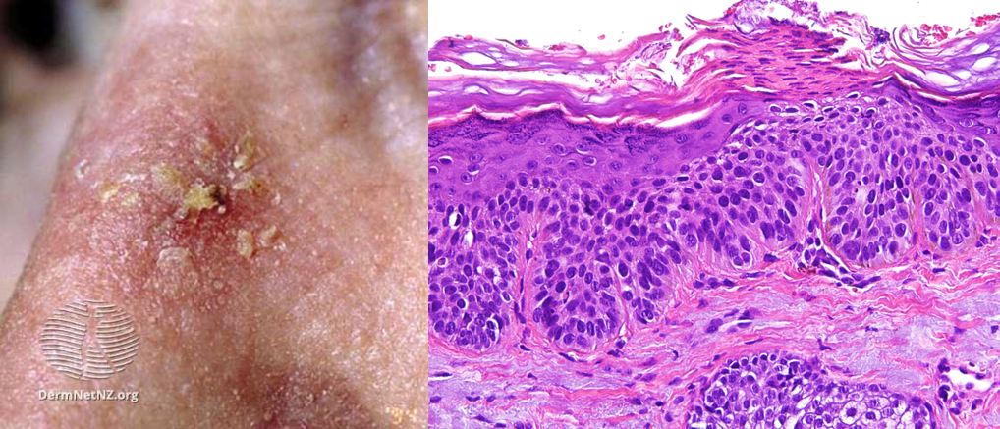

皮膚腫瘤/皮膚增生
＊
2025年2月16日
上午 11:19

- SCC癌前病變
**==角化棘皮瘤(keratoacantoma)==**
- 為SCC的癌前病變
- 生長快速的**==單一凸起結節、中央有佈滿鱗屑之凹陷(像火山口被填滿)==**
- 好發部位：日曬處

**==光化性角化症(Actinic keratosis)=日光性角化症(Solar keratosis)==**
- **==長期累積紫外線(UVB)傷害所致的皮膚角質層增生==**
- **==SCC的癌前病變==**
- **單顆進展成SCC機率小，但==10顆惡化成為SCC的機率可達10~15%==**
- 好發位置：**易曝曬在陽光下的部位**，大多分布在臉部、頭部、頸部、手、胸口
- 常見族群：
  - 膚色淺：白種人(Skin phototype I~III) \> 黃種人、黑人
  - 常需日曬工作者如農夫、工人、水手
  - 中年男性
  - 免疫抑制、器官移植
- 可分數種亞型(萎縮型、增厚型、色素擴散型、增生型、苔癬型及類波文氏型)
- 臨床表現：
  - 皮膚**==表面粗糙、有皮屑及脫皮現象之斑塊或丘疹==**，或是扁平稍具鱗狀的斑點。顏色大多呈現淺紅色、棕色，**常被誤認為脂漏性角化症或濕疹**
  - 病理特徵為**==局部表皮層==**角質化不全(parakeratosis)或角質化不良 (dyskeratosis )，併有顆粒層喪失、非典型角質細胞(atypical keratinocytes )增生，但不像Bowen's disease是整層epidermis都有atypia的情形
    - Atypia：細胞大小形狀不一(pleomorphism)、nuclear hyperchromatism、increased mitosis

- 處置：
  - 防曬
  - **==單一病灶==**：
    - 刮除(curettage)、電燒、冷凍治療、手術切除
  - **==多重病灶==**：
    - **==局部塗抹藥劑==**：治療菜花的藥(?)
      - **Imiquimod**：免疫調節劑，可刺激皮膚的免疫反應，由自身的免疫系統來攻擊不正常增生的表皮細胞
      - **5-FU (fluorouracil)**：抑制DNA合成和複製，導致分生不良細胞死亡。但較具刺激性，可能會有灼熱刺痛感及造成皮膚潰瘍
      - **三氯醋酸(Trichloroacetic acid, TCA)**：很強的蛋白質變性劑，用於化學換膚，使病灶被破壞脫落，幾週後長出新皮膚，穿透性良好適合移除較深層的病灶， 皮膚刺激感也較強烈
    - **==光照動力療法(photodynamic therapy)==**：靜脈注射光感物質，再給特定的光照射激發光感物質產生光化學反應，製造出對細胞具有毒性的自由基，選擇性消滅不正常細胞
# SCC in situ
**==波文氏症(Bowen's disease)==**=**皮膚上**的SCC in situ

**==Erythroplasia==**=**生殖器**上SCC in situ(在glans penis的加上**of Queyrat**)
- 致病因子：紫外線、HPV、砷中毒、瀝青或焦油接觸
- 外觀上為單一或多個粉紅色或棕色脫屑斑塊，邊界明顯但不規則，表面過度角化，可附痂皮。緩慢向周圍擴大，但中央無癒合現象
- 病理上可見**==整層表皮(Epidermis)分布==**，排列不規則的atypical keratinocyte (細胞大小形狀不一、hyperchromatism、mitosis)，不過基底膜是完整尚未被侵犯的
- 治療：
  - 局部塗抹 **5-Fluorouracil cream** 或 **Imiquimod ( Aldara )**
  - **==冷凍療法==**：效果好
  - **==光動力療法==**
  - **==手術切除==**：治癒率最高，但有美觀上的考量

# [鱗狀上皮細胞癌(Squamous cell carcinoma, SCC)](https://dermnetnz.org/topics/cutaneous-squamous-cell-carcinoma)
- **==第二常見的皮膚癌==**，源自表皮層中的**角質細胞(keratinocyte)**
- 好發年老男性
- **\>60%的SCC是從AK病灶轉變而來**
- 危險因子：
  - **HPV-16, 18 和 31 最常見**
  - 陽光、輻射、砷、瀝青或焦油的暴露史
  - **白人(Skin phototype type I & II)**
  - Immunosuppression：器官移植服用免疫抑制劑或AIDS
  - **皮膚反覆受傷、傷口癒合不佳或長期慢性發炎**
- 好發位置：==**陽光容易長期照射的部位**(頭皮、鼻子、下唇、耳朵、手背或手臂)==
- 初期為皮膚加厚，產生鱗狀脫屑性斑塊或結節，之後會迅速生長擴散呈現潰瘍，易流血且碰觸即痛。周圍併有隆起**硬化之邊緣，潰瘍表面有痂皮覆蓋，底下則有紅色肉芽組織**。故身上有出現難以癒合的傷口或潰瘍須注意，盡早發現治療。
- 病理下為**==惡性的角質細胞穿過基底膜向下侵犯致真皮層==**，依分化情形可在分為Differentiated SCC 和 Undifferentiated SCC
- **==Marjolin ulcer==**
  - 發生在燒傷瘢痕潰瘍的皮膚腫瘤
  - context of chronic wounds including burn injuries, varicose veins, venous ulcers, ulcers from osteomyelitis, and post radiotherapy scars
  - 生長緩慢，無痛，由於局部破壞淋巴通道而沒有淋巴擴散
  - 組織學：well-differentiated squamous cell carcinoma
  - 預後：侵犯性高、局部擴散、預後差
- 治療
  - **==外科切除==**：**首選**，如果病灶過大可合併植皮或皮瓣移植
    - Margin free：切除範圍外4~6mm正常
    - 深度：切到mid-subcutaneous adipose tissue
  - **==顯微手術(Mohs Micrographic surgery,MMS)或放射治療==**：
    - 針對顏面的「危險地帶」，例如鼻唇區域、眼睛周圍、眼瞼、耳道、耳後或頭皮，因結構脆弱、手術易出血且考量顏面美觀
    - **==莫氏切除手術Mohs Micrographic surgery==**
      - 先移除最表層的病灶，再一層一層深入移除，每層都進行顯微鏡檢査確定確定有free margin再切下一層，精確的移除所有病灶且避免切除過都的良性組織，造成傷口過大影響癒合
      - 治癒率高、復發率低、且可保留較多的正常皮膚組織，為當前皮膚癌手術切除的主流
      - Indication：
        - High risk of local recurrence
        - Need for tissue preservation
        - High risk of metastasis
  - **==冷凍療法或電燒==**：較小病灶可考慮
  - **==Curettage and electrodessiccation(C&E)==**：MMS或切除不適用的low-risk SCC
    - Contraindication：有毛髮的皮膚(因可能腫瘤藏在follicle)、吃超過真皮
  - **==化學藥物、光動力學==**
    - 藥物選擇
      - Immune checkpoint inhibitors Anti PD-1 (e.g., pembrolizumab, cemiplimab)
      - Chemotherapy (e.g., cisplatin, carboplatin, 5-FU, paclitaxel)
      - Epidermal growth factor receptor inhibitors (e.g., cetuximab)

# [基底細胞癌(Basal cell carcinoma, BCC)](https://dermnetnz.org/topics/basal-cell-carcinoma)
- **==人類最常見的皮膚癌==**
- 由**表皮最底層之基底細胞**轉變而來
- 流行病學：
  - 發病年齡多大於40歲
  - 男性\>女性
  - **白人(Skin phototype I & II)較常見**，少見於黑色或褐色人種
- 致病因子：多和**==紫外線照射(主要為UVB)或PTCH gene mutation、砷的接觸史==**有關
- 好發位置：**==頭頸部，尤其是鼻子、眼瞼(下眼瞼為主)和臉頰==**
- **==局部侵犯性(local aggressive invasion)==**，少有轉移，預後良好
- 臨床表徵：
  - 皮膚表層可見**無法移動的硬腫塊， 無疼痛感、表面發亮蠟狀像珍珠(pearly)並於皮膚==表淺可見末梢血管擴張現象(telangiectasia)==**
  - =rodent ulcer(像被老鼠咬到)病灶中央潰瘍，外緣不規則隆起，有如火山口，**==少有結痂脫屑(和SCC的鑑別)==**
  - 可再細分為五種型態：
    - **==Nodular==**：**最常見**，外觀即為前述之典型臨床表徵
    - **==Superficial==**：表面稍微隆起珍珠樣的滾邊，中心部位常出現表淺性潰瘍和痂皮，呈浸潤性紅斑。類似濕疹或銀屑病變
    - **==Pigmented==**：除了多了色素(藍、黑或褐色)的沉澱外，外觀與nodular BCC相似， 易和黑色素細胞瘤弄混
    - **==Morpheaform==**：=sclerotic(硬斑)，扁平或輕度凹陷之淡色斑塊，邊界不明顯，表面也可見血管擴張現象，較惡性、較易轉移
    - **==Basosquamous==**：BCC+SCC，比較惡性

- 病理上常見基底細胞從**==表皮向真皮層內蔓延生長==**，基底細胞呈現核大細胞質少(n/c ratio高)的現象，腫瘤細胞團塊(nest of basaloid cells)基質會萎縮，造成**==腫瘤周邊出現空白間隙(retraction artifact)==**，像是孤島(tumor island)，團塊最外圈細胞成**==柵狀排列(palisading cells)==**
- 處置：癌細胞生長速度緩慢，一般只會局部浸潤，極少發生遠端轉移，所以致死率極低，治癒率高達95%以上
  - **==外科切除==**：**首選**，如果病灶過大可合併植皮或皮瓣移植
    - Margin free：切除範圍外4~6mm正常
    - 深度：切到mid-subcutaneous adipose tissue
  - **==顯微手術(Mohs Micrographic surgery,MMS)或放射治療==**：
    - 針對顏面的「危險地帶」，例如鼻唇區域、眼睛周圍、眼瞼、耳道、耳後或頭皮，因結構脆弱、手術易出血且考量顏面美觀
    - **==莫氏切除手術Mohs Micrographic surgery==**
      - 先移除最表層的病灶，再一層一層深入移除，每層都進行顯微鏡檢査確定確定有free margin再切下一層，精確的移除所有病灶且避免切除過都的良性組織，造成傷口過大影響癒合
      - 治癒率高、復發率低、且可保留較多的正常皮膚組織，為當前皮膚癌手術切除的主流
      - Indication：
        - High risk of local recurrence
        - Need for tissue preservation
        - High risk of metastasis
  - **==冷凍療法或電燒==**：較小病灶可考慮
  - **==Curettage and electrodessiccation(C&E)==**：MMS或切除不適用的low-risk SCC
    - Contraindication：有毛髮的皮膚(因可能腫瘤藏在follicle)、吃超過真皮
  - **==化學藥物、光動力學==**
    - 藥物選擇
      - Hedgehog pathway inhibitors (e.g., **vismodegib, sonidegib**)
        - S/E：肌肉痙攣、疲倦、食慾減退、脫髮、味覺異常
      - Immunotherapy(**cemiplimab**)
# [黑色素細胞瘤(Melanoma)](https://dermnetnz.org/topics/melanoma)
- 黑色素細胞經癌化生成的皮膚癌，時常經由**==淋巴轉移==**
- **==致死率極高的皮膚腫瘤，預後不佳==**
- **==ABCDE rule==**：病患臨床上有以下特徵時，需懷疑為黑色素細胞瘤
  - **A**symmetry：形狀不對稱
  - **B**order irregular：邊緣不規則、有突起或是表面潰瘍
  - **C**olor variation：顏色斑駁不一致
  - **D**iameter \>6 mm：直徑大於 6 mm
  - **E**nlargement：短時間內持續增大；**E**levation：表面不規則隆起
- 危險因子：
  - BRAF gene突變(50%)
    - **V600E mutation(最常見)**：在第600位上以glutamic acid取代valine
  - CDKN2a (tumor suppressor gene)突變
  - **白人(Skin phototype type I & II)**
  - Sun exposure or radiation exposure
  - Family or personal history
  - 身上超過50顆且大於5 mm的黑色素母斑(melanocytic nevi)
- 常見突變：
  - 西方：BRAF\>NRAS(佔50-80% cutaneuous melanoma)
  - 家族遺傳型：CDKN2a (tumor suppressor gene)突變
- Melanoma的生長期依序為：
  - **==輻射生長期(radial growth phase)==**：此期melanoma生長局限在上皮層、呈水平輻射擴散，生長速度緩慢，較不具侵犯性
  - **==垂直生長期(vertical growth phase)==**：侵犯到真皮層及鄰近血管，因而藉由血管、 淋巴管擴散至他處
- 黑色素細胞瘤可分為以下四種主要亞型：
  - **==Superficial spreading melanoma(70%)==**：**最常見，較常見BRAF**
    - **==40 - 50 歲歐美白種人==最常見**之黑色素細胞瘤
    - 好發於**==女性下肢和男性上背(間斷靂露的曰曬處(intermittent sun exposure))==**，**病灶特徵相當符合ABCDE rule**
    - 主要是表淺擴散(大而淺)，radial phase最多可長達兩年，之後才進入劇烈的vertical phase
  - **==Nodular melanoma(15%)==**：**第二常見**，**生長相當快速，預後最差**
    - 40-50 歲男性較多
    - 無radial phase而直接進入vertical phase(快又深)，外觀為表面突起圓頂狀藍黑色痣(像藍莓)
  - **==Acral lentiginous melanoma(5-10%)==**：生長緩慢，多在後期才被發現，故**預後差**
    - **==東方人(29-46%)及非洲裔(60-72%)等有色人種==最常見**之黑色素細胞瘤
    - 常見於**==大於60歲之老人==**，**好發於手掌、腳掌或手指(腳趾)之甲床(huntchinson's sign)**
  - **==Lentigo maligna melanoma(5%)==**：**最少見**，生長速度相當緩慢，**較常見c-KIT**
    - 好發在**==老人==**日曬部位(臉、手臂)
    - radial phase：=Lentigo Maligna或Melanoma in situ，可從數年到20年之久，外觀為扁平微突起之黑斑(macule)
    - vertical phase：病灶轉為顏色和邊緣不一的丘疹或結節
- 檢查診斷：
  - **==Hutchinson sign==**：指甲可見棕黑色色素從縱向延伸至近端和側邊皮膚，是Melanoma的重要指標(和[帶狀皰疹眼病](onenote:#🩺|感染性皮膚病&section-id={8EAEF31F-3C85-4A44-8C94-1B976A1DCB9C}&page-id={CF86E3C0-3B3E-4723-A365-FBC2875C9B76}&end&base-path=https://d.docs.live.net/56ce32fba64785ca/臨床筆記/Derma.one)比較)
  - 傳統檢查：包含**胸部X光、abdominal echo、CT或MRI**等，以檢查是否有器官轉移。但須在腫瘤大於1公分以上才能顯像，且無法確定是否是真的轉移惡性腫瘤或其他良性的病變
  - **前哨淋巴結(Sentinel lymph node)切片**：可以預測黑色素細胞瘤是否已經產生淋巴轉移
  - 正子掃描造影(PET scan)：主要的目的在於**手術前評估**、早期治療成效及藥物治療效期之追蹤，來判斷惡性黑色素細胞瘤是否有轉移
  - LDH：
    - Metastatic melanoma的病患會升高，但不適合用來作為偵測是否有轉移的指標(敏感度和特異性低)
    - 黑色素細胞瘤轉移的病患，假使LDH升高其預後較不好
- 分期與處置
  - 初級預防：防曬，篩檢
  - 次級預防：早期偵測
  - Melanoma對化學治療和放射線治療的反應並非十分良好，且容易轉移
  - 以初步切片確認病灶深度
  - **==外科手術==**：目前最主要的治療方式，仍是早期發現趁病灶還很小就切除。肺、腦、胃腸單一病灶及局部淋巴轉移都可以採用
    - 病灶深度以及轉移狀況決定是否需要sentinal lymph node biopsy

- 若沒有distal meta但sentinal LN(+)→Radical lymph node dissection
- **==化學療法(以Dacarbazine/DTIC為主)、放射線療法==**：輔助性療法， 常配合手術切除後使用
- **==免疫細胞療法==**：直接或間接使用患者的免疫系統，注射基因改造過的免疫細胞 (例如CD8 + T cell)，使其能鎖定並攻擊癌細胞，為目前提倡之新療法
- **==標靶療法==**：目前針對**晚期轉移性**病患
  - Vemurafenib：針對特定基因BRAF V600E位置突變
- 預後：
  - **==Tumor thickness：最重要的預後因子==**，越厚預後越差，厚度＜ 0.76 mm的 8-year survival rate 為 93.2%，＞3.6 mm 則為 33.3%
  - 出現潰爛情形(Histologic ulceration )
  - 淋巴轉移(Lymph node involvement)
  - 衛星樣微轉移(microscopic satellitosis，＞0.05 mm)
  - 血管浸潤(vascular invasion)
  - 分裂指數高(mitotic rate ≧ 1 mitosis/mm )

**==卡波西氏肉瘤(Kaposi's sarcoma, KS)==**
- 多發性血管腫瘤，由**==HHV-8==**所引起，好發於愛滋患者
- **唾液和口腔黏膜的病毒含量(30%)** 遠高於肛門和生殖器(1%)
- 臨床表現
  - 典型表徵：一開始為**1~2公分之紫斑，後來進展為丘疹、斑塊**、結節或腫塊，顏色為粉紅到深紫色， 無痛無癢感
    - 單一深色斑塊，可演變成結節狀、藍色、黏膜下和疼痛性皮膚變化
  - 侵犯內臟器官
    - 較常發生在愛滋病患者，90%死於愛滋者，其屍體解剖可發現內臟侵犯
    - **常見侵犯器官：胃、腸、肝、脾、肺、淋巴系統**(造成淋巴水腫(lymphedema))
- 目前分為四型：
  - **==典型==**：好發於**==老年==**、東歐男性，好發自**==下肢形成暗紅凸起斑塊==或結節，再逐漸往上擴張，伴隨下肢淋巴水腫**
    - 斑塊期(plaque stage)→結節期(nodular stage)/腫塊期(tumor stage)
  - **==地域型(Endemic)==**：見於赤道非洲，好發兩個雙峰(大人(平均35歲)及小孩(平均3歲)。**病灶較廣泛，==進展快==，也常侵犯內臟，若侵犯內臟，相當致命**
  - **==因化療或器官移植而致免疫力低落者==**：少見，主要見於solid-organ移植並長期服用免疫抑制劑者，**停止服用免疫抑制劑可以使症狀緩解**
  - **==後天免疫不全症候群(AIDS)相關型==**：見於AIDS患者，此類幾乎只發生在男同性戀者，主要分布在**臉上，然後==迅速==蔓延至軀幹**
- 病理：
  - 早期病灶：小血管異常增生伴隨發炎細胞浸潤為主，這些小血管缺乏基底膜而使得紅血球外滲和鐵血色素沉積。其血管內皮細胞較大且突岀於血管腔
  - 成熟病灶：可見**==梭狀細胞(spindle cell)聚集成漩渦狀==**，形成不規則的血管間隙(irregular, cleft/slit like, angulated vascular channel)，間隙內可見紅血球
- 治療：
  - 放射治療：典型KS效果較佳
  - 化學治療：地域性KS效果較佳
  - 切除：單一或小範圍侵犯可達痊癒
  - 局部療法：液態氮冷凍療法、雷射、電燒、光動力療法
  - 因免疫抑制所引發KS者，停藥後常會自癒，也可嘗試換藥，如以sirolimus取代**cyclosporin**及 tacrolimus
  - AIDS患者接受正統抗病毒治療即有療效，或使用干擾素及介白質治療，也可暫時改善
