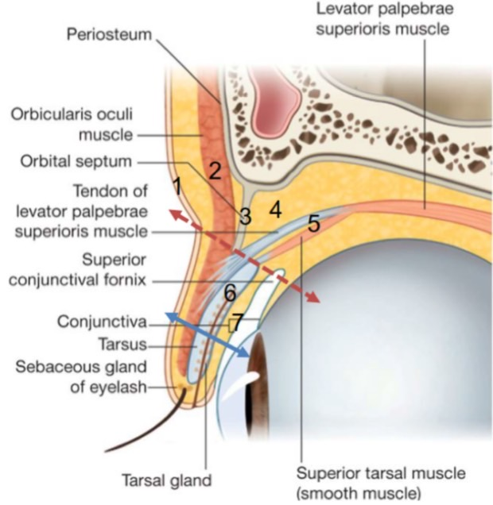

眼瞼
Friday, March 14, 2025
4:07 PM

一、眼瞼解剖
1.  可以由外而內分為七層
    1.  皮膚：CN V I上眼皮、CN V II下眼皮感覺
    2.  閉眼肌肉：CN VII負責眼輪匝肌，閉眼
    3.  眶隔(Orbital septum)：orbital infection的界線
    4.  眼眶脂肪(Orbital fat)：若受傷看到脂肪不能直接縫合
    5.  睜眼肌肉：Aponeurosis of levator m.(CN III)、Muller's m.(交感) -\> 與Horner等ptosis相關
    6.  眼瞼板(Tarsus)：lid margin、meibomian gland(油脂腺)、gray line(眼輪匝肌邊緣) -\> 眼瞼撕裂修復的land mark
    7.  結膜(Conjunctiva)

二、眼瞼功能：保護眼球，形成淚液層保水，幫助眼淚排除淚液
三、遺傳性疾病
1.  Blepharophimosis眼瞼狹窄：Telecanthus眼距過寬、Epicanthus inversus跟嚴重眼瞼下垂
2.  Epicanthus 內側贅皮：會看起來有假性內斜視，透過反光點可以排除
3.  Epiblepharon眼瞼贅皮：眼瞼位置正常，但外側皮肉增生導致睫毛內轉，觸碰角膜引起角膜炎
四、後天性疾病
1.  Chalazion霰粒腫, **非感染**：Meibomian gland出口阻塞造成的慢性、無菌肉芽腫發炎
    1.  抗生素無效！！
    2.  以熱敷、引流、手術切除
2.  Hordeolum麥粒腫=針眼, **感染性：**油脂腺的急性感染
    1.  Gland of Zeis -\> external hordeolum
    2.  Meibomian gland -\> internal hordeolum
    3.  治療：熱敷、局部或系統性抗生素
3.  Herpes Zoster Ophthalmicus帶狀皰疹病毒眼症
    1.  特徵：VZV引起的CN V-1感染，跟一般但狀皰疹有一樣的不跨中線的皮膚病灶，角膜感染有Psudodendritic corneal ulcer(見角膜)
    2.  Htuchinson sign！！
        1.  角膜跟鼻尖同時為CN V-1的鼻睫神經（Nasociliary nerve）支配，分屬外鼻神經（External nasal nerve） → 負責支配鼻尖及鼻翼內側的皮膚；長睫神經（Long ciliary nerves） → 負責支配角膜感覺
        2.  治療：根據急慢性，以acyclovir治療
\# 補充 Hutchinson sign在不同科別有三個
1.  Nail -\> Subungual melanoma
2.  Teeth -\> congenital symphilis
3.  Nose tip -\> VZV infection
五、眼瞼邊緣異常：
1.  眼瞼外翻, Ectropion：
    1.  退化性(Involutional)：下眼瞼為主
    2.  麻痺性(Paralytic)：CN7麻痺
    3.  機械性(Mechanical)：腫瘤在邊緣導致
    4.  結痂(Cicatricial)：疤痕導致
2.  眼瞼內翻, Entropion：下眼瞼常見
    1.  Congenital entropion
    2.  Spastic entropion：常見於輕微眼瞼退化病人，因為不舒服一直眨眼，導致環狀肌肥大把眼瞼內推 -\> 可以肉毒注射治療
    3.  Involutional entropion：和年紀增長有關，最常見
    4.  Cicatricial entropion：砂眼、外傷等造成
3.  睫毛倒插Trichiasis
六、眼瞼下垂：
1.  正常眼瞼：上眼瞼會蓋住角膜交界(1-2mm)，下眼接切齊角膜交界
2.  可根據下垂的多寡區分嚴重度：mild(-2mm), Moderate(2-4mm), Severe (\>4mm)
3.  評估：
    - Margin-Reflex Distance：手電筒照的角膜反光點和眼皮的距離
    - Levator muscle function：讓病人向下看，再用手壓住額肌避免代償，正常人8-12 mm, 4-8 mm尚可, \< 4mm 為不良
    - 看上眼瞼皺褶
    - 垂直瞼裂高度：就是上述看上眼瞼跟limbus的距離
4.  病因：
    - 神經性Neurogenic
      1.  動眼神經麻痺：會有眼瞼下垂、眼前往外下方移動、合併diplopia等。不一定會有瞳孔擴張。因為瞳孔縮小的調控起源是Edinger-Westphal nucleus，較周邊且血流供應充足，因此若有合併瞳孔擴張表示要危險可能有外科問題。

2.  Isolated CN 3 palsy
    1.  25%病因不明
    2.  血管問題 -\> 三高相關
    3.  Trauma -\> subdura clot
    4.  P-com or PCA aneurysm
3.  Horner syndrome
    1.  交感神經受損：ptosis, miosis, anhydrosis
4.  Marcus-Gunn jaw winking ptosis
    1.  CN5異常支配提上眼瞼肌所造成 -\> 因此給病人吃糖果可以改善

2.  肌原性Myogenic -\>透過Brow suspension以額肌力量去拉起眼皮
    1.  Congenital：提上眼瞼肌發育不良
    2.  Acquired：
        1.  重症肌無力MG：有15%病人只有眼睛的症狀稱為OMG，定義為levator palpebrae, superioris, orbivularis oculi等眼動肌的麻痺，OMG相較系統性的比較沒有Acetylcholine receptor的抗體，因此診斷為一大困難，可以用ice packing test做鑑別但常常做不出來
        2.  肌肉失養症
3.  腱膜性Aponeurotic
    1.  Congential：罕見
    2.  Acquired：所有種類最常見，年紀老化、隱眼戴太多等，雙眼皮會感覺被拉很開因為腱模鬆掉
4.  機械性Mechanical ：一樣腫瘤相關
5.  手術：根據Levator muscle function決定
    1.  Muller's muscle conjunctival resection：縮短muller's muscle
    2.  Frontalis muscle suspension=Brow suspension：在muller's muscle功能不彰的時候，用提眉毛的肌肉把眼皮拉起來，可以提升最多Margin-reflex distance
\# 補充：可以用交感刺激的眼藥水去測試muller's muscle的功能，區別視神經支配問題還是肌肉本身受損
七、眼瞼後縮
1.  定義：後縮造成過多眼白露出，可能有閉合不全、暴露型角膜炎的狀況
2.  甲狀腺眼炎(thyroid ophthalmopathy)
    1.  Graves' disease是成人凸眼最常見的成因，且為上下眼皮後退的最常見原因
    2.  與TSH、甲狀腺功能並沒有直接的正相關
    3.  機轉：TSH引起免疫變化，fibroblast增生導致眼外肌發炎增大，導致眼窩壓力增大、凸眼、眼皮後縮
    4.  特徵：最常影響下直肌\>內直肌。CT中肌肉tendon不似肌肉belly增厚(tendon spare)。lateral flare眼球外側後退比內側嚴重，**提上瞼肌（levator palpebrae superioris, LPS）** 和 **Müller’s muscle** 的不均勻收縮所致
3.  治療：戒菸、治療underlyign、保濕、可以給予類固醇
4.  手術：以眼窩減壓\>眼肌手術\>眼瞼手術(閉不緊)
八、眼皮肌張力失調
1.  原發性眼瞼痙攣(essential blepharospasm)
    1.  中年女性好發
    2.  病因可能為基底核放電異常：眼周肌肉不正常收縮造成眨眼
    3.  可以打肉毒
2.  半面顏面神經痙攣(Hemifacial spasm)
    1.  間歇姓痙攣
    2.  睡覺也會造成 (反之essential 則不會)
    3.  病因和facial nerve的血管在腦幹附近受到壓迫
    4.  可以神經減壓打肉毒
3.  麻痺性眼瞼閉合不全
九、眼瞼腫瘤(Eyelid tumor)
1.  良性
    1.  最常見為病毒疣
    2.  容易變成前期惡性的為陽光角化症(actinic keratosis)
2.  惡性
    1.  基底細胞癌(Basal cell carcinoma)
        1.  最常見的惡性腫瘤，約占90-95%
        2.  分部內下側眼瞼，會有maradosis(破壞附近的睫毛)
        3.  有小的血管擴張或是中央火山口潰瘍
        4.  治療：Moh's micrographic surgery
    2.  鱗狀細胞癌(Squamous cell carcinoma)
        1.  少見但侵略性高，可能發展自癌前病變的光照傷口或是角化班
        2.  好發於下眼瞼，透過淋巴血行傳播
        3.  治療：wide excision、Moh's surgery
    3.  皮脂腺癌(Sebaceous cell carcinoma)
        1.  最常源自Meibomian gland
        2.  好發於上眼瞼，東方中年女性好發
        3.  偉大的模仿者(之一呵呵)，也會有睫毛脫落，惡性程度高義全身轉移
        4.  治療：wide excision

