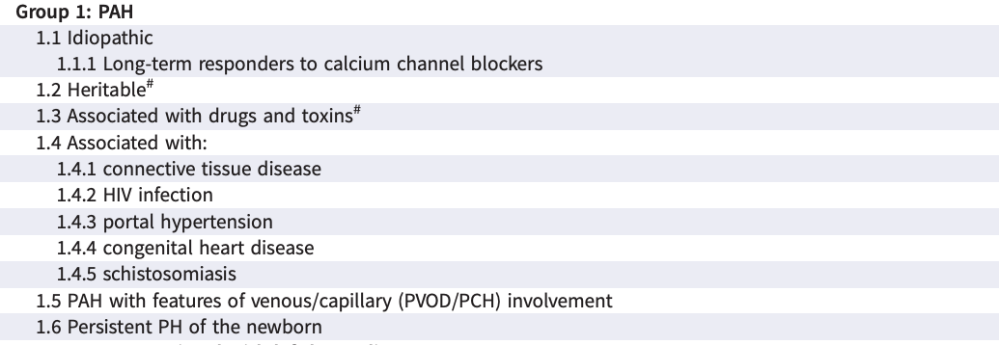

- 定義
  - 先天性心臟病的嚴重併發症，因肺動脈高壓，導致原本的左向右分流反轉為右向左分流，最終演變為發紺型心臟病
  - 可發生於任何年齡，但**通常出現在先天性心臟病的晚期階段**
  - 是先天性、與分流相關、不可逆肺動脈高壓（PAH）中最嚴重的形態
- 流行病學
  - **盛行率**：3% 至 10% 的先天性心臟病患者，年齡愈大盛行率愈高
  - 在大型第三級醫療中心的先天性心臟病患者中，仍有約 1%-5.6%的發生率
  - 個論
    - **未修補 ASD**：**10% 會發展為肺動脈高壓和Eisenmenger’s Syndrome**
    - **未修補 VSD**：**50%**
    - **未修補動脈幹（truncus arteriosus）**：幾乎全部
- 分類
  - 根據2022年第七屆世界肺高壓會議的Nice classification，因先天性心臟病引起的肺動壓高壓被歸類為**第 I 類（Group I）**

- 其他類別見肺動脈高壓章節
- 病因
  - 完全型房室中隔缺損（Complete AVSD）
  - 動脈幹（Persistent truncus arteriosus）
  - ASD
  - VSD
  - PDA
- 病生理
  - **左向右分流（left-to-right shunt）**
    - 肺血管阻力（PVR）增加，長期下來造成肺動脈高壓（prolonged pulmonary hypertension），**肺血管會反應性收縮，逐漸產生永久性重塑（permanent remodeling）**，最終發展為不可逆的肺動脈高壓
  - **肺動脈高壓**
    - 引起右心室肥厚（RV hypertrophy）及右心室壓力上升
    - 若右心室壓力超過左心室壓力，會引起分流反轉（shunt reversal），即**變成右向左分流**，會導致病人出現**發紺、杵狀指（clubbing finger）、紅血球增多症（polycythemia）**等臨床特徵
  - **三尖瓣前缺損（pretricuspid defects）**
    - 出生後即有左向右分流，隨著肺血管成熟，分流量於新生兒期逐漸增加
    - 正常的肺血管系統能夠透過血管擴張與納入原本灌流不足的血管來調節肺血流量的增加，所以肺動脈壓上升僅出現在部分患者，而肺血管阻力（PVR）上升通常要到成年期才會出現
- 臨床特徵
  - **漸進性發展**：早期僅表現出輕微症狀，**隨著年齡增長與肺血管阻力上升，症狀會逐漸加重**
  - **低血氧**
    - 程度從輕微到嚴重不等，通常在活動時加劇
  - **呼吸困難、過度換氣**
    - 右向左分流、肺血管疾病導致生理性死腔增加
  - **發紺**
    - 中樞性發紺（Central cyanosis）為主
    - **差異性發紺（differential cyanosis）**
      - 因開放性動脈導管（PDA）所致
      - 下肢發紺、上肢相對正常
  - **杵狀指（Digital clubbing）**
    - 因長期缺氧導致
  - **繼發性紅細胞增多症（Secondary Erythrocytosis）**
    - 因長期缺氧產生
  - **系統性**
    - **肺動脈血栓（Thrombosis）**：因肺血流速度降低而產生，可導致中風或肺栓塞
    - **出血**：牙齦出血、鼻出血、容易瘀傷、月經過多、咳血
      - 自發性出血通常較輕微且會自行停止
      - **反覆性咳血（hemoptysis）**是最常見的重大出血表現
        - 與**肺內出血與擴張支氣管動脈的侵蝕破裂**有關，可能致命
        - 並非常見的死亡原因，僅占死亡案例的 約 3%
    - **心律不整（Arrhythmias）**
      - 是造成病人猝死的原因之一
    - **心臟衰竭（Heart failure）**
      - 病人常伴有心臟衰竭，而因心臟衰竭而住院是死亡的預測因子
    - 若發展成右心衰竭，會出現周邊水腫、肝腫大、腹水的狀況
      - 因**靜脈壓升高**所引起
- 診斷
  - 理學檢查
    - **頸靜脈搏動（Jugular venous pulse）**
      - A 波增高
      - 頸靜脈壓上升
    - **心音**
      - Loud P2：明顯肺動脈瓣關閉音
      - 通常無明顯雜音，但可聽到射出音（ejection sound），與肺動脈擴張有關
  - 心電圖
    - 並非必需的診斷工具
    - **高而窄的 P 波**：右心房擴大（right atrial enlargement）
    - **心軸右偏（right axis deviation）**
    - **右心室肥厚（RVH）或雙心室肥厚（biventricular hypertrophy）**
    - **T 波倒置、 ST depression**：V1-V3
  - 胸部 X 光
    - 肺動脈主幹擴張（dilated central pulmonary arteries）
    - 肺周邊血管稀疏（peripheral pulmonary artery pruning）：周邊肺動脈分支突然變細或中斷
    - 新生血管形成（neovascularity）：在電腦斷層（CT）上更為明顯
    - 右心腔擴大（right heart enlargement）、右心室肥厚（right ventricular hypertrophy）
      - 右心房明顯突出
      - 左心緣變直或向外凸出：因右心室流出道擴張與位移所致
    - 肺動脈鈣化：晚期可能出現
  - 心臟超音波
    - 若病人心腔或血管間壓力趨於平衡，或出現雙向分流，傳統的二維心臟超音波可能難以清楚顯示分流位置
    - **氣泡劑心臟超音波檢查（agitated saline contrast echocardiography）**
      - 建議對新診斷肺高壓之患者進行
      - 以**排除潛在的心房中隔缺損（ASD）**造成分流
      - 氣泡劑顯影（Agitated saline contrast）對於確診心內分流很有幫助
      - 但若有已知大型心內分流時，應避免使用此方法，以免引發腦部微栓塞等併發症
      - 若開放性動脈導管仍存在，即使使用氣泡劑仍可能漏診
  - 心導管檢查（Cardiac Catheterization）
    - 可評估分流程度、測量心臟與肺循環的壓力、評估其他可能導致右向左分流的因素
    - **肺高壓**：肺動脈壓 (PAP) \>20mmHg 或 肺血管阻力 (PVR) ≥2 Wood units（WU）
    - **嚴重肺動脈高壓**：PVR ≥5 WU
  - 其他輔助檢查
    - **心肺運動測試**：評估運動能力和對運動時換氣反應
    - **核醫肺灌流掃描（Nuclear Lung Scintigraphy / V/Q Scan）**：評估是否存在**慢性肺血栓栓塞性肺高壓（CTEPH）**
    - **肺功能測試與氣體擴散能力評估（Pulmonary function tests with DLCO）**：確認肺高壓是否因肺部病變引起
    - **BNP 與 NT-proBNP**：**在肺動脈高壓患者中會升高**，可協助評估病程及治療效果。**數值越高，預後越差**。
- 處置
  - 內科治療：可改善症狀與運動耐受性，盡量延長存活率，等待手術
    - **內皮素受體拮抗劑（endothelin receptor antagonist, ERA）**
      - Bosentan
      - Macitentan
    - **PDE-5 抑制劑**
      - Sildenafil
      - Tadalafil
  - 手術治療
    - **心肺移植**：唯一治療方式
      - **需同時進行先天性心臟病的矯正手術**
    - 不可單獨進行分流修補手術（關閉ASD、VSD等）：會加重右心負擔與死亡風險。
- 併發症
  - 繼發性紅細胞增多症（Secondary Erythrocytosis）
  - 血栓（Thrombosis）：造成中風或肺栓塞
  - 出血
  - 心律不整（Arrhythmias）：是造成病人猝死的原因之一
  - 心臟衰竭（Heart failure）
  - 腎功能不全、缺鐵
- 預後
  - **未治療者**：平均壽命30-40歲
    - 部分病人若合併右心功能尚可與低風險併發症者可活到50歲以上
  - 女性預後通常比男性差
  - 會增加孕婦死亡率（30–50%）及胎兒死亡或併發症風險（30%）
    - 患有 Eisenmenger’s Syndrome 需避免懷孕
- **Reference**
  - Arvanitaki, A., Gatzoulis, M. A., Opotowsky, A. R., Khairy, P., Dimopoulos, K., Diller, G.-P., Giannakoulas, G., Brida, M., Griselli, M., Grünig, E., Montanaro, C., Alexander, P. D., Ameduri, R., Mulder, B. J. M., & D’Alto, M. (2022). Eisenmenger Syndrome: JACC State-of-the-Art Review. Journal of the American College of Cardiology, 79(12), 1183-1198
  - Daliento, L., Somerville, J., Presbitero, P., et al. (1998). Eisenmenger syndrome. Factors relating to deterioration and death. European Heart Journal, 19, 1845–1855
  - Pulmonary hypertension with congenital heart disease: Clinical manifestations and diagnosis, UpToDate
  - Pulmonary hypertension in children: Classification, evaluation, and diagnosis, UpToDate
  - Eisenmenger’s Syndrome, AMBOSS

