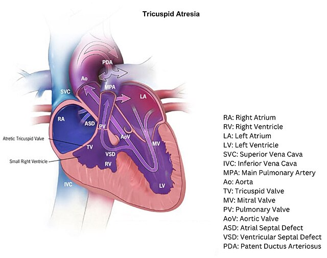

- 定義
  - 三尖瓣缺失或發育不全，導致右心房與右心室之間無法進行血流傳導
- 流行病學
  - **第三常見**的發紺性先天性心臟病（2-3%）
- 病因
  - 不明
- 病生理
  - 三尖瓣沒發育，右心房室不相通，導致右心房因血量過多而擴大（RA dilation），且右心室發育不全（RV hypoplasia）
    - 呈現**單心室循環（univentricular heart）**的狀態
  - **病童要存活必需依靠**
    - **心房中膈缺損（ASD）或 開放性卵圓孔（PFO）：**使血液能從右心房進入左心房
    - **心室中膈缺損（VSD）：**讓血液從左心室再流回肺循環

(圖說：三尖瓣閉鎖之解剖構造及病生理學)

Reference: Tricuspid atresia with small right ventricle, Centers for Disease Control and Prevention, <https://www.cdc.gov/heart-defects/about/tricuspid-atresia.html>
- 臨床特徵
  - 中樞性發紺（central cyanosis）**：出生後幾天**會出現
    - 全身性發紺，但四肢及顏面部除外（around the core and lips）
    - 常見由心肺疾病引起
    - 一般新生兒剛出生後5-10分鐘內會有中樞性發紺的現象，但通常10分鐘後就會恢復
  - 呼吸喘
  - **頸靜脈怒張：**with a prominent A wave
  - 周邊脈搏減弱
  - **心音**：**胸骨左緣holosystolic murmur**、single S2
- 診斷
  - **產前超音波**：可在**第18-22週**診斷
  - **心臟超音波：**確診
    - **三尖瓣缺失（Absent tricuspid valve）**
    - **ASD**
    - **右心室發育不全（RV hypoplasia）**
  - **胸部X光**
    - 心臟肥大、肺紋增加
  - **心電圖（EKG）**
    - **心軸左偏：左心室肥大**
      - 其他發紺型大部分為右偏
    - **高P波**
- 處置
  - 內科治療：等待手術
    - PGE1**：維持PDA開啟**
    - 氣球心房中隔造口術（Balloon atrial septostomy）**：增加充氧血以及缺氧血血液的混合機會**
  - 手術
    - **暫時性手術**：先分流，再爭取時間手術
      - **B-T shunt：若合併肺動脈狹窄或閉鎖**
      - **PA banding：預防肺動脈高壓**
    - **三階段**手術
      - **Norwood procedure（stage I）：新生兒階段進行**
        - 分離主動脈和肺動脈，並將主動脈接到右心，用 B-T shunt 連接主動脈和肺動脈
        - 心房中膈切除，促進靜脈血混合，增加主動脈血流，確保體循環有足夠血液
      - Glenn procedure（stage II）: **3-6個月**
        - **將上腔靜脈（SVC）接到肺動脈**
      - Fontan procedure（stage III）: **2-3歲**
        - **將上、下腔靜脈（SVC）接到肺動脈**
        - 只要病人前期手術安排得當、單心室功能保護得好，且肺動脈發育足夠，手術成功率高
        - 手術成功的必要條件包括**肺血管阻力低於 4 Wood 單位、心射出分率大於 45%。**
        - 肺動脈壓偏高的病人，可考慮房間隔開窗術（fenestration）
- 預後
  - 手術後約 90% 可存活至 1 歲
  - 10 年存活率約為 80%
- 併發症
  - 心房撲動、導管阻塞
  - 蛋白質流失性腸病（PLE）
  - 運動耐力下降
- Reference
  - Sabiston Textbook of Surgery 21st Edition
  - Schwartz's Principles of Surgery 11th Edition
  - Tricuspid Valve Atresia, AMBOSS
