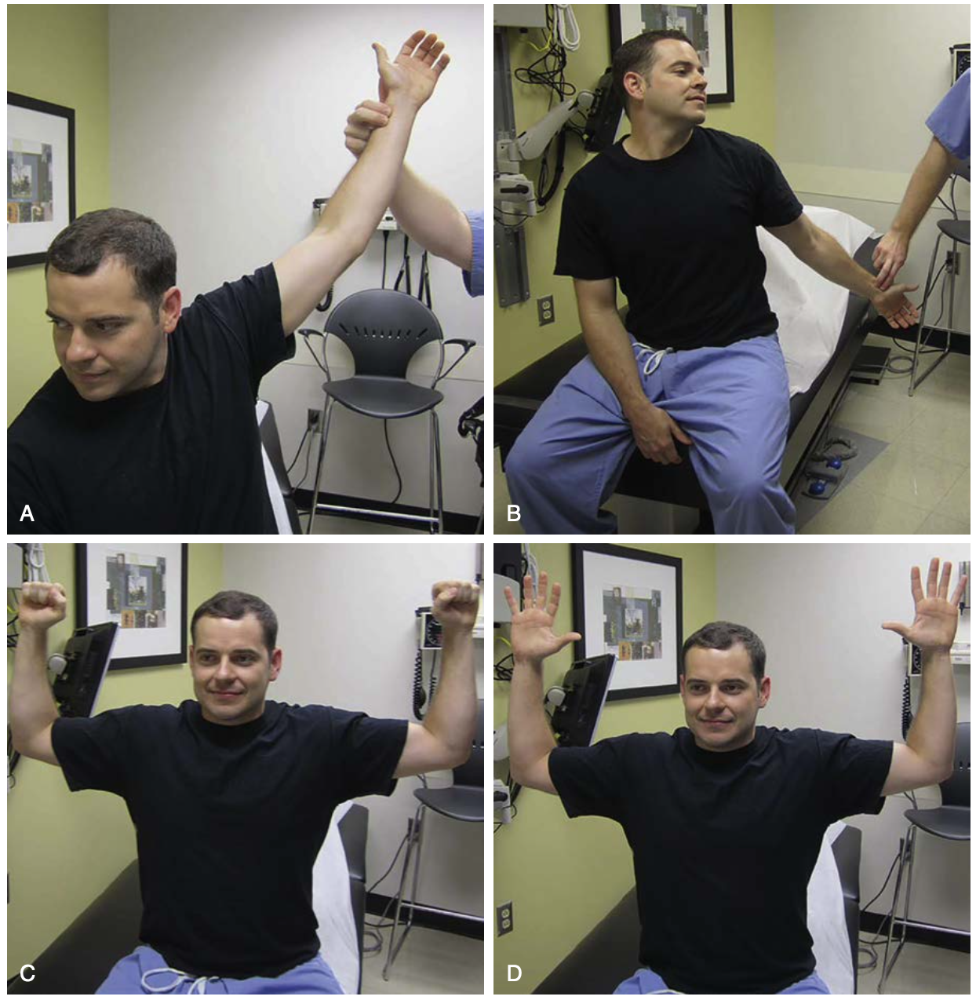

胸廓出口症候群（Thoracic outlet syndrome, TOS）
2025年7月6日 星期日
下午2:31
# 定義
- 鎖骨下血管（subclavian vessels）與臂神經叢（brachial plexus）在胸廓入口區域（斜角肌三角 scalene triangle）受到壓迫
# 流行病學
- 中年女性常見
# 分類
- **斜角肌間三角（interscalene triangle）**：壓迫動脈與神經
- **鎖骨下間隙（costoclavicular space）**：壓迫靜脈
- **喙突下區域（subcoracoid area）**：壓迫動脈、靜脈與神經
# 病因
- **外力創傷：**頸部過度伸展
- **重複性肩膀外展外旋**：運動員（網球、棒球、游泳、反覆投擲）、提重物時高於頭部（overhead）
- **解剖結構異常**
  - **骨骼**：異常的頸肋（cervical rib）、鎖骨骨折、第一肋或鎖骨的骨贅/刺（exostoses）
  - **軟組織**
    - 肌肉肥大：運動員與健身者
    - 姿勢不良、肥胖
    - 血腫
    - **腫瘤**：Pancoast tumor
# 臨床特徵
- 神經性症狀（90-95%）
  - **感覺喪失或感覺異常**：常沿尺神經分布
  - 頸、手臂疼痛
  - **Gilliatt-Sumner Hand**：**手部內在肌肉萎縮**，包括
    - 包括魚際肌（thenar）、小魚際肌（hypothenar）、蚓狀肌（lumbricals）、骨間肌（interossei）
- 血管性症狀
  - **鎖骨下動脈壓迫（\< 1%）**
    - 手臂痠痛、疲勞
    - **5P 症狀**：**無脈搏（pulselessness）、疼痛（pain）、蒼白（pale）、感覺異常（paresthesia）、溫度調節異常（poikilothermia）**
    - **患側手臂的血壓比健側低 \>20 mmHg**
    - 潰瘍、壞疽：若造成上肢缺血
  - **鎖骨下靜脈壓迫（3%）**
    - **水腫、靜脈擴張**
    - 手臂疼痛、沉重感
    - 側枝循環形成、發紺
    - **Paget-Schroetter syndrome**：上肢水腫、靜脈怒張或運動型血栓形成
    - 血栓形成：少數情況下血栓可能導致遠端栓塞，造成 Raynaud phenomenon 或缺血變化（ischemic change）
# 診斷
- 理學檢查（Physical Examination）
  - **Wright test（過度外展測試）**
    - 將病患肩膀外展至 90°，再外旋、肘部屈曲，接著將雙臂過度外展至頭部上方**（Hyperabduction）**
    - 此動作會使神經血管可能在喙突下區域（subcoracoid region）受到壓迫（胸大肌腱、肱骨頭或喙突壓迫）
    - **陽性：**橈動脈搏動變弱或消失
  - **Adson test（斜角肌測試）**
    - 先**觸診橈動脈脈搏**，然後將病患手臂外展 90°、外旋並伸展，請患者**仰頭並將頭轉向患側，**同時深吸氣，再次觸診橈動脈
    - 此動作會使**前、中斜角肌收縮，導致後斜角間隙變窄**，壓迫鎖骨下動脈與臂神經叢
    - **陽性**：橈動脈搏動減弱或消失
  - **Roos stress test**
    - **將雙肩外展並外旋 90°，雙肘同時屈曲 90°，連續打開與握拳動作 3 分鐘**
    - **陽性：**患側肢體出現沉重感或疲勞感
  - **Halsted test（肋鎖間隙測試）**
    - 向後下方拉動患肩，請病人脖子**轉向健側**，使第一肋與鎖骨之間的空間變窄，壓迫神經血管
    - **陽性**：症狀出現或橈動脈搏動變弱
  - 
(圖說：三種理學檢查的動作。A：Wright test；B：Adson test；C&D：Roos test )

(Reference：FIG. 58.36 Clinical photographs demonstrating provocative physical tests for thoracic outlet syndrome., P.1628, Section XI Chest, Sabiston Textbook of Surgery 21st Edition )

(圖說：Halstead Test的動作)

(Reference：Neck Orthopaedic Test: Halstead Test, Movement Assessment Technologies, <https://www.matassessment.com/blog/halstead-test>)
- 檢查
  - **胸椎與頸椎 X 光**：有時會發現頸肋（cervical rib）或頸椎出現退化性病變（degenerative cervical spine changes）
  - **CT、MRI**：用於鑑別診斷
    - 椎間孔狹窄（intervertebral foramina）、頸椎椎間盤病變（ cervical disc pathology）
    - 旋轉肌袖撕裂
    - Pancoast tumor
    - 纖維肌痛症
  - **Doppler 超音波、 血管攝影：**若懷疑血管受壓，評估血流障礙、是否有動脈瘤或靜脈血栓
  - **神經傳導速度檢查（**nerve conduction studies**）**
    - 若為神經型 TOS，確認壓迫部位並排除其他壓迫症候群（如腕隧道症候群）
# 治療
- 保守治療為主
  - 物理治療
  - 減重
  - 避免反覆性上肢活動
  - **NSAIDs**：緩解疼痛與發炎
  - **血栓溶解劑合併抗凝血治療**：若有靜脈血栓形成
- 手術
  - **適應症**
    - 保守治療失敗
    - 神經症狀持續惡化
    - 尺神經或正中神經傳導速度減慢
    - 鎖骨下動脈狹窄或閉塞
    - 腋靜脈或鎖骨下靜脈血栓形成
  - **術式**
    - 切除頸肋或第一肋骨，若有副肋骨則一併切除
    - 前斜角肌切除術（Anterior scalenectomy）：分離前斜角肌與中斜角肌
    - **將胸小肌從喙突的附著點釋放**（release of the pectorals minor muscle from its insertion on the coracoid process ）
    - **若臂神經叢周圍出現纖維化**，可行**神經鬆解術（neurolysis）**
    - **若血管嚴重狹窄：血管擴張術（Angioplasty）或動靜脈繞道術（Bypass）**
    - **注意保護以下結構：**臂神經叢、膈神經、長胸神經（long thoracic nerve）、鎖骨下動靜脈
# 預後
- **手術成功率（5 年內無症狀）：** 70%
- **復發**：三分之一患者可能因復發需再手術
# Reference
1.  Sabiston Textbook of Surgery 21st Edition
2.  Thoracic outlet syndrome, AMBOSS
