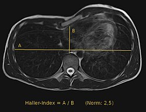

胸廓異常（Pectus deformity）
2025年7月3日 星期四
下午2:28
# 漏斗胸/凹胸（Pectus Excavatum ）
- 定義
  - 胸骨向背側凹陷
- 流行病學
  - 最常見的胸壁畸形，佔 90%
  - 每 400 名兒童中有 1 名
  - 男性多於女性（4：1）
  - 通常於**1歲內**診斷（90%）
- 病因
  - **家族史**
    - \> 30%有胸壁畸形家族史
  - **合併其他骨骼肌肉異常**：20%
    - 脊椎側彎（scoliosis）：最常合併，15%
    - Marfan syndrome：僅次脊椎側彎
  - **合併先天性心臟病**：1.5%
- 病生理
  - 由於低位肋骨與肋軟骨（第 3 肋骨起）生長速度不一致或過度生長，導致胸骨柄向後壓迫
  - 可以為對稱或不對稱，其中以右側凹陷較常見
  - 不對稱凹陷會導致胸骨旋轉（rotation of the sternum），主要原因是肋軟骨延長不均所造成（uneven elongation of costal cartilages）
- 臨床特徵
  - 大多數患者無症狀
  - 有些人會出現運動耐力下降或肺功能不足、呼吸受限
  - 運動時肋軟骨疼痛
  - 若不治療會逐年惡化，嚴重時會壓迫到縱膈腔器官
    - 肺最大呼吸容積下降
    - 心搏量及心輸出量下降
- 診斷
  - 凹陷的嚴重程度是評估漏斗胸最重要的指標之一，評估胸骨與脊椎之間距離
  - 用量尺、胸部X光、CT 測量凹陷深度
  - **CT**：測 Haller Index
    - 選擇**凹陷最嚴重處**作測量
    - Haller Index = A/B（正常 \< 2.5）
      - **A：橫向胸腔寬度**（Transverse diameter）
        - 左右肋骨內緣之間最寬的距離
      - **B**：**前後胸徑**（Anteroposterior diameter）
        - 胸骨內緣到脊椎前緣的最短距離

（圖說：Haller Index 電腦斷層切面）  
（Reference：Der Haller-Index zur Quantifizierung einer Trichterbrust (Pectus excavatum) kann auch mit der MRT in axialen Schichten bestimmt werden. Der Normalwert beträgt 2,5. In diesem Beispiel liegt er bei ca. 4,7, 13 February 2016）
| **輕度** | 2.5 - 3.25 |
|----------|------------|
| **中度** | \> 3.25    |
| **嚴重** | \> 4       |
- **其他術前評估**
  - **肺功能**：**10歲以上**患者
  - **心電圖、心臟超音波**：懷疑合併先天性心臟病
- 治療
  - **手術適應症**
    - 嚴重影響運動或日常活動及耐力
    - 嚴重的胸壁疼痛
    - 病人因體態外觀造成嚴重困擾
    - 量尺測得胸骨凹陷深度 \> 2.5cm
    - **Haller index \> 3.25**（中度以上）
  - **手術時機**
    - 等到患者進入青少年中期（8 - 12歲）再接受漏斗胸矯正手術，效果較佳
      - 過去認為手術最佳時間是 3 - 5歲，但經多年追蹤發現，**過早開刀會造成胸壁纖維化，導致胸壁發育不良**。加上**過早開刀復發率高**，導致病人在青春期需再次手術
  - **術式**
    - 可傳統開胸或微創手術進行
    - **術中步驟**
      - 切除雙側胸骨旁與肋骨軟骨下的畸形軟骨
      - 分離離劍突
      - 於胸骨凹陷上緣進行橫向楔形截骨術，將胸骨向前彎曲使其變直
      - 最後固定胸骨的矯正位置
    - **The Nuss technique**（1987年）
      - 微創矯正，近年最常用的術式
      - 通過兩個小的外側胸腔切口，將一個凸形不鏽鋼棒/金屬板置於胸骨下方，把胸骨和肋骨往外推，無需進行任何骨骼或軟骨切除
      - 鋼棒通常在術後 3 年移除
      - **優點**：技術簡單、早期療效良好
- 預後
  - 術後一年後 80-90% 能維持外觀
  - 復發率：3%
- 併發症
  - 術後
    - 氣胸（Pneumothorax）：1-7%
    - 復發
- Reference
  - Sabiston Textbook of Surgery 21st Edition
  - Pectus excavatum: Etiology and evaluation, UpToDate
  - Pectus excavatum: Treatment, UpToDate
  - 漏斗胸手術微創取代傳統, 賴勁堯醫師, 長庚紀念醫院國際醫療中心

# 凸胸/雞胸（Pectus Carinatum）
- 定義
  - 胸骨向外突出和/或肋骨異常隆起
- 流行病學
  - 第二常見的胸壁畸形，發生率約為漏斗胸（pectus excavatum）的 1/5
  - 每 1500 名新生兒中 1 名
  - 男性多於女性（4：1）
  - 常於**1歲後**診斷
- 病因
  - 病因目前尚不清楚。可能機制包括：**肋軟骨異常增生、胸骨或肋骨生長異常**
  - **家族史**
    - 25-30% 有胸壁畸形家族史
  - **合併其他骨骼肌肉異常**：22%
    - 脊椎側彎（scoliosis）：最常見，15-30 %
    - Marfan syndrome
    - Poland syndrome
    - Noonan syndrome
    - 成骨不全症（Osteogenesis imperfecta）
- 分類
  - **胸骨體突起型（chondrosternal prominence）：**最常見
    - 又稱「龍骨胸（keel chest）」
    - 胸骨下三分之一過度延長並向前突起，尤其在胸骨與劍突交界處最為明顯，形成**「金字塔型胸廓」（pyramidal chest）**
    - 可能伴隨兩側肋骨的凹陷，可對稱或不對稱，視肋骨延長程度與胸骨旋轉情況而定
  - **側向型雞胸（lateral pectus carinatum）**
    - 胸骨體突出合併肋軟骨凹陷
    - Poland's syndrome 病人最常見的凸胸型態
  - **胸骨柄突出型（chondromanubrial type/**pectus arcuatum**）**
    - 又稱「鴿胸（pouter pigeon chest）」
    - 胸骨柄與其相鄰肋軟骨（第1-2肋骨）突出，胸骨體後移，伴隨胸骨提早骨化
- 臨床特徵
  - 大多數患者無症狀
  - 有些人會出現運動時呼吸困難、耐受性下降、反覆呼吸道感染、氣喘
- 診斷
  - 凹陷的嚴重程度是評估漏斗胸最重要的指標之一，評估胸骨與脊椎之間距離
  - **胸部X光**
    - 若側位X光出現**胸骨角度異常與胸骨縫過早骨化**，則懷疑是**胸骨柄突出型（chondromanubrial prominence）**
  - **CT**：評估嚴重度
    - **胸骨突起角度（greatest sternal rotation）**：測量胸骨旋轉最明顯處的角度
    - **Haller Index = A/B**（**正常**：**2.5**）
      - **與漏斗胸相反，越低代表畸形越嚴重**
  - **超音波**：若有局部肋軟骨突起，有助**鑑別軟骨變形和肋骨腫瘤**
- 治療
  - 雞胸主要是外觀上的問題，而非功能性障礙。是否接受治療，取決於畸形的嚴重程度，以及患者對外觀的在意程度與心理壓力
  - **矯正型胸部壓迫背架（corrective constricting brace）**
    - **適應症**：若患者仍處於生長期（5-10歲），胸壁較柔軟（可用手壓縮回原位）
      - **但不適用胸骨柄突出型（chondromanubrial prominence）**
    - **效果：**\> 80% 的患者有效
      - 若矯正失敗，則考慮手術治療
  - **手術**
    - **適應症**
      - 無法或不願意配合背架治療、背架矯正失敗
      - 胸骨柄突出型
      - 胸壁不具可塑性（已進入青春期晚期或年齡更大）
      - 重度雞胸、中或重度胸骨不對稱
    - **手術時機**
      - 以青春期生長高峰結束後為佳（**13-16歲**）
        - 青春期前手術，可能會導致**窒息性軟骨發育不全（asphyxiating chondrodystrophy）**
      - **Marfan syndrome：**患者因為**早期手術復發率較高**，通常會**延後至骨骼成熟後才進行**矯正手術
    - **術式**
      - 雙側胸骨旁與肋軟骨下切除畸形肋軟骨
      - 橫向線狀骨折切開術（linear transverse osteotomy）
      - 將劍突分離，並從胸骨尾端切除約 3–4 公分，再重新接回胸骨遠端
- 預後
  - 超過 90% 的患者在手術後有良好至極佳的外觀改善
  - 復發並不常見
- Reference
  - Sabiston Textbook of Surgery 21st Edition
  - Pectus carinatum and arcuatum, UpToDate

