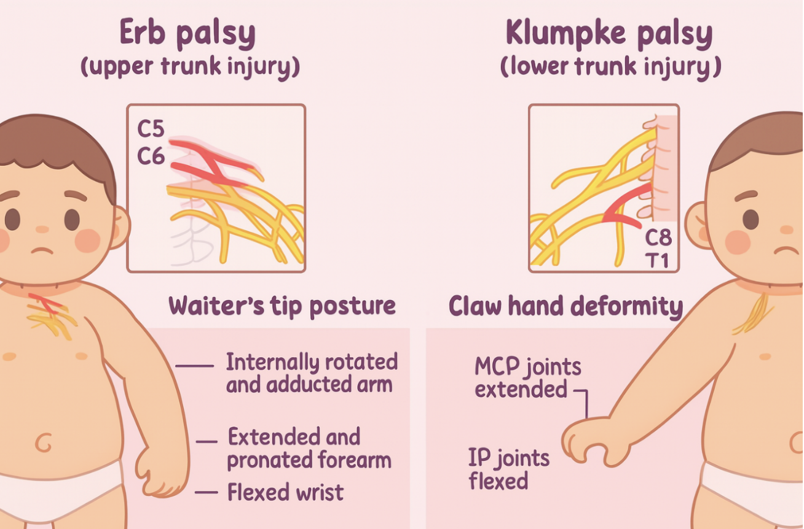

肩難產
2025年2月11日
下午 03:03

- 定義: **正常head-to-body的產出時間是24秒，若超過1分鐘，則屬肩難產。**
- 危險因子: 巨嬰妊娠、妊娠糖尿病、高齡產婦、產婦肥胖。
- 併發症: 臂神經叢受傷(=Erb’s palsy)，尤其是C5-C6→上臂無法舉起、前臂無法旋後。
- 處理方式
<table>
<colgroup>
<col style="width: 22%" />
<col style="width: 77%" />
</colgroup>
<thead>
<tr class="header">
<th><strong>輔助方法</strong></th>
<th><strong>說明</strong></th>
</tr>
</thead>
<tbody>
<tr class="odd">
<td>McRoberts maneuver</td>
<td>把產婦的腳快速往頭的方向推，讓hip hyperflexion，通常會搭配 suprapubic pressure（壓產婦的恥骨），使胎兒肩膀彈出。</td>
</tr>
<tr class="even">
<td>Woods corkscrew maneuver</td>
<td>將胎兒的後肩旋轉 180 度，使兩肩靠在一起並拉出，像是轉螺軟木塞蓋。</td>
</tr>
<tr class="odd">
<td>Rubin maneuver</td>
<td>類似 Woods maneuver，但改旋轉前肩，使兩肩靠在一起。 
🧠Robin盧比＝錢(前)</td>
</tr>
<tr class="even">
<td>Fundal pressure</td>
<td>孕婦無力時的輔助生產方式。生產時從胸往腹部方向，施加壓力在子宮的 fundus 上。</td>
</tr>
</tbody>
</table>
- McRoberts maneuver＆Suprapubic pressure→Barnum (post. Shoulder)、Rubin、Woods corkscrew、gaskin maneuver→Zavanelli maneuver/ abdominal rescue

**neonatal brachial plexus palsy 新生兒臂神經叢麻痺 (113.考古、骨科也愛考）**
<table>
<colgroup>
<col style="width: 21%" />
<col style="width: 12%" />
<col style="width: 39%" />
<col style="width: 26%" />
</colgroup>
<thead>
<tr class="header">
<th><strong>分類（比例）</strong></th>
<th><strong>受損神經</strong></th>
<th><strong>神經麻痺後姿勢</strong></th>
<th><strong>備註</strong></th>
</tr>
</thead>
<tbody>
<tr class="odd">
<td>上臂型 Erb's palsy (80%)</td>
<td>C5–6</td>
<td>"waiter's tip posture" 
- 肩：內轉（IR）、內收（Add） 
- 肘：伸直（ext）、旋前（pronation） 
- 手腕、手指：屈曲（flex）主要影響 deltoid m.</td>
<td>更易造成肩關節攣縮（contracture）與 glenohumeral dysplasia 有關</td>
</tr>
<tr class="even">
<td>下臂型 Klumpke's palsy (15%)</td>
<td>C8–T1</td>
<td>
與 Erb's 相反 
- 肩：外轉（ER）、外展（Abd） 
- 肘：屈曲（flex）、旋後（supination） 
-

手腕：伸直（ext）因內在肌無力（intrinsic minus hand），手指無法抓握或伸直，呈 claw's hand
</td>
<td>可能傷及交感神經而導致 Horner's syndrome</td>
</tr>
</tbody>
</table>

