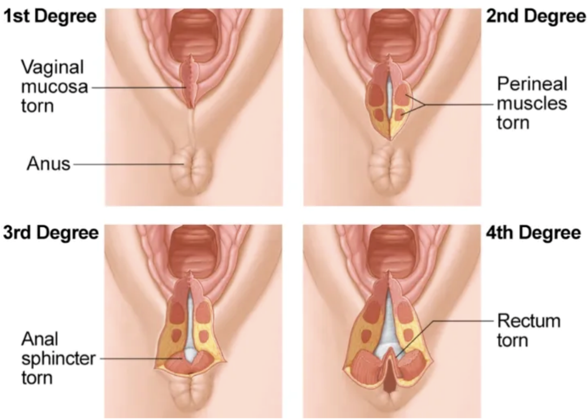

陰道生產撕裂傷
2025年7月6日
下午 05:51

<table>
<colgroup>
<col style="width: 23%" />
<col style="width: 31%" />
<col style="width: 44%" />
</colgroup>
<thead>
<tr class="header">
<th><strong>grade</strong></th>
<th><strong>撕裂位置</strong></th>
<th><strong>Tx</strong></th>
</tr>
</thead>
<tbody>
<tr class="odd">
<td>1st degree</td>
<td>會陰/陰道<strong>粘膜</strong></td>
<td></td>
</tr>
<tr class="even">
<td>2nd degree</td>
<td>會陰/陰道<strong>肌肉</strong>層，但<strong>anal sphincter complex完整</strong></td>
<td></td>
</tr>
<tr class="odd">
<td><strong>3rd degree</strong></td>
<td>**肛門外擴約頸 
</td>
<td>
<strong>需將肛門括約肌對齊縫合，要給</strong>預防性Abx

</td>
</tr>
<tr class="even">
<td></td>
<td>
3a: &lt;1/2 ext. anal sphincter

</td>
<td></td>
</tr>
<tr class="odd">
<td></td>
<td>
3b: &gt;1/2 ext. anal sphincter

</td>
<td></td>
</tr>
<tr class="even">
<td></td>
<td>
3c: int. anal sphincter**

</td>
<td></td>
</tr>
<tr class="odd">
<td>4th degree</td>
<td><strong>直腸粘膜</strong></td>
<td>需將肛門括約肌對齊縫合，要給預防性Abx</td>
</tr>
</tbody>
</table>

